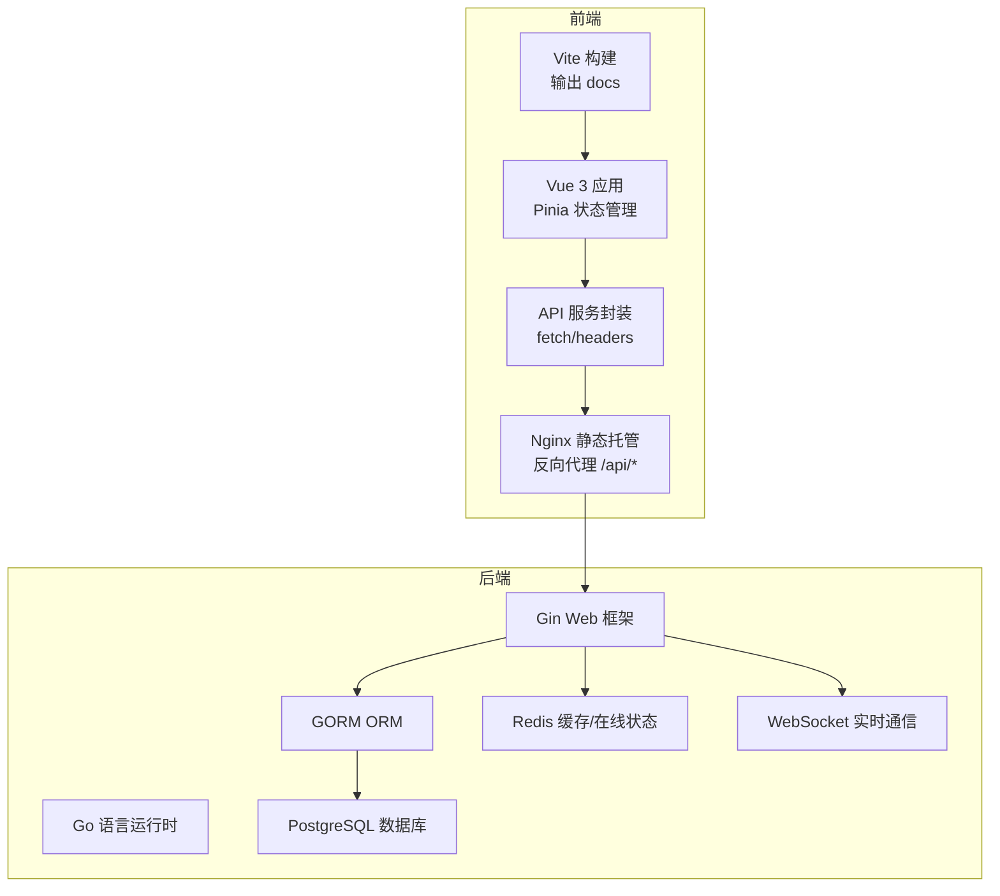
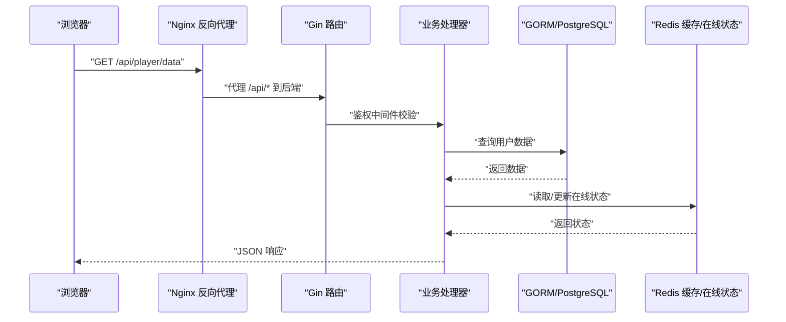
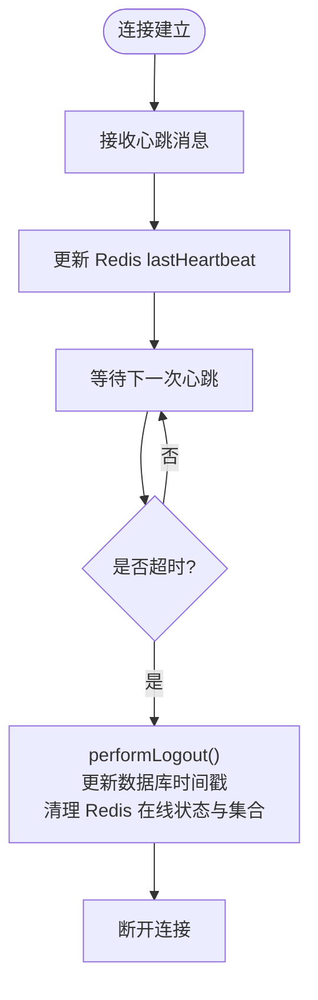
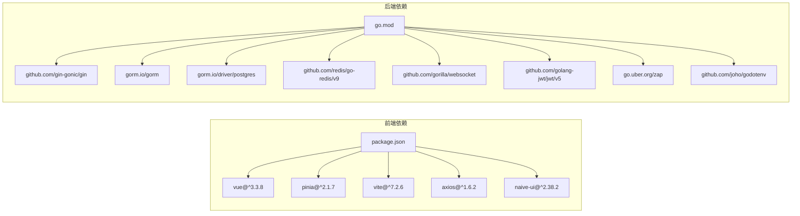

# 技术栈

<cite>
**本文引用的文件**
- [package.json](file://package.json)
- [vite.config.js](file://vite.config.js)
- [src/main.js](file://src/main.js)
- [src/services/api.js](file://src/services/api.js)
- [server-go/go.mod](file://server-go/go.mod)
- [server-go/cmd/server/main.go](file://server-go/cmd/server/main.go)
- [server-go/internal/http/router/router.go](file://server-go/internal/http/router/router.go)
- [server-go/internal/models/user.go](file://server-go/internal/models/user.go)
- [server-go/internal/websocket/manager.go](file://server-go/internal/websocket/manager.go)
- [server-go/internal/redis/redis.go](file://server-go/internal/redis/redis.go)
- [server-go/init.sql](file://server-go/init.sql)
- [Dockerfile.nginx](file://Dockerfile.nginx)
- [Dockerfile.server.prod](file://Dockerfile.server.prod)
- [nginx.conf](file://nginx.conf)
</cite>

## 目录
1. [简介](#简介)
2. [项目结构](#项目结构)
3. [核心组件](#核心组件)
4. [架构总览](#架构总览)
5. [详细组件分析](#详细组件分析)
6. [依赖关系分析](#依赖关系分析)
7. [性能考量](#性能考量)
8. [故障排查指南](#故障排查指南)
9. [结论](#结论)

## 简介
本文件系统性梳理 xiuxian-go 项目的技术栈构成，覆盖前端与后端的关键技术选型、版本兼容性、角色定位与集成方式，并结合仓库中的配置文件与源码片段给出依据。前端采用 Vue 3 + Pinia + Vite + Axios/原生 fetch + Naive UI；后端采用 Go + Gin + GORM + PostgreSQL + Redis + WebSocket；部署层使用 Nginx 与 Docker 进行容器化与反向代理。本文旨在帮助开发者快速建立技术认知体系，明确各组件职责与交互边界。

## 项目结构
项目采用前后端分离架构：
- 前端位于根目录的 src 与 docs 输出目录，使用 Vite 构建并输出静态资源到 docs，由 Nginx 提供静态托管与反向代理。
- 后端位于 server-go，采用模块化分层：cmd、internal（db、http、models、redis、websocket 等），通过 Gin 注册路由并提供 REST API 与 WebSocket 通道。
- 部署层通过 Dockerfile 与 nginx.conf 实现前后端打包与反向代理。



图表来源
- [vite.config.js](file://vite.config.js#L23-L30)
- [nginx.conf](file://nginx.conf#L11-L17)
- [server-go/cmd/server/main.go](file://server-go/cmd/server/main.go#L60-L105)
- [server-go/internal/http/router/router.go](file://server-go/internal/http/router/router.go#L17-L126)
- [server-go/internal/websocket/manager.go](file://server-go/internal/websocket/manager.go#L19-L48)
- [server-go/internal/redis/redis.go](file://server-go/internal/redis/redis.go#L10-L33)
- [server-go/init.sql](file://server-go/init.sql#L1-L31)

章节来源
- [vite.config.js](file://vite.config.js#L23-L30)
- [nginx.conf](file://nginx.conf#L1-L23)
- [server-go/cmd/server/main.go](file://server-go/cmd/server/main.go#L60-L105)
- [server-go/internal/http/router/router.go](file://server-go/internal/http/router/router.go#L17-L126)

## 核心组件
- 前端技术栈
  - Vue 3：应用入口与组件化开发，提供响应式与组合式 API。
  - Pinia：轻量状态管理，集中管理全局状态。
  - Vite：现代化构建工具，提供快速热更新与生产构建。
  - Axios/原生 fetch：HTTP 请求封装，统一处理鉴权与数据转换。
  - Naive UI：组件库，提供丰富的 UI 组件与主题能力。
- 后端技术栈
  - Go：高性能并发语言，适合高吞吐 API 与实时通信。
  - Gin：Web 框架，路由清晰、中间件生态完善。
  - GORM：ORM，支持 PostgreSQL，提供模型与迁移能力。
  - PostgreSQL：关系型数据库，承载用户与游戏数据。
  - Redis：缓存与在线状态管理，支撑 WebSocket 心跳与会话。
  - WebSocket：实时通信，推送灵力增长、探索事件等。
- 部署与运维
  - Nginx：静态资源托管与反向代理，转发 /api/* 到后端。
  - Docker：容器化打包，分别构建前端静态站点与后端服务镜像。

章节来源
- [package.json](file://package.json#L12-L27)
- [vite.config.js](file://vite.config.js#L1-L22)
- [src/main.js](file://src/main.js#L1-L12)
- [src/services/api.js](file://src/services/api.js#L1-L10)
- [server-go/go.mod](file://server-go/go.mod#L1-L20)
- [server-go/cmd/server/main.go](file://server-go/cmd/server/main.go#L60-L105)
- [server-go/internal/http/router/router.go](file://server-go/internal/http/router/router.go#L17-L126)
- [server-go/internal/websocket/manager.go](file://server-go/internal/websocket/manager.go#L19-L48)
- [server-go/internal/redis/redis.go](file://server-go/internal/redis/redis.go#L10-L33)
- [Dockerfile.nginx](file://Dockerfile.nginx#L1-L35)
- [Dockerfile.server.prod](file://Dockerfile.server.prod#L1-L18)
- [nginx.conf](file://nginx.conf#L1-L23)

## 架构总览
从前端到后端的典型请求链路如下：
- 前端通过 Vite 开发服务器或 Nginx 静态托管访问页面。
- 前端 API 服务封装统一的 /api 前缀请求，经 Nginx 反向代理转发至后端 Gin 服务。
- Gin 注册路由组，按模块划分接口，鉴权中间件保护敏感接口。
- 后端通过 GORM 访问 PostgreSQL，使用 Redis 缓存与在线状态。
- WebSocket 由后端管理器维护连接，定时任务驱动灵力增长等事件，实时推送给前端。



图表来源
- [nginx.conf](file://nginx.conf#L11-L17)
- [server-go/internal/http/router/router.go](file://server-go/internal/http/router/router.go#L17-L126)
- [server-go/internal/models/user.go](file://server-go/internal/models/user.go#L12-L42)
- [server-go/internal/redis/redis.go](file://server-go/internal/redis/redis.go#L10-L33)

## 详细组件分析

### 前端：Vue 3 + Pinia + Vite + Axios/原生 fetch + Naive UI
- 角色与职责
  - Vue 3：应用入口创建与路由挂载，组件化开发。
  - Pinia：集中式状态管理，跨模块共享数据。
  - Vite：开发与构建工具，配置别名、插件与代理。
  - Axios/原生 fetch：统一 API 调用，携带 Authorization 头。
  - Naive UI：提供对话框、通知、加载条等 UI 能力。
- 版本与兼容性
  - Vue 3、Pinia、Vite、Naive UI、Axios 的版本声明见 package.json。
  - Vite 插件生态（AutoImport、Components、obfuscator）提升 DX 与产物优化。
- 关键实现要点
  - 应用初始化：创建 App、Pinia、Router 并挂载。
  - API 服务：统一前缀 /api，封装 GET/POST/PATCH/DELETE 等方法，统一小驼峰字段转换。
  - 开发代理：本地开发时将 /api 代理到后端端口，便于联调。
  - 构建输出：构建产物输出到 docs，由 Nginx 提供静态托管。

章节来源
- [src/main.js](file://src/main.js#L1-L12)
- [src/services/api.js](file://src/services/api.js#L1-L10)
- [vite.config.js](file://vite.config.js#L1-L22)
- [vite.config.js](file://vite.config.js#L23-L30)
- [vite.config.js](file://vite.config.js#L95-L103)
- [package.json](file://package.json#L12-L27)

### 后端：Go + Gin + GORM + PostgreSQL + Redis + WebSocket
- 角色与职责
  - Go：运行时与并发模型，支撑高吞吐 API 与 WebSocket。
  - Gin：路由注册、中间件（日志、gzip、鉴权）、上下文传递。
  - GORM：模型定义、数据库迁移、事务与查询。
  - PostgreSQL：持久化存储，init.sql 定义核心表结构。
  - Redis：在线状态、心跳时间、集合去重等。
  - WebSocket：连接管理、心跳检测、广播与事件推送。
- 版本与兼容性
  - Go 版本要求见 go.mod。
  - Gin、GORM、Redis 客户端、WebSocket 等依赖见 go.mod。
- 关键实现要点
  - 路由组织：按模块分组（auth、player、online、gacha、exploration、cultivation、dungeon、alchemy），公开接口与鉴权接口清晰分离。
  - 中间件：日志、gzip、鉴权中间件贯穿请求生命周期。
  - 数据模型：User 结构体映射 users 表，JSON 字段承载战斗属性。
  - WebSocket：连接管理器维护在线用户，心跳超时触发自动下线与数据库时间戳更新。
  - Redis：初始化连接，心跳时更新 lastHeartbeat，离线时清理在线集合与状态。

```mermaid
classDiagram
class ConnectionManager {
+clients : map[uint]*ClientConnection
+broadcast : chan *Message
+register : chan *ClientConnection
+unregister : chan *ClientConnection
+Start(ctx)
+RegisterClient(userID, username, conn)
+UnregisterClient(client)
+SendToUser(userID, type, data)
+GetOnlineCount() int
+IsUserOnline(userID) bool
}
class ClientConnection {
+userID : uint
+username : string
+conn : *websocket.Conn
+send : chan *Message
+done : chan struct{}
+lastHeartbeat : time.Time
+heartbeatTimeout : time.Duration
+readLoop()
+writeLoop()
+performLogout()
}
class Message {
+type : string
+userID : uint
+timestamp : int64
+data : json.RawMessage
}
ConnectionManager --> ClientConnection : "管理连接"
ClientConnection --> Message : "读写消息"
```

图表来源
- [server-go/internal/websocket/manager.go](file://server-go/internal/websocket/manager.go#L19-L48)
- [server-go/internal/websocket/manager.go](file://server-go/internal/websocket/manager.go#L107-L136)
- [server-go/internal/websocket/manager.go](file://server-go/internal/websocket/manager.go#L138-L153)
- [server-go/internal/websocket/manager.go](file://server-go/internal/websocket/manager.go#L171-L213)
- [server-go/internal/websocket/manager.go](file://server-go/internal/websocket/manager.go#L222-L256)
- [server-go/internal/websocket/manager.go](file://server-go/internal/websocket/manager.go#L259-L309)

章节来源
- [server-go/cmd/server/main.go](file://server-go/cmd/server/main.go#L60-L105)
- [server-go/internal/http/router/router.go](file://server-go/internal/http/router/router.go#L17-L126)
- [server-go/internal/models/user.go](file://server-go/internal/models/user.go#L12-L42)
- [server-go/internal/websocket/manager.go](file://server-go/internal/websocket/manager.go#L19-L48)
- [server-go/internal/redis/redis.go](file://server-go/internal/redis/redis.go#L10-L33)
- [server-go/init.sql](file://server-go/init.sql#L1-L31)

### 数据库与模型：PostgreSQL + GORM
- 表结构与字段
  - users：用户名、密码、玩家名、境界、修炼值、灵力、各类宝石与 JSON 属性等。
  - items/herbs/pills/pill_fragments/pets/equipment 等：围绕背包、炼丹、宠物、装备等系统的表。
  - dungeon_progress/dungeon_buffs：秘境进度与选择记录。
- 索引策略
  - 针对常用查询字段建立索引，提升查询性能。
- 版本与驱动
  - PostgreSQL 驱动与 GORM 版本见 go.mod。

章节来源
- [server-go/init.sql](file://server-go/init.sql#L1-L31)
- [server-go/init.sql](file://server-go/init.sql#L33-L83)
- [server-go/init.sql](file://server-go/init.sql#L85-L123)
- [server-go/init.sql](file://server-go/init.sql#L125-L166)
- [server-go/go.mod](file://server-go/go.mod#L15-L17)

### WebSocket 实时通信流程
- 连接建立与心跳
  - 客户端连接后，服务端维护连接管理器，设置读写死线与 pong 处理。
  - 心跳消息到达时刷新 lastHeartbeat，并同步更新 Redis。
- 心跳超时与自动下线
  - 若超过阈值未收到心跳，触发 performLogout：更新数据库灵力增长时间戳，清理 Redis 在线状态与集合，断开连接。
- 广播与事件
  - 广播通道将消息投递到指定用户连接队列，实现实时推送。



图表来源
- [server-go/internal/websocket/manager.go](file://server-go/internal/websocket/manager.go#L171-L213)
- [server-go/internal/websocket/manager.go](file://server-go/internal/websocket/manager.go#L222-L256)
- [server-go/internal/websocket/manager.go](file://server-go/internal/websocket/manager.go#L259-L309)

章节来源
- [server-go/internal/websocket/manager.go](file://server-go/internal/websocket/manager.go#L171-L213)
- [server-go/internal/websocket/manager.go](file://server-go/internal/websocket/manager.go#L222-L256)
- [server-go/internal/websocket/manager.go](file://server-go/internal/websocket/manager.go#L259-L309)

### 部署与反向代理：Nginx + Docker
- Nginx 配置
  - 静态资源托管：root 指向 docs，index 为 index.html。
  - 反向代理：/api/* 代理到 backend:3000，透传 Host、X-Real-IP、X-Forwarded-For、X-Forwarded-Proto。
- Docker 构建
  - 前端镜像：使用 Node 基础镜像，复制 package.json，设置国内镜像源，安装依赖并构建，最终拷贝构建产物到 Nginx 镜像。
  - 后端镜像：使用 Node 基础镜像，安装生产依赖，复制后端代码，暴露 3000 端口，启动命令 npm start。
- 运行建议
  - 前端镜像构建后，静态资源由 Nginx 提供；后端镜像运行时需提供 REDIS_URL 与 DATABASE_URL 等环境变量。

章节来源
- [nginx.conf](file://nginx.conf#L1-L23)
- [Dockerfile.nginx](file://Dockerfile.nginx#L1-L35)
- [Dockerfile.server.prod](file://Dockerfile.server.prod#L1-L18)

## 依赖关系分析
- 前端依赖
  - Vue 3、Pinia、Vue Router、Naive UI、Axios、dotenv、ioredis、jsonwebtoken、uuid 等。
  - Vite 插件：@vitejs/plugin-vue、unplugin-auto-import、unplugin-vue-components、terser、bundle obfuscator。
- 后端依赖
  - Gin、GORM、PostgreSQL 驱动、Redis 客户端、JWT、WebSocket、Zap 日志、dotenv 等。
- 依赖版本与兼容性
  - 前端版本见 package.json。
  - 后端版本见 go.mod。
  - 前端与后端均通过各自配置文件声明依赖，避免隐式版本冲突。



图表来源
- [package.json](file://package.json#L12-L27)
- [server-go/go.mod](file://server-go/go.mod#L5-L18)

章节来源
- [package.json](file://package.json#L12-L27)
- [server-go/go.mod](file://server-go/go.mod#L5-L18)

## 性能考量
- 前端
  - Vite 使用 Terser 压缩与手动分包策略，拆分 vendor、vue-vendor、pinia-vendor，减少首屏体积。
  - 开发代理与预览配置，提升调试效率。
- 后端
  - Gin 启用 gzip 压缩，降低网络传输开销。
  - Redis 缓存在线状态与心跳时间，减少数据库压力。
  - WebSocket 连接管理器使用带缓冲的广播通道与写队列，避免阻塞。
- 数据库
  - init.sql 为高频查询字段建立索引，有助于查询性能。
- 部署
  - Nginx 静态托管 + 反向代理，减少后端静态资源压力。

章节来源
- [vite.config.js](file://vite.config.js#L23-L45)
- [vite.config.js](file://vite.config.js#L46-L51)
- [server-go/cmd/server/main.go](file://server-go/cmd/server/main.go#L60-L67)
- [server-go/internal/websocket/manager.go](file://server-go/internal/websocket/manager.go#L19-L48)
- [server-go/init.sql](file://server-go/init.sql#L154-L166)

## 故障排查指南
- 前端
  - API 调用失败：检查 /api 前缀与 Authorization 头是否正确；确认开发代理指向后端端口。
  - 构建产物为空：确认 Vite 输出目录 docs 权限与 Nginx root 配置。
- 后端
  - 路由 404：核对 router.go 分组与具体路由是否匹配。
  - 数据库连接失败：检查 DATABASE_URL 环境变量与 init.sql 表结构一致性。
  - Redis 连接失败：检查 REDIS_URL 环境变量与 Redis 服务可达性。
  - WebSocket 心跳超时：确认客户端 ping 消息是否按时发送；检查 Redis lastHeartbeat 更新。
- 部署
  - Nginx 无法访问 /api：确认 proxy_pass 地址与端口；检查容器网络与端口映射。
  - Docker 构建失败：检查 Node 镜像源与依赖安装步骤。

章节来源
- [src/services/api.js](file://src/services/api.js#L1-L10)
- [vite.config.js](file://vite.config.js#L95-L103)
- [nginx.conf](file://nginx.conf#L11-L17)
- [server-go/internal/http/router/router.go](file://server-go/internal/http/router/router.go#L17-L126)
- [server-go/internal/redis/redis.go](file://server-go/internal/redis/redis.go#L10-L33)
- [server-go/internal/websocket/manager.go](file://server-go/internal/websocket/manager.go#L171-L213)

## 结论
xiuxian-go 的技术栈围绕“现代前端 + 高性能后端 + 实时通信 + 容器化部署”展开。前端以 Vue 3 + Pinia + Vite + Naive UI 构建，后端以 Go + Gin + GORM + PostgreSQL + Redis + WebSocket 提供稳定可靠的 API 与实时能力，Nginx 与 Docker 则保障了部署的一致性与可扩展性。通过明确的模块划分与清晰的依赖声明，项目具备良好的可维护性与演进空间。