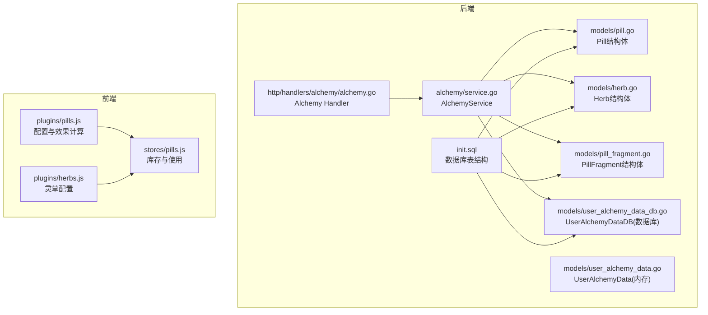
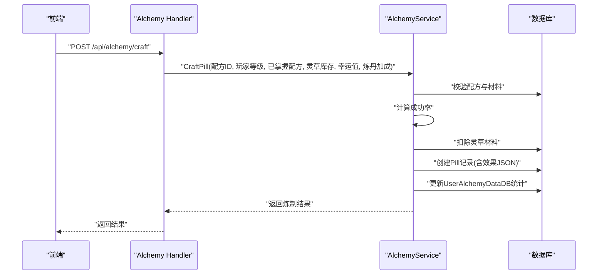
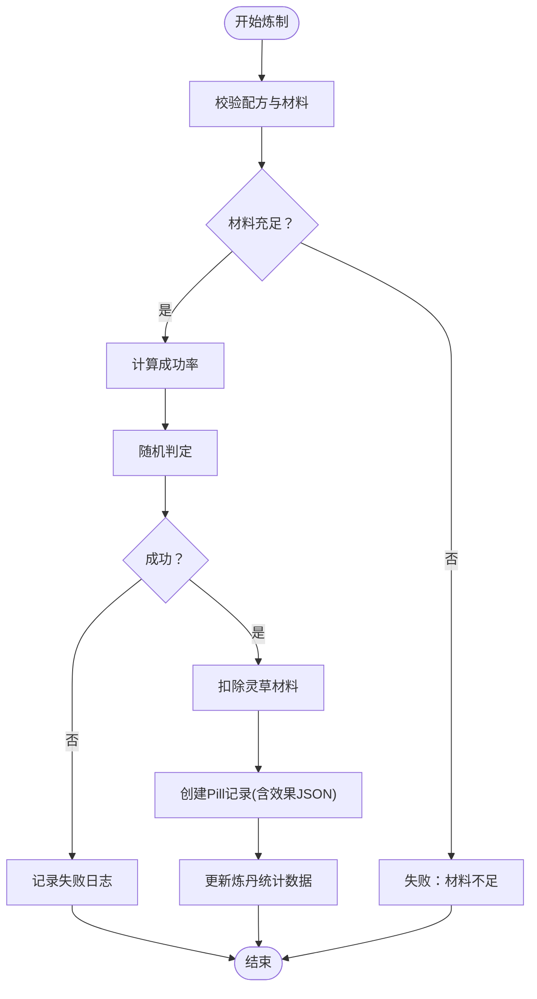
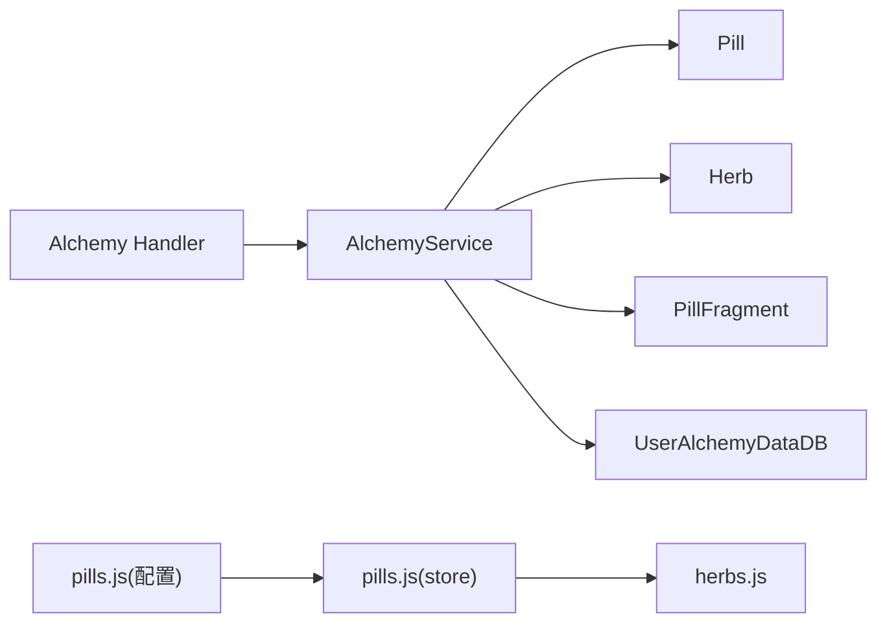

# 丹药模型

<cite>
**本文引用的文件**
- [pill.go](file://server-go/internal/models/pill.go)
- [herb.go](file://server-go/internal/models/herb.go)
- [init.sql](file://server-go/init.sql)
- [service.go](file://server-go/internal/alchemy/service.go)
- [alchemy.go](file://server-go/internal/http/handlers/alchemy/alchemy.go)
- [user_alchemy_data.go](file://server-go/internal/models/user_alchemy_data.go)
- [user_alchemy_data_db.go](file://server-go/internal/models/user_alchemy_data_db.go)
- [pill_fragment.go](file://server-go/internal/models/pill_fragment.go)
- [README_炼丹系统.md](file://README_炼丹系统.md)
- [pills.js](file://src/plugins/pills.js)
- [pills.js（store）](file://src/stores/pills.js)
- [herbs.js](file://src/plugins/herbs.js)
</cite>

## 目录
1. [简介](#简介)
2. [项目结构](#项目结构)
3. [核心组件](#核心组件)
4. [架构总览](#架构总览)
5. [详细组件分析](#详细组件分析)
6. [依赖分析](#依赖分析)
7. [性能考虑](#性能考虑)
8. [故障排查指南](#故障排查指南)
9. [结论](#结论)
10. [附录](#附录)

## 简介
本文件围绕“丹药模型”进行权威说明，基于后端模型与数据库脚本，系统梳理Pill结构体字段与其数据库映射，阐明丹药与灵草（herb）之间的原料关联关系，解释炼丹系统在后端的使用逻辑与API调用链路。结合README_炼丹系统.md，说明不同丹药的效果计算方式与服用后的状态变更机制，并给出一次炼丹操作如何生成新的丹药记录，以及当前仓库中关于丹药库存管理的数据结构现状与建议。

## 项目结构
炼丹系统涉及前后端协同：前端负责交互与状态管理，后端提供API与数据库持久化。与丹药模型直接相关的关键文件如下：
- 后端模型与数据库：pill.go、herb.go、pill_fragment.go、user_alchemy_data.go、user_alchemy_data_db.go、init.sql
- 后端业务与API：service.go、alchemy.go
- 前端插件与状态：pills.js（配置与效果计算）、pills.js（store库存与使用）、herbs.js（灵草配置）

图表来源
- [pill.go](file://server-go/internal/models/pill.go#L1-L21)
- [herb.go](file://server-go/internal/models/herb.go#L1-L17)
- [pill_fragment.go](file://server-go/internal/models/pill_fragment.go#L1-L13)
- [user_alchemy_data.go](file://server-go/internal/models/user_alchemy_data.go#L1-L17)
- [user_alchemy_data_db.go](file://server-go/internal/models/user_alchemy_data_db.go#L1-L21)
- [service.go](file://server-go/internal/alchemy/service.go#L1-L670)
- [alchemy.go](file://server-go/internal/http/handlers/alchemy/alchemy.go#L1-L305)
- [init.sql](file://server-go/init.sql#L47-L83)
- [pills.js](file://src/plugins/pills.js#L1-L270)
- [pills.js（store）](file://src/stores/pills.js#L1-L94)
- [herbs.js](file://src/plugins/herbs.js#L1-L164)

章节来源
- [init.sql](file://server-go/init.sql#L47-L83)
- [pill.go](file://server-go/internal/models/pill.go#L1-L21)
- [herb.go](file://server-go/internal/models/herb.go#L1-L17)
- [pill_fragment.go](file://server-go/internal/models/pill_fragment.go#L1-L13)
- [user_alchemy_data.go](file://server-go/internal/models/user_alchemy_data.go#L1-L17)
- [user_alchemy_data_db.go](file://server-go/internal/models/user_alchemy_data_db.go#L1-L21)
- [service.go](file://server-go/internal/alchemy/service.go#L1-L670)
- [alchemy.go](file://server-go/internal/http/handlers/alchemy/alchemy.go#L1-L305)
- [pills.js](file://src/plugins/pills.js#L1-L270)
- [pills.js（store）](file://src/stores/pills.js#L1-L94)
- [herbs.js](file://src/plugins/herbs.js#L1-L164)

## 核心组件
- Pill（后端模型）：代表一个玩家拥有的丹药实例，包含唯一标识、所属玩家、丹药模板ID、名称、描述与效果JSON。
- Herb（后端模型）：代表玩家背包中的灵草，包含唯一标识、所属玩家、灵草ID、名称与数量。
- UserAlchemyDataDB（后端模型）：用户炼丹统计数据，包含已解锁丹方、炼制次数、服用次数、炼丹等级与加成率。
- PillFragment（后端模型）：丹方残页，记录玩家对某个丹方的残页数量。
- AlchemyService（后端服务）：封装炼丹业务逻辑，包括效果计算、炼制成功率判定、材料消耗、丹药创建与统计数据更新。
- Alchemy Handler（后端HTTP处理器）：对外暴露API，接收请求并调用AlchemyService。
- 前端插件与状态：pills.js（配置与效果计算）、pills.js（store库存与使用）、herbs.js（灵草配置）。

章节来源
- [pill.go](file://server-go/internal/models/pill.go#L1-L21)
- [herb.go](file://server-go/internal/models/herb.go#L1-L17)
- [user_alchemy_data_db.go](file://server-go/internal/models/user_alchemy_data_db.go#L1-L21)
- [pill_fragment.go](file://server-go/internal/models/pill_fragment.go#L1-L13)
- [service.go](file://server-go/internal/alchemy/service.go#L1-L670)
- [alchemy.go](file://server-go/internal/http/handlers/alchemy/alchemy.go#L1-L305)
- [pills.js](file://src/plugins/pills.js#L1-L270)
- [pills.js（store）](file://src/stores/pills.js#L1-L94)
- [herbs.js](file://src/plugins/herbs.js#L1-L164)

## 架构总览
炼丹系统采用“前端交互 + 后端API + 数据库持久化”的分层架构。前端负责展示与交互，后端负责业务规则与数据一致性，数据库提供持久化能力。

图表来源
- [alchemy.go](file://server-go/internal/http/handlers/alchemy/alchemy.go#L140-L217)
- [service.go](file://server-go/internal/alchemy/service.go#L349-L454)
- [init.sql](file://server-go/init.sql#L47-L83)

章节来源
- [alchemy.go](file://server-go/internal/http/handlers/alchemy/alchemy.go#L140-L217)
- [service.go](file://server-go/internal/alchemy/service.go#L349-L454)
- [init.sql](file://server-go/init.sql#L47-L83)

## 详细组件分析

### Pill结构体与数据库映射
- 字段说明
  - id：自增主键，唯一标识一条丹药记录。
  - user_id：外键，指向users表，表示该丹药属于哪个玩家。
  - pill_id：字符串，对应丹方ID，用于标识该丹药来源于哪个配方。
  - name：字符串，丹药名称。
  - description：文本，丹药描述。
  - effect：JSON，存储该丹药的效果定义（类型、数值、持续时间、成功率等）。
- 数据库映射
  - 表名：pills
  - 字段类型与约束：id为主键；user_id为外键；pill_id、name、description为字符串；effect为JSONB。
- 作用
  - 记录玩家拥有的每一份丹药实例，包含其效果定义，便于后续服用与状态叠加。

章节来源
- [pill.go](file://server-go/internal/models/pill.go#L1-L21)
- [init.sql](file://server-go/init.sql#L56-L64)

### 灵草（Herb）与丹药的原料关联
- Herb结构体
  - 字段：id、user_id、herb_id、name、count。
  - 表名：herbs。
- 关联关系
  - 炼制时，AlchemyService会根据配方要求检查玩家背包中的灵草数量，并在成功炼制后扣除相应数量。
  - 前端通过herbs.js维护灵草配置与掉落概率，store中的pills.js负责消耗与库存变化。
- 注意
  - README_炼丹系统.md指出“丹药库存管理（数据结构在但未完全使用）”，当前仓库中后端未直接提供“玩家拥有的丹药库存”表，而是通过Pill记录与effect JSON存储效果定义。

章节来源
- [herb.go](file://server-go/internal/models/herb.go#L1-L17)
- [init.sql](file://server-go/init.sql#L47-L55)
- [service.go](file://server-go/internal/alchemy/service.go#L374-L416)
- [pills.js（store）](file://src/stores/pills.js#L35-L66)
- [herbs.js](file://src/plugins/herbs.js#L1-L164)
- [README_炼丹系统.md](file://README_炼丹系统.md#L158-L167)

### 丹药效果计算与服用状态变更
- 效果计算
  - 基础效果由配方定义，类型倍数来自类型配置，等级倍数随玩家等级提升。
  - 计算公式：最终效果 = 基础效果 × 类型倍数 × 等级倍数（等级倍数 = 1 + (玩家等级 - 1) × 0.1）。
- 服用与状态变更
  - 前端pills.js（store）支持“使用丹药”：将效果加入activeEffects，记录开始与结束时间，并从背包移除该丹药。
  - README_炼丹系统.md明确指出“丹药效果应用（计时器、属性加成）”尚未实装，当前为前端本地状态管理。
- 成功率与随机判定
  - 成功率 = 品阶成功率 × 幸运值 × 炼丹加成；随机判定成功后扣除材料并创建Pill记录。

章节来源
- [service.go](file://server-go/internal/alchemy/service.go#L332-L347)
- [pills.js](file://src/plugins/pills.js#L236-L248)
- [pills.js（store）](file://src/stores/pills.js#L69-L94)
- [README_炼丹系统.md](file://README_炼丹系统.md#L115-L133)

### 一次炼丹操作如何生成新的丹药记录
- 步骤
  1) 校验配方与材料：确认玩家已掌握配方且背包中灵草数量满足需求。
  2) 计算成功率：综合品阶成功率、幸运值与炼丹加成。
  3) 随机判定：若失败则记录日志；若成功则扣除材料。
  4) 创建Pill：填充用户ID、配方ID、名称、描述与效果（效果JSON）。
  5) 更新统计：增加UserAlchemyDataDB中的炼制次数。
- 返回
  - 返回炼制结果（成功/失败、成功率、消耗的材料、效果预估）。

图表来源
- [service.go](file://server-go/internal/alchemy/service.go#L349-L454)
- [alchemy.go](file://server-go/internal/http/handlers/alchemy/alchemy.go#L140-L217)

章节来源
- [service.go](file://server-go/internal/alchemy/service.go#L349-L454)
- [alchemy.go](file://server-go/internal/http/handlers/alchemy/alchemy.go#L140-L217)

### 丹药库存管理的数据结构设计
- 现状
  - 后端未提供“玩家拥有的丹药库存”表，Pill记录作为实例存在，effect以JSON形式存储。
  - README_炼丹系统.md指出“丹药库存管理（数据结构在但未完全使用）”，当前仓库中后端未直接实现库存查询与管理接口。
- 建议
  - 若需后端库存管理，可在数据库新增“玩家拥有的丹药库存表”，字段包含user_id、pill_id、数量、创建时间等，并在API中提供查询与变更接口。
  - 当前前端pills.js（store）已具备库存与使用的逻辑，可作为过渡方案，待后端完善后再迁移。

章节来源
- [init.sql](file://server-go/init.sql#L56-L64)
- [pills.js（store）](file://src/stores/pills.js#L1-L94)
- [README_炼丹系统.md](file://README_炼丹系统.md#L158-L167)

## 依赖分析
- 组件耦合
  - AlchemyHandler依赖AlchemyService；AlchemyService依赖models（Pill、Herb、PillFragment、UserAlchemyDataDB）与数据库。
  - 前端pills.js（store）依赖pills.js（配置与效果计算）与herbs.js。
- 外部依赖
  - Gin路由框架、GORM ORM、Zap日志库。
- 潜在风险
  - 前端当前为本地状态管理，未与后端库存一致，存在数据不一致风险；建议尽快迁移至后端统一管理。

图表来源
- [alchemy.go](file://server-go/internal/http/handlers/alchemy/alchemy.go#L1-L305)
- [service.go](file://server-go/internal/alchemy/service.go#L1-L670)
- [pill.go](file://server-go/internal/models/pill.go#L1-L21)
- [herb.go](file://server-go/internal/models/herb.go#L1-L17)
- [pill_fragment.go](file://server-go/internal/models/pill_fragment.go#L1-L13)
- [user_alchemy_data_db.go](file://server-go/internal/models/user_alchemy_data_db.go#L1-L21)
- [pills.js](file://src/plugins/pills.js#L1-L270)
- [pills.js（store）](file://src/stores/pills.js#L1-L94)
- [herbs.js](file://src/plugins/herbs.js#L1-L164)

章节来源
- [alchemy.go](file://server-go/internal/http/handlers/alchemy/alchemy.go#L1-L305)
- [service.go](file://server-go/internal/alchemy/service.go#L1-L670)
- [pill.go](file://server-go/internal/models/pill.go#L1-L21)
- [herb.go](file://server-go/internal/models/herb.go#L1-L17)
- [pill_fragment.go](file://server-go/internal/models/pill_fragment.go#L1-L13)
- [user_alchemy_data_db.go](file://server-go/internal/models/user_alchemy_data_db.go#L1-L21)
- [pills.js](file://src/plugins/pills.js#L1-L270)
- [pills.js（store）](file://src/stores/pills.js#L1-L94)
- [herbs.js](file://src/plugins/herbs.js#L1-L164)

## 性能考虑
- 材料检查与消耗：当前AlchemyService在炼制时遍历配方材料并检查库存，若存在大量材料种类，可能带来较高开销。
- 建议
  - 在后端建立索引与缓存策略，减少重复查询。
  - 优化材料检查算法，避免不必要的循环与条件判断。
  - 将库存管理迁移到后端，减少前端状态同步带来的潜在性能与一致性问题。

章节来源
- [README_炼丹系统.md](file://README_炼丹系统.md#L194-L208)
- [service.go](file://server-go/internal/alchemy/service.go#L374-L416)

## 故障排查指南
- 常见问题
  - “材料不足”：确认玩家背包中灵草数量满足配方需求。
  - “未掌握该丹方”：确认玩家是否已通过残页合成完整丹方。
  - “炼制失败”：检查成功率计算（品阶、幸运值、炼丹加成），并确认随机判定。
  - “库存不一致”：当前前端本地状态与后端库存未完全对接，建议先使用后端API进行库存管理。
- 排查步骤
  - 检查Alchemy Handler入参与日志。
  - 校验AlchemyService的材料检查与成功率计算。
  - 确认数据库中herbs与pills表的数据一致性。

章节来源
- [alchemy.go](file://server-go/internal/http/handlers/alchemy/alchemy.go#L140-L217)
- [service.go](file://server-go/internal/alchemy/service.go#L349-L454)
- [init.sql](file://server-go/init.sql#L47-L83)

## 结论
- Pill结构体与数据库映射清晰，effect以JSON存储，便于灵活扩展效果类型与数值。
- 丹药与灵草的原料关联通过AlchemyService在后端完成，炼制流程完整。
- 效果计算与成功率计算已在前后端均有实现，但效果应用与库存管理尚未完全后端化，建议尽快完善后端库存与效果应用逻辑，确保数据一致性与可维护性。

## 附录
- API一览（与炼丹相关）
  - GET /api/alchemy/recipes：获取所有丹方列表（含品阶、类型、配方、玩家统计）。
  - GET /api/alchemy/recipes/:recipeId：获取单个丹方详情。
  - POST /api/alchemy/craft：炼制丹药（传入配方ID、玩家等级、已掌握配方、灵草库存、幸运值、炼丹加成）。
  - POST /api/alchemy/buy-fragment：购买丹方残页。
  - GET /api/alchemy/configs：获取炼丹系统配置（品阶、类型、配方、灵草）。

章节来源
- [alchemy.go](file://server-go/internal/http/handlers/alchemy/alchemy.go#L24-L304)
- [service.go](file://server-go/internal/alchemy/service.go#L1-L670)
- [README_炼丹系统.md](file://README_炼丹系统.md#L73-L87)