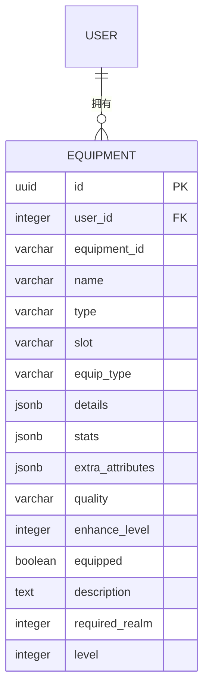

# 数据模型

<cite>
**本文档引用文件**  
- [user.go](file://server-go/internal/models/user.go)
- [equipment.go](file://server-go/internal/models/equipment.go)
- [pet.go](file://server-go/internal/models/pet.go)
- [pill.go](file://server-go/internal/models/pill.go)
- [herb.go](file://server-go/internal/models/herb.go)
- [item.go](file://server-go/internal/models/item.go)
- [init.sql](file://server-go/init.sql)
- [item_qualities.go](file://server-go/internal/models/item_qualities.go)
- [装备属性生成设定.md](file://装备属性生成设定.md)
- [灵宠系统需求文档.md](file://灵宠系统需求文档.md)
- [炼丹功能梳理.md](file://炼丹功能梳理.md)
- [README_炼丹系统.md](file://README_炼丹系统.md)
</cite>

## 目录
1. [引言](#引言)
2. [核心实体模型](#核心实体模型)
3. [装备系统数据模型](#装备系统数据模型)
4. [灵宠系统数据模型](#灵宠系统数据模型)
5. [炼丹系统数据模型](#炼丹系统数据模型)
6. [实体关系图](#实体关系图)
7. [数据生命周期管理](#数据生命周期管理)

## 引言
本文档旨在全面定义xiuxian-go项目的权威数据模型，涵盖User、Equipment、Pet、Pill、Herb等核心实体。文档基于`models/`目录下的Go结构体定义和`init.sql`数据库初始化脚本，详细描述各模型的字段类型、约束条件、默认值及业务规则。同时，本文档解释了装备属性生成逻辑、灵宠成长机制以及丹药与灵草的关联关系。

**本文档引用文件**  
- [user.go](file://server-go/internal/models/user.go)
- [init.sql](file://server-go/init.sql)

## 核心实体模型

### 用户模型 (User)
用户模型是系统的核心实体，存储玩家的认证信息、基础属性、修炼状态和战斗属性。

**字段定义**:
- `id`: 主键，自增整数
- `username`: 用户名，唯一且非空
- `password`: 密码，非空
- `playerName`: 玩家昵称
- `level`: 修为等级，默认为1
- `realm`: 修炼境界
- `cultivation`: 当前修为值，默认为0
- `maxCultivation`: 修为上限，默认为100
- `spirit`: 灵力值，默认为0
- `spiritStones`: 灵石数量，默认为0
- `reinforceStones`: 强化石数量，默认为0
- `refinementStones`: 精炼石数量，默认为0
- `petEssence`: 灵宠精华数量，默认为0
- `baseAttributes`: 基础属性，JSONB格式存储
- `combatAttributes`: 战斗属性，JSONB格式存储
- `combatResistance`: 战斗抗性，JSONB格式存储
- `specialAttributes`: 特殊属性，JSONB格式存储
- `lastSpiritGainTime`: 上次灵力增长时间，默认为当前时间戳
- `createdAt`: 创建时间，默认为当前时间戳
- `updatedAt`: 更新时间，默认为当前时间戳

**约束条件**:
- 主键约束: `id`
- 唯一约束: `username`
- 外键约束: 无
- 索引: `idx_users_username` (username), `idx_users_last_spirit_gain_time` (last_spirit_gain_time)

**业务规则**:
- 用户名必须唯一
- 灵力会随时间自动增长
- 玩家属性通过装备、灵宠和丹药进行增强

```mermaid
erDiagram
USER {
integer id PK
string username UK
string password
string player_name
integer level
string realm
double precision cultivation
double precision max_cultivation
double precision spirit
integer spirit_stones
integer reinforce_stones
integer refinement_stones
integer pet_essence
jsonb base_attributes
jsonb combat_attributes
jsonb combat_resistance
jsonb special_attributes
timestamp last_spirit_gain_time
timestamp created_at
timestamp updated_at
}
```

**图表来源**  
- [user.go](file://server-go/internal/models/user.go#L12-L42)
- [init.sql](file://server-go/init.sql#L10-L31)

**本节来源**  
- [user.go](file://server-go/internal/models/user.go#L12-L42)
- [init.sql](file://server-go/init.sql#L10-L31)

## 装备系统数据模型

### 装备模型 (Equipment)
装备模型存储玩家拥有的装备信息，包括装备属性、品质和强化等级。

**字段定义**:
- `id`: 主键，UUID类型
- `userID`: 外键，关联用户ID
- `equipmentID`: 装备标识符
- `name`: 装备名称
- `type`: 装备类型
- `slot`: 装备槽位
- `equipType`: 装备子类型
- `details`: 装备详细信息，JSONB格式
- `stats`: 装备属性，JSONB格式
- `extraAttributes`: 额外属性，JSONB格式
- `quality`: 装备品质
- `enhanceLevel`: 强化等级，默认为0
- `equipped`: 是否已装备，默认为false
- `description`: 装备描述
- `requiredRealm`: 所需境界
- `level`: 装备等级，默认为1

**约束条件**:
- 主键约束: `id`
- 外键约束: `userID` 引用 `users(id)`
- 索引: `idx_equipment_user_id` (user_id)

**业务规则**:
- 装备品质分为：凡器、法器、灵器、极品灵器、伪仙器、仙器
- 装备属性生成与装备类型和品质相关
- 装备可进行强化，提升属性

### 装备属性生成逻辑
装备属性的生成遵循特定规则，根据装备类型和品质决定生成的属性条数和类型。

**装备类型与属性关联规则**:
- `faqi`: 生成攻击相关属性
- `guanjin`: 生成生命和防御类属性
- `daopao`: 生成生命和防御相关属性
- `yunlv`: 生成速度相关属性
- `fabao`: 生成攻击、生命、防御、速度和通用属性

**属性条数生成规则**:
- `common`: 1条基础属性
- `uncommon`: 1条基础属性，1条战斗属性
- `rare`: 1条基础属性，1条战斗属性，1条战斗抗性
- `epic`: 1条基础属性，2条战斗属性，2条战斗抗性
- `legendary`: 1条基础属性，2条战斗属性，2条战斗抗性，1条特殊属性
- `mythic`: 1条基础属性，2条战斗属性，2条战斗抗性，2条特殊属性

**属性分类**:
- **攻击相关**: attack, critRate, stunRate, vampireRate, critDamageBoost, finalDamageBoost
- **生命相关**: health, vampireResist, healBoost
- **防御相关**: defense, counterRate, critResist, counterResist, stunResist, critDamageReduce, finalDamageReduce
- **速度相关**: speed, comboRate, dodgeRate, comboResist, dodgeResist
- **通用属性**: combatBoost, resistanceBoost



**图表来源**  
- [equipment.go](file://server-go/internal/models/equipment.go#L7-L29)
- [init.sql](file://server-go/init.sql#L106-L123)
- [装备属性生成设定.md](file://装备属性生成设定.md#L1-L46)

**本节来源**  
- [equipment.go](file://server-go/internal/models/equipment.go#L7-L29)
- [init.sql](file://server-go/init.sql#L106-L123)
- [装备属性生成设定.md](file://装备属性生成设定.md#L1-L46)

## 灵宠系统数据模型

### 灵宠模型 (Pet)
灵宠模型存储玩家拥有的灵宠信息，包括灵宠属性、等级和星级。

**字段定义**:
- `id`: 主键，UUID类型
- `userID`: 外键，关联用户ID
- `petID`: 灵宠标识符
- `name`: 灵宠名称
- `type`: 灵宠类型
- `rarity`: 灵宠稀有度
- `level`: 灵宠等级，默认为1
- `star`: 灵宠星级，默认为1
- `experience`: 经验值，默认为0
- `maxExperience`: 最大经验值，默认为100
- `quality`: 品质，JSONB格式
- `combatAttributes`: 战斗属性，JSONB格式
- `isActive`: 是否激活，默认为false
- `attackBonus`: 攻击加成，默认为0
- `defenseBonus`: 防御加成，默认为0
- `healthBonus`: 生命加成，默认为0

**约束条件**:
- 主键约束: `id`
- 外键约束: `userID` 引用 `users(id)`
- 索引: `idx_pets_user_id` (user_id)

**业务规则**:
- 灵宠品质分为：凡兽、妖兽、灵兽、上古异兽、瑞兽、仙兽
- 灵宠可通过升级提升等级
- 灵宠可通过升星提升星级
- 灵宠可作为其他灵宠的升星材料

### 灵宠成长机制
灵宠的成长通过升级和升星两种方式实现。

**升级机制**:
- 消耗灵宠精华进行升级
- 升级后提升灵宠等级
- 等级提升会增加灵宠的基础属性

**升星机制**:
- 使用相同品质的灵宠作为材料进行升星
- 相同名字的灵宠升星成功率为100%
- 不同名字的灵宠升星成功率为30%
- 升星成功会增强灵宠的各项战斗属性

**属性加成计算**:
- 基础加成: 根据灵宠品质确定
- 星级加成: 每星提供固定加成
- 等级加成: 随等级提升而增加
- 阶段加成: 每5星为一个阶段，提供额外加成

```mermaid
erDiagram
PET {
uuid id PK
integer user_id FK
varchar pet_id
varchar name
varchar type
varchar rarity
integer level
integer star
integer experience
integer max_experience
jsonb quality
jsonb combat_attributes
boolean is_active
double precision attack_bonus
double precision defense_bonus
double precision health_bonus
}
USER ||--o{ PET : "拥有"
```

**图表来源**  
- [pet.go](file://server-go/internal/models/pet.go#L7-L30)
- [init.sql](file://server-go/init.sql#L86-L103)
- [灵宠系统需求文档.md](file://灵宠系统需求文档.md#L56-L211)

**本节来源**  
- [pet.go](file://server-go/internal/models/pet.go#L7-L30)
- [init.sql](file://server-go/init.sql#L86-L103)
- [灵宠系统需求文档.md](file://灵宠系统需求文档.md#L56-L211)

## 炼丹系统数据模型

### 丹药模型 (Pill)
丹药模型存储玩家炼制的丹药信息。

**字段定义**:
- `id`: 主键，自增整数
- `userID`: 外键，关联用户ID
- `pillID`: 丹药标识符
- `name`: 丹药名称
- `description`: 丹药描述
- `effect`: 丹药效果，JSONB格式

**约束条件**:
- 主键约束: `id`
- 外键约束: `userID` 引用 `users(id)`
- 索引: `idx_pills_user_id` (user_id)

### 灵草模型 (Herb)
灵草模型存储玩家收集的灵草信息。

**字段定义**:
- `id`: 主键，自增整数
- `userID`: 外键，关联用户ID
- `herbID`: 灵草标识符
- `name`: 灵草名称
- `count`: 灵草数量，默认为0

**约束条件**:
- 主键约束: `id`
- 外键约束: `userID` 引用 `users(id)`
- 索引: `idx_herbs_user_id` (user_id)

### 丹方残页模型 (PillFragment)
丹方残页模型存储玩家收集的丹方残页信息。

**字段定义**:
- `id`: 主键，自增整数
- `userID`: 外键，关联用户ID
- `recipeID`: 丹方标识符
- `count`: 残页数量，默认为0

**约束条件**:
- 主键约束: `id`
- 外键约束: `userID` 引用 `users(id)`
- 索引: `idx_pill_fragments_user_id` (user_id)

### 用户炼丹数据模型 (UserAlchemyData)
用户炼丹数据模型存储玩家的炼丹统计数据。

**字段定义**:
- `id`: 主键，自增整数
- `userID`: 外键，唯一，关联用户ID
- `recipesUnlocked`: 已解锁的丹方ID列表，JSON格式
- `pillsCrafted`: 总炼制次数，默认为0
- `pillsConsumed`: 总服用次数，默认为0
- `alchemyLevel`: 炼丹等级，默认为1
- `alchemyRate`: 炼丹加成率，默认为1.0

**约束条件**:
- 主键约束: `id`
- 外键约束: `userID` 引用 `users(id)`
- 唯一约束: `userID`
- 索引: `idx_user_alchemy_data_user_id` (user_id)

### 丹药与灵草关联关系
丹药的炼制需要消耗特定种类和数量的灵草。

**炼制规则**:
- 每种丹药有特定的材料需求
- 材料需求包括灵草种类和数量
- 炼制成功率受丹药品阶、玩家炼丹等级和幸运值影响

**丹药品阶系统**:
- 一品到九品，难度递增
- 品阶越高，所需残页数越多，基础成功率越低
- 残页数 = (品阶数字 × 5) + 5

**丹药类型系统**:
- 灵力类: 效果倍数×1.0
- 修炼类: 效果倍数×1.2
- 属性类: 效果倍数×1.5
- 特殊类: 效果倍数×2.0

```mermaid
erDiagram
PILL {
integer id PK
integer user_id FK
varchar pill_id
varchar name
text description
jsonb effect
}
HERB {
integer id PK
integer user_id FK
varchar herb_id
varchar name
integer count
}
PILL_FRAGMENT {
integer id PK
integer user_id FK
varchar recipe_id
integer count
}
USER_ALCHEMY_DATA {
integer id PK
integer user_id UK FK
json recipes_unlocked
integer pills_crafted
integer pills_consumed
integer alchemy_level
double precision alchemy_rate
}
USER ||--o{ PILL : "拥有"
USER ||--o{ HERB : "拥有"
USER ||--o{ PILL_FRAGMENT : "拥有"
USER ||--o{ USER_ALCHEMY_DATA : "拥有"
```

**图表来源**  
- [pill.go](file://server-go/internal/models/pill.go#L7-L16)
- [herb.go](file://server-go/internal/models/herb.go#L5-L12)
- [pill_fragment.go](file://server-go/internal/models/pill_fragment.go#L3-L9)
- [user_alchemy_data.go](file://server-go/internal/models/user_alchemy_data.go#L4-L11)
- [init.sql](file://server-go/init.sql#L57-L83)
- [炼丹功能梳理.md](file://炼丹功能梳理.md#L1-L670)
- [README_炼丹系统.md](file://README_炼丹系统.md#L1-L286)

**本节来源**  
- [pill.go](file://server-go/internal/models/pill.go#L7-L16)
- [herb.go](file://server-go/internal/models/herb.go#L5-L12)
- [pill_fragment.go](file://server-go/internal/models/pill_fragment.go#L3-L9)
- [user_alchemy_data.go](file://server-go/internal/models/user_alchemy_data.go#L4-L11)
- [init.sql](file://server-go/init.sql#L57-L83)
- [炼丹功能梳理.md](file://炼丹功能梳理.md#L1-L670)
- [README_炼丹系统.md](file://README_炼丹系统.md#L1-L286)

## 实体关系图
以下ER图展示了xiuxian-go项目中核心实体之间的关系。

```mermaid
erDiagram
USER {
integer id PK
string username UK
string password
string player_name
integer level
string realm
double precision cultivation
double precision max_cultivation
double precision spirit
integer spirit_stones
integer reinforce_stones
integer refinement_stones
integer pet_essence
jsonb base_attributes
jsonb combat_attributes
jsonb combat_resistance
jsonb special_attributes
timestamp last_spirit_gain_time
timestamp created_at
timestamp updated_at
}
EQUIPMENT {
uuid id PK
integer user_id FK
varchar equipment_id
varchar name
varchar type
varchar slot
varchar equip_type
jsonb details
jsonb stats
jsonb extra_attributes
varchar quality
integer enhance_level
boolean equipped
text description
integer required_realm
integer level
}
PET {
uuid id PK
integer user_id FK
varchar pet_id
varchar name
varchar type
varchar rarity
integer level
integer star
integer experience
integer max_experience
jsonb quality
jsonb combat_attributes
boolean is_active
double precision attack_bonus
double precision defense_bonus
double precision health_bonus
}
PILL {
integer id PK
integer user_id FK
varchar pill_id
varchar name
text description
jsonb effect
}
HERB {
integer id PK
integer user_id FK
varchar herb_id
varchar name
integer count
}
PILL_FRAGMENT {
integer id PK
integer user_id FK
varchar recipe_id
integer count
}
USER_ALCHEMY_DATA {
integer id PK
integer user_id UK FK
json recipes_unlocked
integer pills_crafted
integer pills_consumed
integer alchemy_level
double precision alchemy_rate
}
USER ||--o{ EQUIPMENT : "拥有"
USER ||--o{ PET : "拥有"
USER ||--o{ PILL : "拥有"
USER ||--o{ HERB : "拥有"
USER ||--o{ PILL_FRAGMENT : "拥有"
USER ||--o{ USER_ALCHEMY_DATA : "拥有"
```

**图表来源**  
- [user.go](file://server-go/internal/models/user.go#L12-L42)
- [equipment.go](file://server-go/internal/models/equipment.go#L7-L29)
- [pet.go](file://server-go/internal/models/pet.go#L7-L30)
- [pill.go](file://server-go/internal/models/pill.go#L7-L16)
- [herb.go](file://server-go/internal/models/herb.go#L5-L12)
- [pill_fragment.go](file://server-go/internal/models/pill_fragment.go#L3-L9)
- [user_alchemy_data.go](file://server-go/internal/models/user_alchemy_data.go#L4-L11)
- [init.sql](file://server-go/init.sql#L10-L123)

## 数据生命周期管理
xiuxian-go项目的数据生命周期管理策略确保了用户数据的持久化和物品归属关系的正确维护。

### 用户数据持久化
- 用户数据存储在PostgreSQL数据库中
- 关键字段如用户名、密码等有适当的约束和索引
- 用户属性通过JSONB字段灵活存储，支持动态扩展
- 数据变更通过GORM ORM框架进行管理，确保数据一致性

### 物品归属关系维护
- 所有物品（装备、灵宠、丹药、灵草等）都通过`userID`外键与用户关联
- 物品的创建、更新和删除操作都通过事务确保数据完整性
- 使用适当的索引优化查询性能，特别是基于`userID`的查询
- 物品的归属关系在业务逻辑层进行验证，防止越权访问

### 数据一致性保障
- 使用数据库外键约束确保引用完整性
- 在应用层实现业务规则验证
- 定期备份数据库以防止数据丢失
- 通过Redis缓存频繁访问的数据，提高系统性能

**本节来源**  
- [user.go](file://server-go/internal/models/user.go#L12-L42)
- [equipment.go](file://server-go/internal/models/equipment.go#L7-L29)
- [pet.go](file://server-go/internal/models/pet.go#L7-L30)
- [pill.go](file://server-go/internal/models/pill.go#L7-L16)
- [herb.go](file://server-go/internal/models/herb.go#L5-L12)
- [pill_fragment.go](file://server-go/internal/models/pill_fragment.go#L3-L9)
- [user_alchemy_data.go](file://server-go/internal/models/user_alchemy_data.go#L4-L11)
- [init.sql](file://server-go/init.sql#L10-L123)