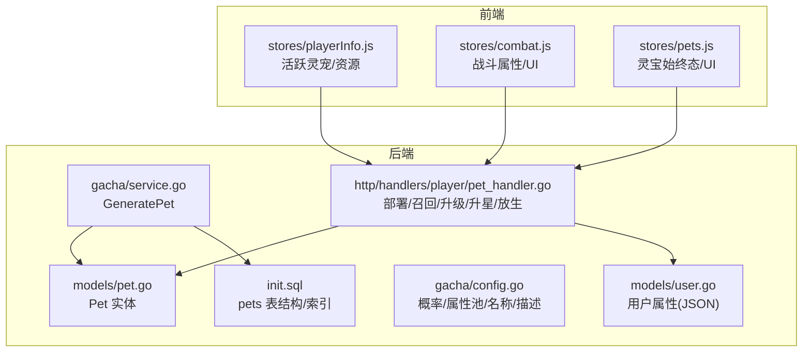
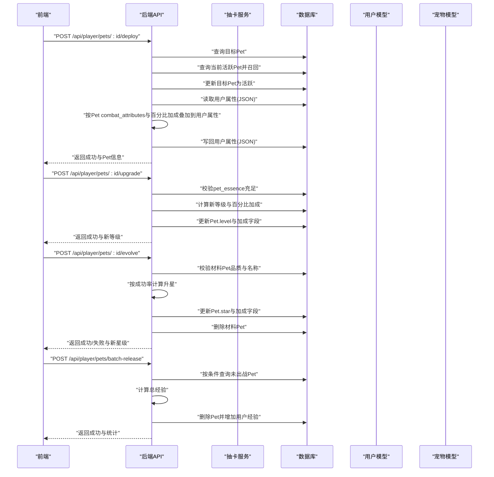
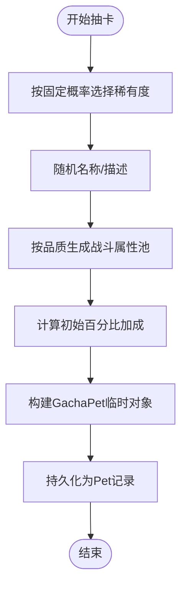
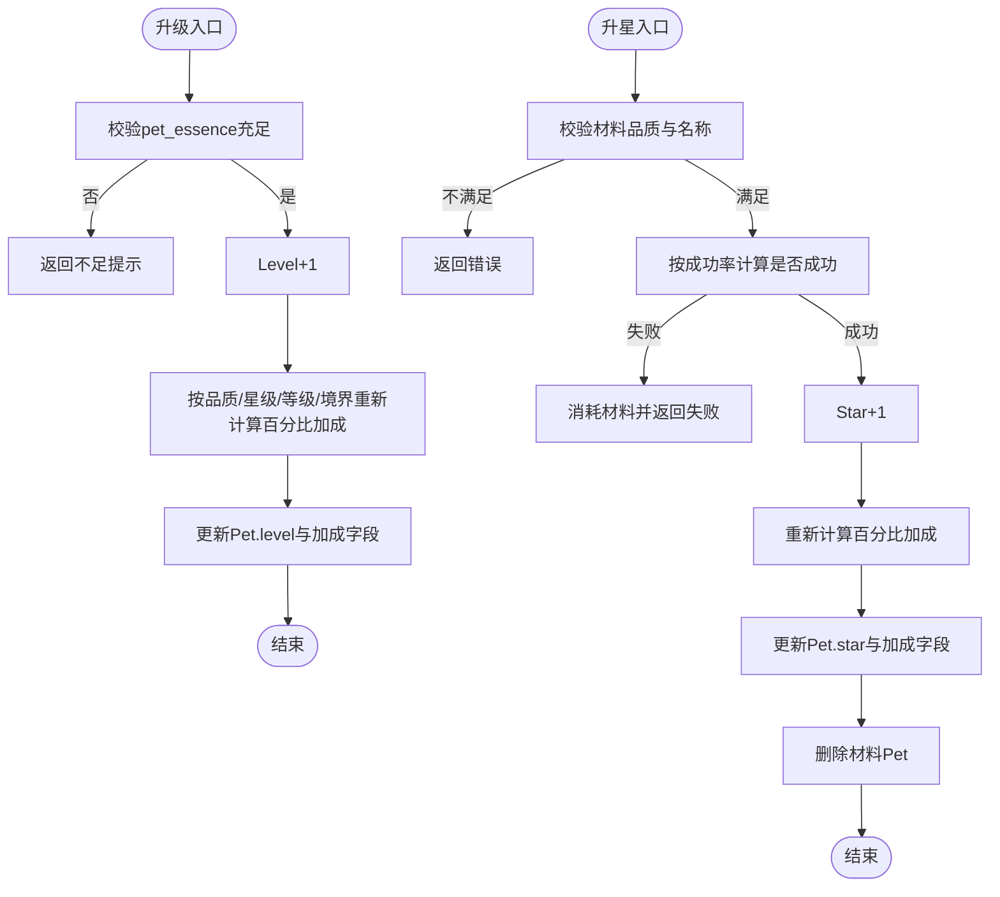
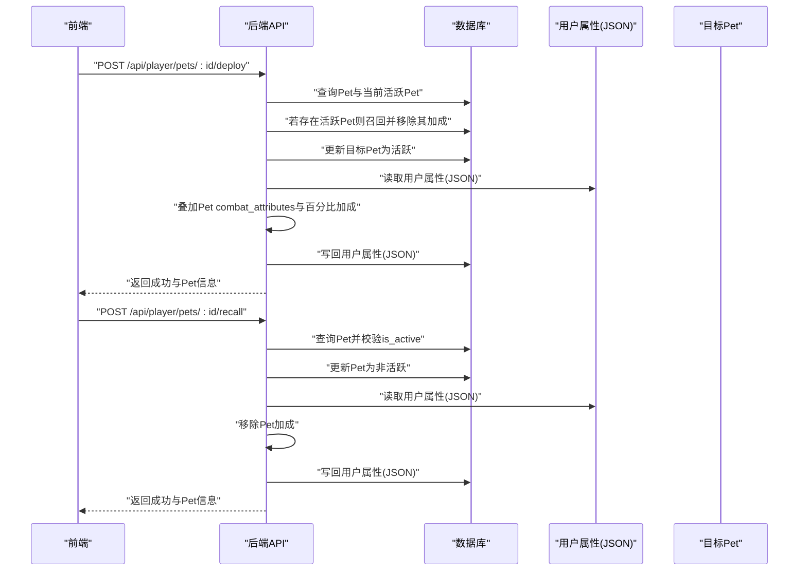
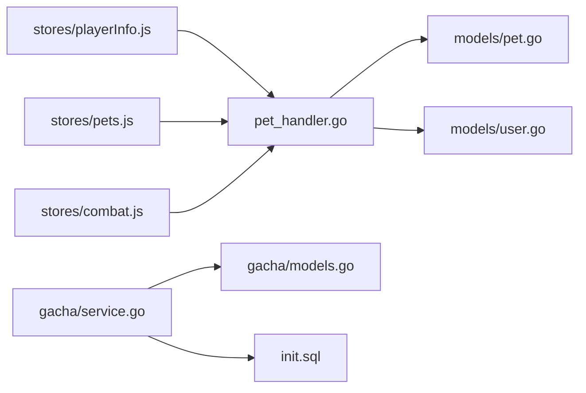

# 灵宠模型

<cite>
**本文引用的文件**
- [server-go/internal/models/pet.go](file://server-go/internal/models/pet.go)
- [server-go/init.sql](file://server-go/init.sql)
- [server-go/internal/gacha/models.go](file://server-go/internal/gacha/models.go)
- [server-go/internal/gacha/service.go](file://server-go/internal/gacha/service.go)
- [server-go/internal/gacha/config.go](file://server-go/internal/gacha/config.go)
- [server-go/internal/http/handlers/player/pet_handler.go](file://server-go/internal/http/handlers/player/pet_handler.go)
- [server-go/internal/models/user.go](file://server-go/internal/models/user.go)
- [server-go/internal/exploration/models.go](file://server-go/internal/exploration/models.go)
- [灵宠系统需求文档.md](file://灵宠系统需求文档.md)
- [src/stores/playerInfo.js](file://src/stores/playerInfo.js)
- [src/stores/combat.js](file://src/stores/combat.js)
- [src/stores/pets.js](file://src/stores/pets.js)
</cite>

## 目录
1. [简介](#简介)
2. [项目结构](#项目结构)
3. [核心组件](#核心组件)
4. [架构总览](#架构总览)
5. [详细组件分析](#详细组件分析)
6. [依赖分析](#依赖分析)
7. [性能考量](#性能考量)
8. [故障排查指南](#故障排查指南)
9. [结论](#结论)
10. [附录](#附录)

## 简介
本文件系统化文档化“灵宠模型”，结合后端模型与数据库初始化脚本，全面阐述 Pet 实体的关键字段、约束与业务规则；解析灵宠成长机制（等级、星级、属性成长与加成算法）；说明灵宠与用户的绑定关系（一对多）；并给出灵宠在探索、战斗等模块中的状态同步方式。同时，依据“灵宠系统需求文档”对抽卡后初始化数据的流程进行说明，并举例数据库存储与查询模式。

## 项目结构
围绕灵宠模型的相关文件分布如下：
- 后端模型与数据库初始化
  - server-go/internal/models/pet.go：Pet 实体定义
  - server-go/init.sql：pets 表结构与索引
  - server-go/internal/models/user.go：用户属性（基础、战斗、抗性、特殊）
- 抽卡与初始化
  - server-go/internal/gacha/models.go：抽卡生成的临时结构（含 GachaPet）
  - server-go/internal/gacha/service.go：GeneratePet 将抽卡产物持久化为 Pet
  - server-go/internal/gacha/config.go：抽卡概率、属性池与名称/描述配置
- 灵宠业务接口
  - server-go/internal/http/handlers/player/pet_handler.go：部署/召回、升级、升星、批量放生
- 前端状态与展示
  - src/stores/playerInfo.js：玩家基础与战斗属性、活跃灵宠
  - src/stores/combat.js：战斗属性、抗性、特殊属性（UI 展示）
  - src/stores/pets.js：灵宝始终态（UI 展示）

图表来源
- [server-go/internal/models/pet.go](file://server-go/internal/models/pet.go#L1-L35)
- [server-go/internal/models/user.go](file://server-go/internal/models/user.go#L1-L48)
- [server-go/internal/gacha/service.go](file://server-go/internal/gacha/service.go#L55-L106)
- [server-go/internal/gacha/config.go](file://server-go/internal/gacha/config.go#L16-L25)
- [server-go/internal/http/handlers/player/pet_handler.go](file://server-go/internal/http/handlers/player/pet_handler.go#L1-L628)
- [server-go/init.sql](file://server-go/init.sql#L85-L103)
- [src/stores/playerInfo.js](file://src/stores/playerInfo.js#L1-L112)
- [src/stores/combat.js](file://src/stores/combat.js#L1-L45)
- [src/stores/pets.js](file://src/stores/pets.js#L1-L11)

章节来源
- [server-go/internal/models/pet.go](file://server-go/internal/models/pet.go#L1-L35)
- [server-go/init.sql](file://server-go/init.sql#L85-L103)
- [server-go/internal/gacha/service.go](file://server-go/internal/gacha/service.go#L55-L106)
- [server-go/internal/http/handlers/player/pet_handler.go](file://server-go/internal/http/handlers/player/pet_handler.go#L1-L628)
- [src/stores/playerInfo.js](file://src/stores/playerInfo.js#L1-L112)

## 核心组件
- Pet 实体（后端模型）
  - 关键字段：ID、UserID、PetID、Name、Type、Rarity、Level、Star、Experience、MaxExperience、Quality、CombatAttributes、IsActive、AttackBonus、DefenseBonus、HealthBonus
  - 约束：ID 主键；UserID 外键关联 users；IsActive 控制是否出战；Experience/MaxExperience 用于升级判定
- 用户属性（后端模型）
  - BaseAttributes、CombatAttributes、CombatResistance、SpecialAttributes 以 JSON 存储，用于承载灵宠加成
- 抽卡生成
  - GachaPet 临时结构包含 id、name、type、rarity、level、star、exp、description、combat_attributes、attack_bonus、defense_bonus、health_bonus 等
  - GeneratePet 将 GachaPet 转换为持久化的 Pet 记录
- 灵宠业务接口
  - 部署/召回：将某只 Pet 标记为 is_active，并将 Pet 的 combat_attributes 与百分比加成叠加到用户属性 JSON
  - 升级：消耗 pet_essence，提升 Level，并按品质/星级/等级/境界计算新的百分比加成
  - 升星：消耗同品质且同名的 Pet，按成功率提升 Star，并重新计算百分比加成
  - 批量放生：按未出战且可选品质过滤，计算经验并删除记录，增加用户经验

章节来源
- [server-go/internal/models/pet.go](file://server-go/internal/models/pet.go#L1-L35)
- [server-go/internal/models/user.go](file://server-go/internal/models/user.go#L1-L48)
- [server-go/internal/gacha/models.go](file://server-go/internal/gacha/models.go#L28-L45)
- [server-go/internal/gacha/service.go](file://server-go/internal/gacha/service.go#L55-L106)
- [server-go/internal/http/handlers/player/pet_handler.go](file://server-go/internal/http/handlers/player/pet_handler.go#L1-L628)

## 架构总览
灵宠系统围绕“抽卡生成 -> 持久化 -> 状态管理 -> 属性叠加/移除”的闭环工作流运行。前端仅负责 UI 与交互，所有状态变更与属性计算由后端完成。

图表来源
- [server-go/internal/http/handlers/player/pet_handler.go](file://server-go/internal/http/handlers/player/pet_handler.go#L1-L628)
- [server-go/internal/gacha/service.go](file://server-go/internal/gacha/service.go#L55-L106)
- [server-go/internal/models/user.go](file://server-go/internal/models/user.go#L1-L48)
- [server-go/internal/models/pet.go](file://server-go/internal/models/pet.go#L1-L35)

## 详细组件分析

### 数据模型与约束
- Pet 实体字段与含义
  - ID：UUID，主键
  - UserID：整型，外键关联 users(id)
  - PetID：字符串，抽卡生成时的临时唯一标识，便于后续关联或去重
  - Name/Type/Rarity：字符串，分别表示名称、实体类型（固定为 pet）、稀有度
  - Level/Star：整型，等级与星级
  - Experience/MaxExperience：整型，经验值与升级所需最大经验值
  - Quality/CombatAttributes：JSON，品质元信息与战斗属性集合
  - IsActive：布尔，是否为活跃（出战）
  - AttackBonus/DefenseBonus/HealthBonus：浮点，百分比加成
- 数据库约束与索引
  - pets 表主键 id；外键 user_id 引用 users(id)
  - idx_pets_user_id 索引，加速按用户查询
- 用户属性 JSON 结构
  - base_attributes、combat_attributes、combat_resistance、special_attributes 均为 JSON，用于承载灵宠加成

章节来源
- [server-go/internal/models/pet.go](file://server-go/internal/models/pet.go#L1-L35)
- [server-go/init.sql](file://server-go/init.sql#L85-L103)
- [server-go/internal/models/user.go](file://server-go/internal/models/user.go#L1-L48)

### 抽卡与初始化流程
- 抽卡概率
  - 灵宠稀有度概率：mythic 0.1%、legendary 0.3%、epic 1.6%、rare 3%、uncommon 15%、common 80%
- 抽卡生成
  - GachaPet 包含 id、name、type、rarity、level、star、exp、description、combat_attributes、attack_bonus、defense_bonus、health_bonus 等
  - GenerateRandomPet 根据概率选择稀有度，随机名称与描述，生成 combat_attributes，并计算初始百分比加成
- 初始化持久化
  - GeneratePet 将 GachaPet 转换为 Pet 记录，设置默认 level/star/experience，写入 combat_attributes 与百分比加成，初始 is_active=false

图表来源
- [server-go/internal/gacha/config.go](file://server-go/internal/gacha/config.go#L16-L25)
- [server-go/internal/gacha/models.go](file://server-go/internal/gacha/models.go#L127-L186)
- [server-go/internal/gacha/service.go](file://server-go/internal/gacha/service.go#L55-L106)

章节来源
- [server-go/internal/gacha/config.go](file://server-go/internal/gacha/config.go#L16-L25)
- [server-go/internal/gacha/models.go](file://server-go/internal/gacha/models.go#L127-L186)
- [server-go/internal/gacha/service.go](file://server-go/internal/gacha/service.go#L55-L106)

### 成长机制与属性算法
- 升级（Upgrade）
  - 消耗 pet_essence，Level+1
  - 百分比加成计算：基于品质基础加成、星级加成、等级加成、境界加成
  - 境界按星级每 5 星为 1 境，每境提供基础加成的 0.5 倍
- 升星（Evolve）
  - 消耗同品质且同名的 Pet 作为材料
  - 成功率：同名 100%，不同名 30%
  - 成功后 Star+1，重新计算百分比加成
- 批量放生（Batch Release）
  - 条件：未出战且可选品质过滤
  - 经验计算：对每只 Pet 取整计算经验并求和，然后删除记录并增加用户经验

图表来源
- [server-go/internal/http/handlers/player/pet_handler.go](file://server-go/internal/http/handlers/player/pet_handler.go#L382-L562)

章节来源
- [server-go/internal/http/handlers/player/pet_handler.go](file://server-go/internal/http/handlers/player/pet_handler.go#L382-L562)

### 状态同步与绑定关系
- 绑定关系
  - 一对多：users(id) -> pets(user_id)
  - 索引 idx_pets_user_id 提升查询效率
- 状态同步
  - 部署（Deploy）：将目标 Pet 标记为 is_active=true；若已有活跃 Pet，则先召回旧 Pet，再将新 Pet 的 combat_attributes 与百分比加成叠加到用户属性 JSON
  - 召回（Recall）：将目标 Pet 标记为 is_active=false；从用户属性 JSON 中移除对应加成
  - 前端仅持有 UI 状态（activePet），最终以后端返回为准

图表来源
- [server-go/internal/http/handlers/player/pet_handler.go](file://server-go/internal/http/handlers/player/pet_handler.go#L1-L380)
- [server-go/internal/models/user.go](file://server-go/internal/models/user.go#L1-L48)

章节来源
- [server-go/internal/http/handlers/player/pet_handler.go](file://server-go/internal/http/handlers/player/pet_handler.go#L1-L380)
- [src/stores/playerInfo.js](file://src/stores/playerInfo.js#L1-L112)

### 探索与战斗中的状态联动
- 探索模块
  - 探索事件与战斗事件独立于灵宠系统，但灵宠加成在部署状态下由后端统一写入用户属性 JSON，从而影响探索/战斗的全局属性
- 战斗模块
  - 前端 combat.js 仅用于 UI 展示，实际加成由后端在部署/召回时计算并写回用户属性 JSON
- WebSocket/状态推送
  - 灵宠部署/召回会触发用户属性变更，建议通过 WebSocket 或刷新玩家数据接口同步到前端

章节来源
- [server-go/internal/exploration/models.go](file://server-go/internal/exploration/models.go#L1-L128)
- [src/stores/combat.js](file://src/stores/combat.js#L1-L45)

## 依赖分析
- 组件耦合
  - pet_handler 依赖 models.Pet、models.User 与数据库层
  - gacha.service 依赖 gacha.models 与数据库层
  - 前端 stores 仅用于 UI 展示，不参与业务计算
- 外部依赖
  - GORM JSON 字段用于用户属性与宠物属性的序列化/反序列化
  - 抽卡概率与属性池来自 gacha.config

图表来源
- [server-go/internal/http/handlers/player/pet_handler.go](file://server-go/internal/http/handlers/player/pet_handler.go#L1-L628)
- [server-go/internal/gacha/service.go](file://server-go/internal/gacha/service.go#L55-L106)
- [server-go/internal/gacha/models.go](file://server-go/internal/gacha/models.go#L28-L45)
- [server-go/init.sql](file://server-go/init.sql#L85-L103)
- [src/stores/playerInfo.js](file://src/stores/playerInfo.js#L1-L112)
- [src/stores/pets.js](file://src/stores/pets.js#L1-L11)
- [src/stores/combat.js](file://src/stores/combat.js#L1-L45)

章节来源
- [server-go/internal/http/handlers/player/pet_handler.go](file://server-go/internal/http/handlers/player/pet_handler.go#L1-L628)
- [server-go/internal/gacha/service.go](file://server-go/internal/gacha/service.go#L55-L106)
- [src/stores/playerInfo.js](file://src/stores/playerInfo.js#L1-L112)

## 性能考量
- 查询优化
  - 为 pets.user_id 建立索引，避免频繁扫描
  - 部署/召回时尽量减少多次读取，合并更新
- JSON 字段处理
  - 用户属性与宠物属性均为 JSON，注意序列化/反序列化成本；避免频繁大对象写回
- 批量放生
  - 一次性删除多条记录并批量更新用户经验，减少事务次数

章节来源
- [server-go/init.sql](file://server-go/init.sql#L154-L166)
- [server-go/internal/http/handlers/player/pet_handler.go](file://server-go/internal/http/handlers/player/pet_handler.go#L564-L628)

## 故障排查指南
- 常见问题
  - 灵宠未找到：检查 user_id 与 pet_id/id 是否匹配
  - 灵宠精华不足：确认用户 pet_essence 是否足够
  - 升星失败：检查材料是否同品质且名称是否一致
  - 批量放生无记录：确认 is_active=false 且 rarity 过滤是否正确
- 日志定位
  - 抽卡与部署/召回均有日志输出，可用于核对属性变化
- 前端同步
  - 部署/召回后，前端应刷新玩家数据以获取最新属性

章节来源
- [server-go/internal/http/handlers/player/pet_handler.go](file://server-go/internal/http/handlers/player/pet_handler.go#L1-L628)
- [server-go/internal/gacha/service.go](file://server-go/internal/gacha/service.go#L55-L106)

## 结论
灵宠系统通过明确的数据模型、严格的约束与清晰的业务接口，实现了从抽卡到部署/召回、升级/升星、批量放生的完整闭环。属性加成完全由后端计算并写回用户属性 JSON，前端仅负责 UI 展示与交互，保证了状态一致性与可维护性。建议在后续迭代中进一步完善 WebSocket 推送与前端刷新策略，确保跨模块状态实时同步。

## 附录

### 数据库存储与查询模式示例
- 存储形式
  - pets 表：包含 id、user_id、pet_id、name、type、rarity、level、star、experience、max_experience、quality（JSON）、combat_attributes（JSON）、is_active、attack_bonus、defense_bonus、health_bonus
  - users 表：包含 id、username、level、realm、spirit、pet_essence、base_attributes（JSON）、combat_attributes（JSON）、combat_resistance（JSON）、special_attributes（JSON）等
- 查询模式
  - 按用户查询宠物：SELECT * FROM pets WHERE user_id = ?
  - 按用户与活跃状态查询：SELECT * FROM pets WHERE user_id = ? AND is_active = ?
  - 按用户与 pet_id 查询：SELECT * FROM pets WHERE user_id = ? AND pet_id = ?

章节来源
- [server-go/init.sql](file://server-go/init.sql#L85-L103)
- [server-go/internal/models/pet.go](file://server-go/internal/models/pet.go#L1-L35)
- [server-go/internal/models/user.go](file://server-go/internal/models/user.go#L1-L48)

### 灵宠系统需求要点对照
- 品质体系与概率：与抽卡概率配置一致
- 出战/召回：后端统一管理，前端仅发起请求
- 升级/升星：消耗资源、按算法计算加成
- 批量放生：按品质过滤、计算经验并删除记录
- 属性加成：后端集中计算并写回用户属性 JSON

章节来源
- [灵宠系统需求文档.md](file://灵宠系统需求文档.md#L1-L211)
- [server-go/internal/gacha/config.go](file://server-go/internal/gacha/config.go#L16-L25)
- [server-go/internal/http/handlers/player/pet_handler.go](file://server-go/internal/http/handlers/player/pet_handler.go#L1-L628)