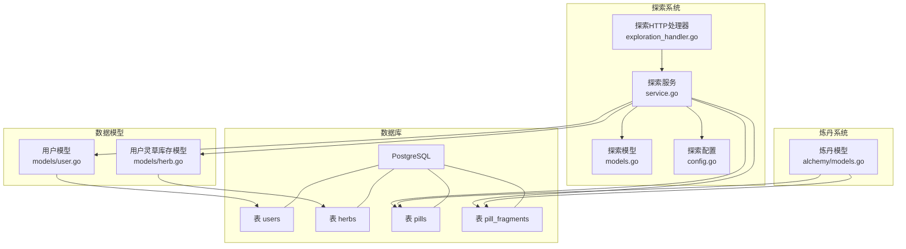
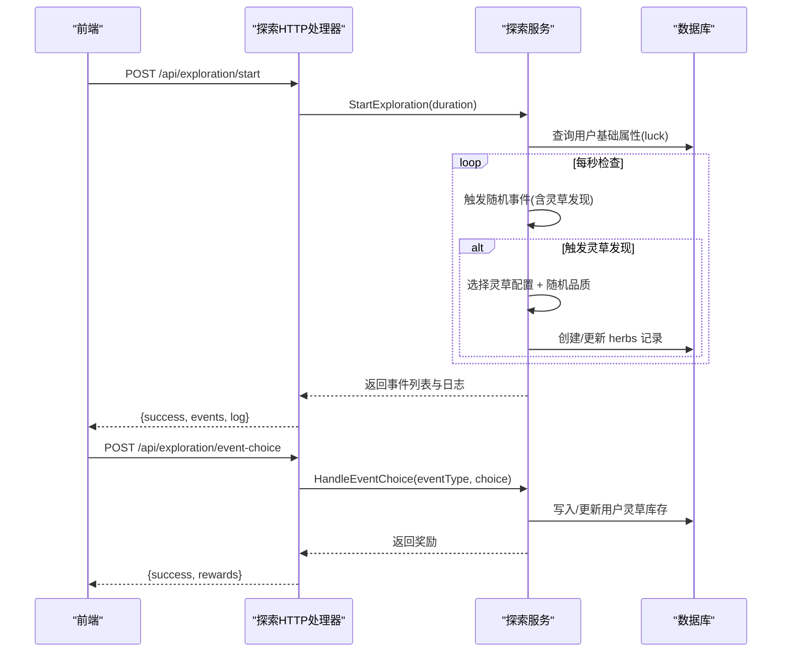
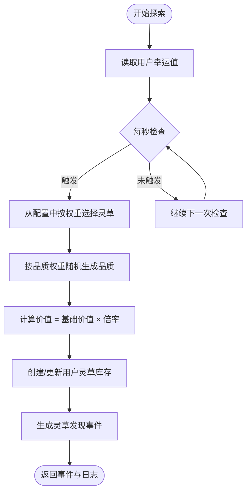
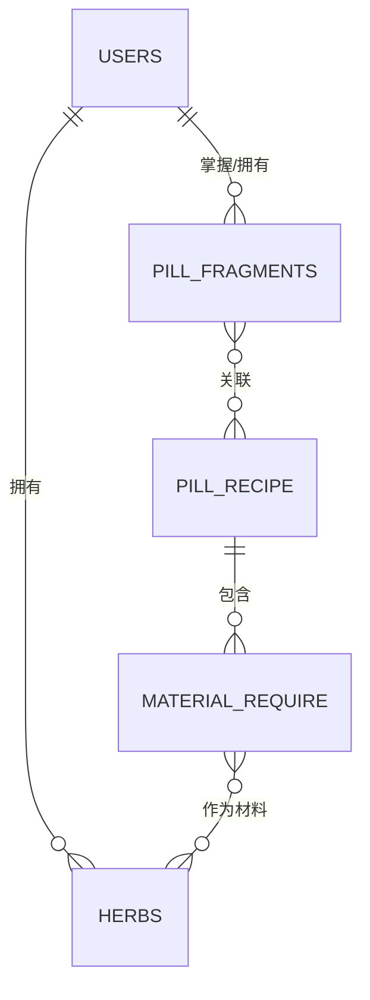
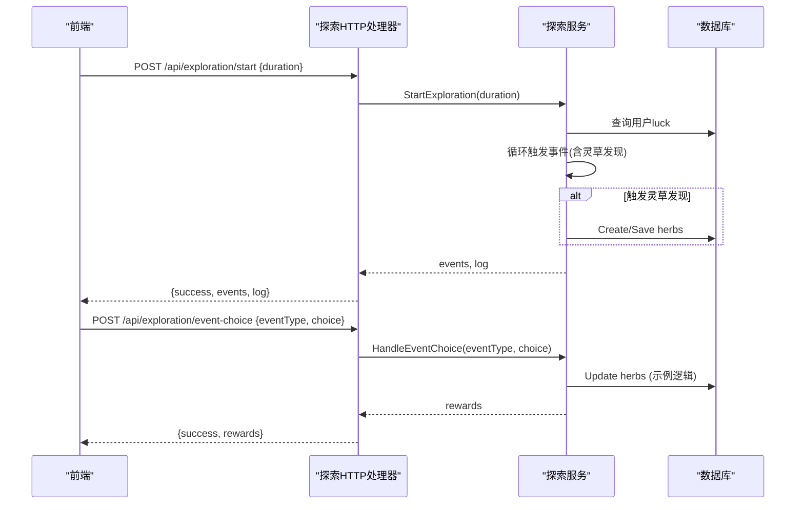
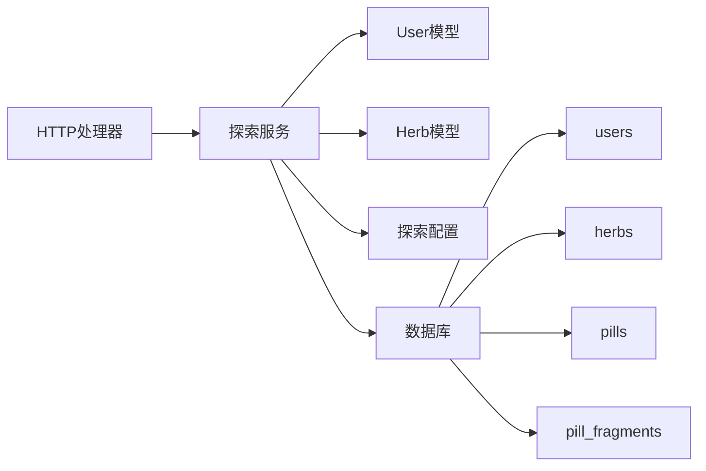

# 灵草模型

<cite>
**本文引用的文件**
- [herb.go](file://server-go/internal/models/herb.go)
- [init.sql](file://server-go/init.sql)
- [models.go](file://server-go/internal/exploration/models.go)
- [service.go](file://server-go/internal/exploration/service.go)
- [config.go](file://server-go/internal/exploration/config.go)
- [user.go](file://server-go/internal/models/user.go)
- [alchemy_models.go](file://server-go/internal/alchemy/models.go)
- [exploration_handler.go](file://server-go/internal/http/handlers/exploration/exploration.go)
- [后端探索系统实现指南.md](file://开发文档/后端探索系统实现指南.md)
</cite>

## 目录
1. [简介](#简介)
2. [项目结构](#项目结构)
3. [核心组件](#核心组件)
4. [架构总览](#架构总览)
5. [详细组件分析](#详细组件分析)
6. [依赖分析](#依赖分析)
7. [性能考虑](#性能考虑)
8. [故障排查指南](#故障排查指南)
9. [结论](#结论)

## 简介
本文件围绕“灵草模型”展开，结合后端探索系统实现指南与仓库现有代码，系统性说明：
- 灵草实体在数据库中的字段与约束
- 灵草在探索系统中的生成逻辑（包括地图分布与采集概率）
- 灵草作为炼丹原材料与丹药配方之间的多对多关系（通过中间表或嵌套结构）
- 一次探索任务如何影响用户灵草库存的数据变更

## 项目结构
与灵草模型相关的关键文件与职责如下：
- 数据模型与实体
  - server-go/internal/models/herb.go：定义用户灵草库存实体及表映射
  - server-go/init.sql：初始化数据库表结构，含 herbs 表
- 探索系统
  - server-go/internal/exploration/models.go：探索事件、灵草配置、玩家统计等结构
  - server-go/internal/exploration/service.go：探索服务，包含灵草发现与采集逻辑
  - server-go/internal/exploration/config.go：灵草配置、品质权重、丹药配方配置
  - server-go/internal/http/handlers/exploration/exploration.go：探索接口处理器
  - 开发文档/后端探索系统实现指南.md：探索系统整体实现说明
- 炼丹系统
  - server-go/internal/alchemy/models.go：炼丹侧的灵草与配方数据结构（与探索侧配置相互印证）

图表来源
- [models.go](file://server-go/internal/exploration/models.go#L1-L128)
- [service.go](file://server-go/internal/exploration/service.go#L1-L515)
- [config.go](file://server-go/internal/exploration/config.go#L1-L265)
- [herb.go](file://server-go/internal/models/herb.go#L1-L17)
- [user.go](file://server-go/internal/models/user.go#L1-L48)
- [init.sql](file://server-go/init.sql#L47-L54)
- [alchemy_models.go](file://server-go/internal/alchemy/models.go#L1-L198)
- [exploration_handler.go](file://server-go/internal/http/handlers/exploration/exploration.go#L1-L110)

章节来源
- [后端探索系统实现指南.md](file://开发文档/后端探索系统实现指南.md#L1-L239)
- [init.sql](file://server-go/init.sql#L47-L54)

## 核心组件
- 用户灵草库存实体（models/herb.go）
  - 字段：id、user_id、herb_id、name、count
  - 表名：herbs
  - 关系：与 users 表外键关联（user_id -> users.id）
- 探索侧灵草配置与事件（exploration/models.go、config.go）
  - 灵草配置 HerbConfig：包含 id、name、description、base_value、category、chance
  - 灵草品质 HerbQualities：common/uncommon/rare/epic/legendary 及倍率
  - 探索事件 ExplorationEvent：包含 type、description、item、amount、herb、recipeId、fragments、choices
- 探索服务（exploration/service.go）
  - 灵草发现事件：随机选择一种灵草，按品质权重随机生成品质，计算价值，创建/更新用户灵草库存
  - 事件选择处理：根据 eventType 调用相应处理逻辑（此处以灵草为例）
- HTTP 处理器（exploration/exploration.go）
  - /api/exploration/start：开始探索，返回事件列表与日志
  - /api/exploration/event-choice：处理事件选择，返回奖励

章节来源
- [herb.go](file://server-go/internal/models/herb.go#L1-L17)
- [init.sql](file://server-go/init.sql#L47-L54)
- [models.go](file://server-go/internal/exploration/models.go#L1-L128)
- [config.go](file://server-go/internal/exploration/config.go#L1-L265)
- [service.go](file://server-go/internal/exploration/service.go#L1-L515)
- [exploration_handler.go](file://server-go/internal/http/handlers/exploration/exploration.go#L1-L110)

## 架构总览
探索系统采用“前端展示 + 后端服务”的分层架构。前端通过 HTTP 接口发起探索与事件选择，后端服务层根据配置与概率生成事件，并持久化更新用户数据。

图表来源
- [exploration_handler.go](file://server-go/internal/http/handlers/exploration/exploration.go#L1-L110)
- [service.go](file://server-go/internal/exploration/service.go#L1-L515)
- [config.go](file://server-go/internal/exploration/config.go#L1-L265)

## 详细组件分析

### 灵草实体与数据库约束
- 表结构（init.sql）
  - herbs 表字段：id、user_id、herb_id、name、count
  - user_id 引用 users(id)，形成一对多关系（用户 -> 多个灵草条目）
  - count 默认 0，表示初始库存为 0
- 实体映射（models/herb.go）
  - Herb 结构体字段与表列一一对应
  - TableName 返回 "herbs"，与 init.sql 保持一致
- 约束与索引
  - init.sql 为 herbs.user_id 建立索引，便于按用户查询库存
  - 未见唯一约束，允许多个同种 herb_id 的记录（可能按 name 区分用途）

章节来源
- [init.sql](file://server-go/init.sql#L47-L54)
- [herb.go](file://server-go/internal/models/herb.go#L1-L17)

### 探索系统中的灵草生成逻辑
- 事件触发概率
  - 探索服务根据用户幸运值计算事件触发概率，基础概率约为 30% × luck
  - 每秒进行一次事件检查，持续时长取决于探索时长
- 灵草发现事件
  - 从 HerbConfigs 中随机选择一种灵草（按 chance 权重）
  - 按品质权重随机生成品质（common/uncommon/rare/epic/legendary）
  - 计算价值：value = base_value × 品质倍率
  - 创建/更新用户灵草库存（herbs 表）
- 地图分布与采集概率
  - 仓库未提供“地图分布”与“采集难度”字段或算法实现
  - 探索侧的 chance 来源于 HerbConfigs，属于全局掉落权重
  - 若需实现“地图分布”，可在 HerbConfigs 中扩展字段（例如 category、zone、difficulty），并在服务层按地图筛选候选列表

图表来源
- [service.go](file://server-go/internal/exploration/service.go#L1-L515)
- [config.go](file://server-go/internal/exploration/config.go#L1-L265)

章节来源
- [service.go](file://server-go/internal/exploration/service.go#L1-L515)
- [config.go](file://server-go/internal/exploration/config.go#L1-L265)
- [后端探索系统实现指南.md](file://开发文档/后端探索系统实现指南.md#L160-L181)

### 灵草与丹药配方的多对多关系
- 探索侧（炼丹系统）的材料需求
  - 炼丹模型中定义了 RecipeConfig.MaterialRequire，包含 herbId 与 count
  - 该结构体现了“配方 -> 灵草”的多对多关系：一个配方可包含多种灵草，一种灵草可出现在多个配方中
- 数据库存储
  - 炼丹系统使用 pill_fragments 表记录“用户已掌握的丹方”与“残页数量”
  - 灵草库存使用 herbs 表记录“用户拥有的灵草数量”
  - 两者通过各自的中间结构（配方材料需求、用户库存）间接建立多对多关系
- 前端与后端的衔接
  - 前端通过 Alchemy.vue 与 pills.js 展示配方与材料需求
  - 后端通过 AlchemyService.CraftPill 等服务进行炼制判定与库存消耗（仓库未贴出具体实现，但数据结构与关系已明确）

图表来源
- [init.sql](file://server-go/init.sql#L47-L54)
- [alchemy_models.go](file://server-go/internal/alchemy/models.go#L1-L198)

章节来源
- [alchemy_models.go](file://server-go/internal/alchemy/models.go#L1-L198)
- [init.sql](file://server-go/init.sql#L47-L54)

### 一次探索任务如何影响用户灵草库存
- 探索开始
  - 前端调用 /api/exploration/start，传入 duration
  - 后端服务根据幸运值计算事件触发概率，模拟多次事件检查
- 灵草发现
  - 若触发“灵草发现”事件，则从 HerbConfigs 中随机选择一种灵草
  - 随机生成品质，计算价值
  - 在 herbs 表中创建或更新对应记录（user_id、herb_id、name、count）
- 事件选择
  - 前端展示事件，用户选择“收起灵草”
  - 后端调用 HandleEventChoice，内部示例逻辑会再次检查/更新用户灵草库存（此处为示例，实际以探索侧 handleHerbFound 为准）

图表来源
- [exploration_handler.go](file://server-go/internal/http/handlers/exploration/exploration.go#L1-L110)
- [service.go](file://server-go/internal/exploration/service.go#L1-L515)

章节来源
- [exploration_handler.go](file://server-go/internal/http/handlers/exploration/exploration.go#L1-L110)
- [service.go](file://server-go/internal/exploration/service.go#L1-L515)

## 依赖分析
- 探索服务依赖
  - models.User：读取 luck 与基础属性
  - exploration.HerbConfigs/HerbQualities：掉落权重与品质倍率
  - models.Herb：创建/更新用户灵草库存
- 数据库依赖
  - users.herbs：用户与灵草库存的一对多
  - pills/pill_fragments：炼丹系统相关表（用于多对多关系的间接体现）
- 前后端依赖
  - HTTP 处理器将请求转换为服务层调用，服务层负责业务逻辑与数据持久化

图表来源
- [exploration_handler.go](file://server-go/internal/http/handlers/exploration/exploration.go#L1-L110)
- [service.go](file://server-go/internal/exploration/service.go#L1-L515)
- [user.go](file://server-go/internal/models/user.go#L1-L48)
- [herb.go](file://server-go/internal/models/herb.go#L1-L17)
- [init.sql](file://server-go/init.sql#L47-L54)

章节来源
- [service.go](file://server-go/internal/exploration/service.go#L1-L515)
- [user.go](file://server-go/internal/models/user.go#L1-L48)
- [herb.go](file://server-go/internal/models/herb.go#L1-L17)
- [init.sql](file://server-go/init.sql#L47-L54)

## 性能考虑
- 事件触发频率
  - 每秒检查一次，探索时长越长，循环次数越多
  - 建议对长时间探索进行节流或分批处理
- 数据库写入
  - 灵草发现与事件选择均涉及写库，建议在高频场景下合并写入或使用事务
- 配置缓存
  - HerbConfigs 与 HerbQualities 可缓存，避免重复创建与序列化开销
- 索引优化
  - herbs.user_id 已建索引，查询与更新性能良好；若扩展字段（如 zone、difficulty），可考虑复合索引

[本节为通用建议，无需特定文件来源]

## 故障排查指南
- 探索接口返回 401 未授权
  - 检查认证中间件是否正确注入 userID
  - 参考处理器对 userID 的提取与校验
- 探索接口返回 400 请求参数错误
  - 检查请求体格式（duration）是否正确
- 灵草未入库或数量异常
  - 检查 eventHerbDiscovery 与 handleHerbFound 的逻辑分支
  - 确认 herbs 表 user_id、herb_id、name、count 字段是否匹配
- 幸运值未生效
  - 检查用户 base_attributes 中 luck 字段是否存在且为数值类型
  - 确认 calculateLuck 的解析逻辑

章节来源
- [exploration_handler.go](file://server-go/internal/http/handlers/exploration/exploration.go#L1-L110)
- [service.go](file://server-go/internal/exploration/service.go#L1-L515)
- [user.go](file://server-go/internal/models/user.go#L1-L48)

## 结论
- 灵草实体在数据库中以 herbs 表呈现，具备 user_id、herb_id、name、count 等字段，并与 users 表建立外键关系
- 探索系统通过配置化的灵草与品质权重实现掉落，事件触发概率受用户幸运值影响
- 灵草与丹药配方之间通过“配方材料需求”体现多对多关系，库存与配方掌握分别由 herbs 与 pill_fragments/pills 间接支撑
- 一次探索任务会通过事件选择影响用户灵草库存，具体逻辑位于探索服务与 HTTP 处理器中