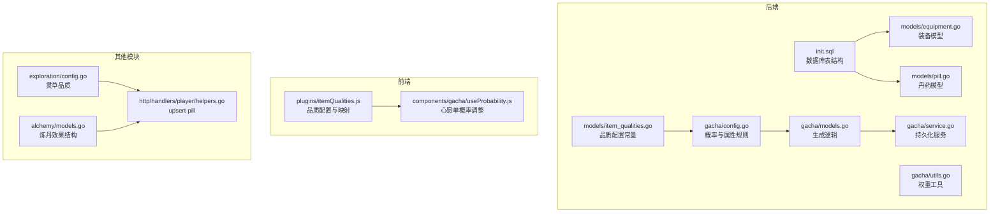
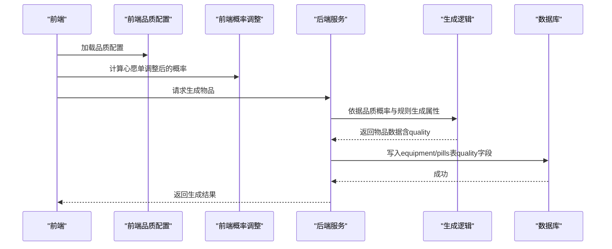
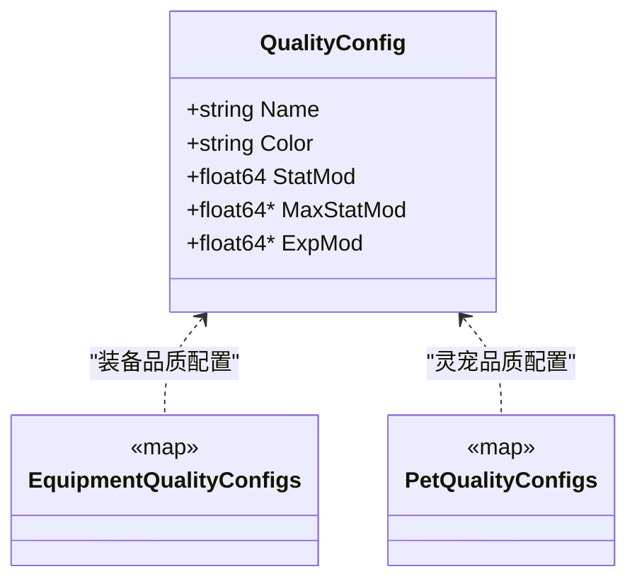
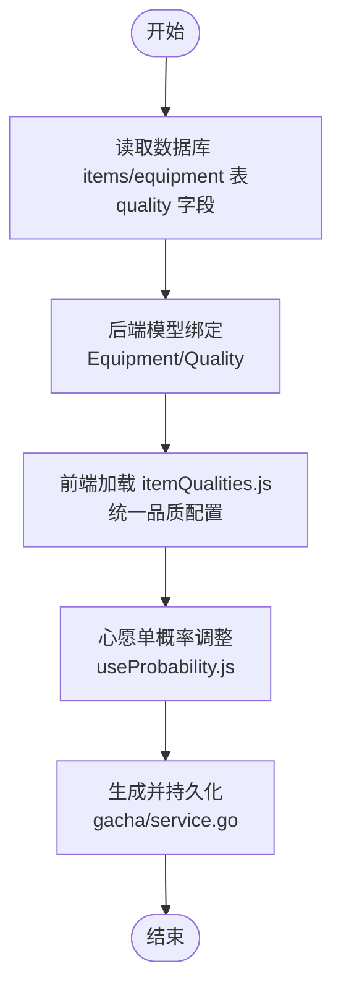
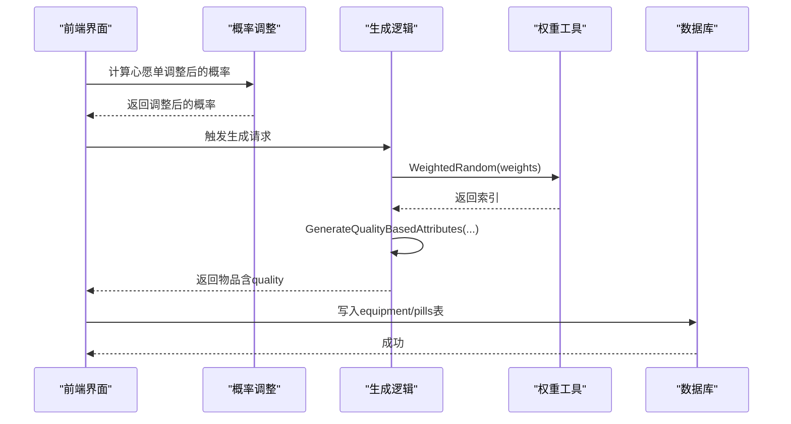
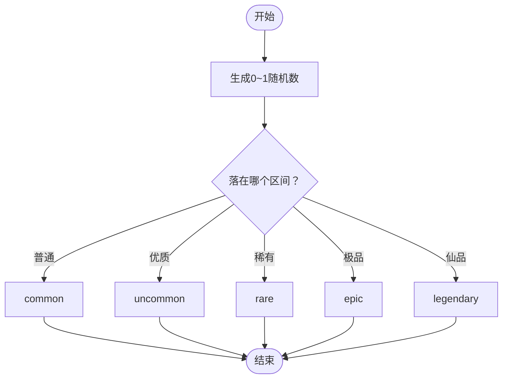
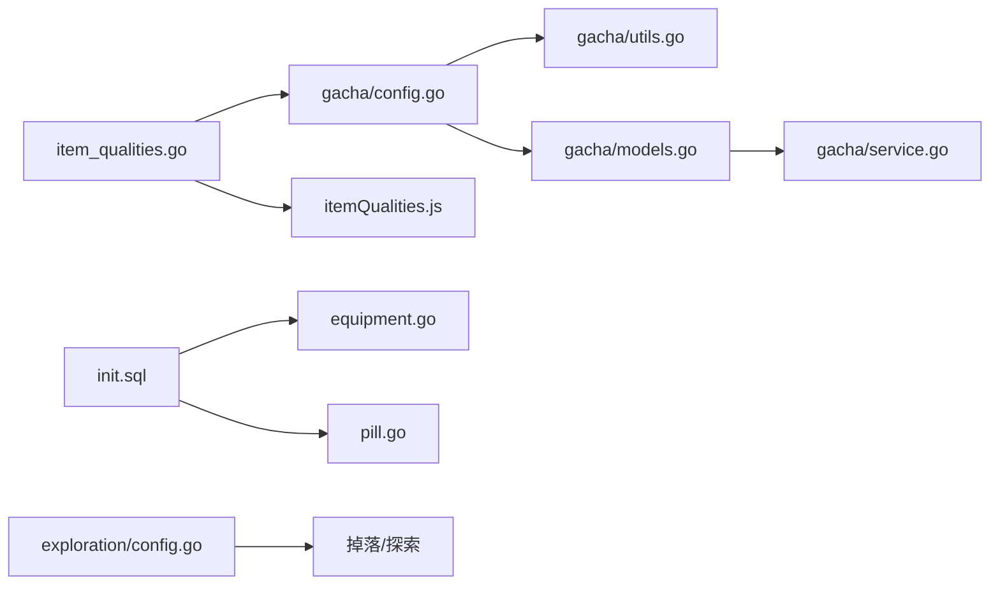

# 物品品质模型

<cite>
**本文引用的文件**
- [server-go/internal/models/item_qualities.go](file://server-go/internal/models/item_qualities.go)
- [server-go/init.sql](file://server-go/init.sql)
- [server-go/internal/models/equipment.go](file://server-go/internal/models/equipment.go)
- [server-go/internal/models/pill.go](file://server-go/internal/models/pill.go)
- [server-go/internal/gacha/config.go](file://server-go/internal/gacha/config.go)
- [server-go/internal/gacha/utils.go](file://server-go/internal/gacha/utils.go)
- [server-go/internal/gacha/models.go](file://server-go/internal/gacha/models.go)
- [server-go/internal/gacha/service.go](file://server-go/internal/gacha/service.go)
- [src/plugins/itemQualities.js](file://src/plugins/itemQualities.js)
- [src/components/gacha/useProbability.js](file://src/components/gacha/useProbability.js)
- [server-go/internal/exploration/config.go](file://server-go/internal/exploration/config.go)
- [server-go/internal/alchemy/models.go](file://server-go/internal/alchemy/models.go)
- [server-go/internal/http/handlers/player/helpers.go](file://server-go/internal/http/handlers/player/helpers.go)
</cite>

## 目录
1. [简介](#简介)
2. [项目结构](#项目结构)
3. [核心组件](#核心组件)
4. [架构总览](#架构总览)
5. [详细组件分析](#详细组件分析)
6. [依赖关系分析](#依赖关系分析)
7. [性能考量](#性能考量)
8. [故障排查指南](#故障排查指南)
9. [结论](#结论)

## 简介
本文件系统化文档化“物品品质系统”的基础模型，围绕后端 Go 模型与数据库表结构、前端品质配置与展示、以及抽奖与掉落算法中的权重配置展开，帮助开发者全面理解：
- 品质等级（凡器、法器、灵器、极品灵器、伪仙器、仙器）的枚举与含义
- 品质字段在不同物品模型（装备、灵草、丹药）中的引用方式与一致性维护
- 品质对属性加成的规则（基础属性、战斗属性、抗性属性、特殊属性）
- 抽奖（gacha）与掉落算法中的权重配置与一致性策略
- 品质系统在整个经济体系中的定位与作用

## 项目结构
与“物品品质系统”直接相关的文件分布如下：
- 后端模型与数据库：item_qualities.go、init.sql、equipment.go、pill.go
- 抽奖系统：config.go、utils.go、models.go、service.go
- 前端品质配置与概率：itemQualities.js、useProbability.js
- 其他涉及品质的模块：探索（灵草品质）、炼丹（配方与效果）

图表来源
- [server-go/internal/models/item_qualities.go](file://server-go/internal/models/item_qualities.go#L1-L96)
- [server-go/init.sql](file://server-go/init.sql#L34-L123)
- [server-go/internal/models/equipment.go](file://server-go/internal/models/equipment.go#L1-L34)
- [server-go/internal/models/pill.go](file://server-go/internal/models/pill.go#L1-L21)
- [server-go/internal/gacha/config.go](file://server-go/internal/gacha/config.go#L1-L198)
- [server-go/internal/gacha/utils.go](file://server-go/internal/gacha/utils.go#L1-L56)
- [server-go/internal/gacha/models.go](file://server-go/internal/gacha/models.go#L71-L161)
- [server-go/internal/gacha/service.go](file://server-go/internal/gacha/service.go#L1-L139)
- [src/plugins/itemQualities.js](file://src/plugins/itemQualities.js#L1-L134)
- [src/components/gacha/useProbability.js](file://src/components/gacha/useProbability.js#L1-L69)
- [server-go/internal/exploration/config.go](file://server-go/internal/exploration/config.go#L1-L265)
- [server-go/internal/alchemy/models.go](file://server-go/internal/alchemy/models.go#L65-L106)
- [server-go/internal/http/handlers/player/helpers.go](file://server-go/internal/http/handlers/player/helpers.go#L437-L471)

章节来源
- [server-go/internal/models/item_qualities.go](file://server-go/internal/models/item_qualities.go#L1-L96)
- [server-go/init.sql](file://server-go/init.sql#L34-L123)

## 核心组件
- 品质配置常量（后端）：定义品质名称、颜色、属性倍率等，分别面向“装备”和“灵宠”两类。
- 数据库表结构：items、equipment、pills 等表均包含 quality 字段，作为内联值存储品质标识。
- 装备模型：Equipment 结构体包含 Quality 字段，用于持久化与查询。
- 丹药模型：Pill 结构体包含 Effect 字段，用于存储炼制后的效果配置。
- 抽奖系统：固定概率配置、权重工具、属性生成规则、生成与持久化流程。
- 前端品质配置：统一的品质配置与映射，以及心愿单概率调整逻辑。
- 掉落与探索：灵草品质配置与价值计算，体现品质在经济体系中的作用。

章节来源
- [server-go/internal/models/item_qualities.go](file://server-go/internal/models/item_qualities.go#L1-L96)
- [server-go/init.sql](file://server-go/init.sql#L34-L123)
- [server-go/internal/models/equipment.go](file://server-go/internal/models/equipment.go#L1-L34)
- [server-go/internal/models/pill.go](file://server-go/internal/models/pill.go#L1-L21)
- [server-go/internal/gacha/config.go](file://server-go/internal/gacha/config.go#L1-L198)
- [server-go/internal/gacha/utils.go](file://server-go/internal/gacha/utils.go#L1-L56)
- [src/plugins/itemQualities.js](file://src/plugins/itemQualities.js#L1-L134)
- [server-go/internal/exploration/config.go](file://server-go/internal/exploration/config.go#L1-L265)

## 架构总览
品质系统贯穿“前端配置—后端规则—数据库存储—业务生成—持久化”的闭环：
- 前端提供品质名称、颜色、倍率等配置，并在抽奖界面做心愿单概率微调。
- 后端提供固定概率与属性生成规则，使用权重工具进行随机决策。
- 数据库以内联值形式存储 quality 字段，保证跨模块一致性。
- 业务层在生成物品后将其持久化到相应表，供后续展示与使用。

图表来源
- [src/plugins/itemQualities.js](file://src/plugins/itemQualities.js#L1-L134)
- [src/components/gacha/useProbability.js](file://src/components/gacha/useProbability.js#L1-L69)
- [server-go/internal/gacha/config.go](file://server-go/internal/gacha/config.go#L1-L198)
- [server-go/internal/gacha/utils.go](file://server-go/internal/gacha/utils.go#L1-L56)
- [server-go/internal/gacha/models.go](file://server-go/internal/gacha/models.go#L71-L161)
- [server-go/internal/gacha/service.go](file://server-go/internal/gacha/service.go#L1-L139)
- [server-go/init.sql](file://server-go/init.sql#L34-L123)

## 详细组件分析

### 品质等级与加成规则
- 品质枚举与名称：common、uncommon、rare、epic、legendary、mythic，分别对应“凡器、法器、灵器、极品灵器、伪仙器、仙器”等中文名称。
- 装备品质加成：
  - StatMod：基础属性倍率
  - MaxStatMod：最大属性倍率（仅装备）
- 灵宠品质加成：
  - StatMod：基础属性倍率
  - ExpMod：经验加成倍率（仅灵宠）
- 前端与后端的品质配置保持一致，避免命名差异导致的数据不一致。

图表来源
- [server-go/internal/models/item_qualities.go](file://server-go/internal/models/item_qualities.go#L1-L96)
- [src/plugins/itemQualities.js](file://src/plugins/itemQualities.js#L1-L82)

章节来源
- [server-go/internal/models/item_qualities.go](file://server-go/internal/models/item_qualities.go#L1-L96)
- [src/plugins/itemQualities.js](file://src/plugins/itemQualities.js#L1-L82)

### 品质字段在物品模型中的引用与一致性维护
- 数据库层面：
  - items 表包含 quality 字段，用于通用物品（如装备、消耗品）的品质标识。
  - equipment 表包含 quality 字段，用于装备的品质标识。
  - pills 表包含 effect 字段，用于存储炼制后的效果配置（与品质概念相关但不直接存储quality）。
- 后端模型层面：
  - Equipment 结构体包含 Quality 字段，与数据库列对应。
  - Pill 结构体包含 Effect 字段，用于存储 JSON 化的效果。
- 前端层面：
  - itemQualities.js 提供统一的品质配置与映射，确保不同系统间品质名称一致。
  - 前端概率调整模块 useProbability.js 在心愿单启用时对目标品质概率进行提升，并按比例重新分配其他品质概率，保证总概率不变。

图表来源
- [server-go/init.sql](file://server-go/init.sql#L34-L123)
- [server-go/internal/models/equipment.go](file://server-go/internal/models/equipment.go#L1-L34)
- [server-go/internal/models/pill.go](file://server-go/internal/models/pill.go#L1-L21)
- [src/plugins/itemQualities.js](file://src/plugins/itemQualities.js#L1-L134)
- [src/components/gacha/useProbability.js](file://src/components/gacha/useProbability.js#L1-L69)
- [server-go/internal/gacha/service.go](file://server-go/internal/gacha/service.go#L1-L139)

章节来源
- [server-go/init.sql](file://server-go/init.sql#L34-L123)
- [server-go/internal/models/equipment.go](file://server-go/internal/models/equipment.go#L1-L34)
- [server-go/internal/models/pill.go](file://server-go/internal/models/pill.go#L1-L21)
- [src/plugins/itemQualities.js](file://src/plugins/itemQualities.js#L1-L134)
- [src/components/gacha/useProbability.js](file://src/components/gacha/useProbability.js#L1-L69)

### 抽奖（gacha）中的权重配置与生成流程
- 固定概率配置：后端提供 EquipmentQualityProbabilities 与 PetRarityProbabilities，确保所有玩家抽取各品质的概率一致。
- 权重工具：WeightedRandom 根据权重数组进行随机选择，支持整数或浮点权重。
- 属性生成规则：
  - AttributesByType 定义属性池（基础、战斗、抗性、特殊），按装备类型映射到不同属性池。
  - QualityAttributeRules 定义不同品质对应的属性条数规则（基础、战斗、抗性、特殊）。
  - GenerateAttributeValue 根据品质与属性类型确定取值范围并生成具体数值。
  - GenerateQualityBasedAttributes 根据物品类型、品质与装备类型选择属性并生成属性集。
- 生成与持久化：
  - GenerateRandomEquipment/GenerateRandomPet 生成物品（含品质、属性、等级等）。
  - service 层将生成的物品写入数据库（equipment/pills 表），quality 字段内联存储。

图表来源
- [server-go/internal/gacha/config.go](file://server-go/internal/gacha/config.go#L1-L198)
- [server-go/internal/gacha/utils.go](file://server-go/internal/gacha/utils.go#L1-L56)
- [server-go/internal/gacha/models.go](file://server-go/internal/gacha/models.go#L71-L161)
- [server-go/internal/gacha/service.go](file://server-go/internal/gacha/service.go#L1-L139)

章节来源
- [server-go/internal/gacha/config.go](file://server-go/internal/gacha/config.go#L1-L198)
- [server-go/internal/gacha/utils.go](file://server-go/internal/gacha/utils.go#L1-L56)
- [server-go/internal/gacha/models.go](file://server-go/internal/gacha/models.go#L71-L161)
- [server-go/internal/gacha/service.go](file://server-go/internal/gacha/service.go#L1-L139)

### 掉落算法中的权重配置（探索与秘境）
- 探索（灵草）：exploration/config.go 定义了灵草品质配置与随机概率（普通、优质、稀有、极品、仙品），并提供按概率选择的实现。
- 秘境掉落：dungeon 的 buff 选择逻辑中，会根据层数对史诗/稀有品质概率进行动态调整，体现“越深入越稀有”的经济平衡。

图表来源
- [server-go/internal/exploration/config.go](file://server-go/internal/exploration/config.go#L1-L265)

章节来源
- [server-go/internal/exploration/config.go](file://server-go/internal/exploration/config.go#L1-L265)

### 丹药与品质的关系
- 丹药模型（Pill）通过 Effect 字段存储炼制后的效果配置，不直接存储 quality 字段；但炼制成功率、效果强度与玩家等级、炼丹等级、幸运值等因素相关，间接体现“品质”对收益的影响。
- 前端与后端的炼丹效果结构（PillEffect、PillEffectResult）与后端炼丹服务（recipes、grades、types）共同构成丹药经济闭环。

章节来源
- [server-go/internal/models/pill.go](file://server-go/internal/models/pill.go#L1-L21)
- [server-go/internal/alchemy/models.go](file://server-go/internal/alchemy/models.go#L65-L106)
- [server-go/internal/http/handlers/player/helpers.go](file://server-go/internal/http/handlers/player/helpers.go#L437-L471)

## 依赖关系分析
- 品质配置依赖：
  - 后端 item_qualities.go 为抽奖与掉落提供品质倍率与名称。
  - 前端 itemQualities.js 与后端保持一致，避免跨系统命名差异。
- 抽奖依赖：
  - config.go 提供固定概率与属性规则；utils.go 提供权重工具；models.go 实现属性生成；service.go 负责持久化。
- 数据一致性：
  - 数据库表 items/equipment/pills 的 quality 字段作为内联值，避免外键约束带来的复杂性，同时通过前后端统一配置保障一致性。
- 掉落依赖：
  - exploration/config.go 为探索系统提供灵草品质概率；dungeon 的 buff 选择逻辑对史诗/稀有品质概率进行动态调整。

图表来源
- [server-go/internal/models/item_qualities.go](file://server-go/internal/models/item_qualities.go#L1-L96)
- [src/plugins/itemQualities.js](file://src/plugins/itemQualities.js#L1-L134)
- [server-go/internal/gacha/config.go](file://server-go/internal/gacha/config.go#L1-L198)
- [server-go/internal/gacha/utils.go](file://server-go/internal/gacha/utils.go#L1-L56)
- [server-go/internal/gacha/models.go](file://server-go/internal/gacha/models.go#L71-L161)
- [server-go/internal/gacha/service.go](file://server-go/internal/gacha/service.go#L1-L139)
- [server-go/init.sql](file://server-go/init.sql#L34-L123)
- [server-go/internal/models/equipment.go](file://server-go/internal/models/equipment.go#L1-L34)
- [server-go/internal/models/pill.go](file://server-go/internal/models/pill.go#L1-L21)
- [server-go/internal/exploration/config.go](file://server-go/internal/exploration/config.go#L1-L265)

章节来源
- [server-go/internal/models/item_qualities.go](file://server-go/internal/models/item_qualities.go#L1-L96)
- [server-go/internal/gacha/config.go](file://server-go/internal/gacha/config.go#L1-L198)
- [server-go/internal/gacha/utils.go](file://server-go/internal/gacha/utils.go#L1-L56)
- [server-go/internal/gacha/models.go](file://server-go/internal/gacha/models.go#L71-L161)
- [server-go/internal/gacha/service.go](file://server-go/internal/gacha/service.go#L1-L139)
- [server-go/init.sql](file://server-go/init.sql#L34-L123)
- [server-go/internal/models/equipment.go](file://server-go/internal/models/equipment.go#L1-L34)
- [server-go/internal/models/pill.go](file://server-go/internal/models/pill.go#L1-L21)
- [server-go/internal/exploration/config.go](file://server-go/internal/exploration/config.go#L1-L265)

## 性能考量
- 权重随机：WeightedRandom 采用线性扫描累加，适合小规模权重数组（如6档品质），无需构建复杂数据结构。
- 属性生成：GenerateAttributeValue 与 GenerateQualityBasedAttributes 为 O(n) 随机选择与赋值，整体开销可控。
- 数据库写入：gacha/service.go 中的 Create 操作为单条插入，配合索引（如 idx_equipment_user_id）可保证写入效率。
- 前端概率调整：useProbability.js 在客户端进行概率重分配，减少后端压力，但需确保与后端概率配置一致。

[本节为通用指导，不直接分析具体文件]

## 故障排查指南
- 品质名称不一致：
  - 现象：前端显示与后端生成的品质名称不一致。
  - 处理：检查前端 itemQualities.js 与后端 item_qualities.go 的映射是否一致；必要时通过 qualityMappings 进行统一。
- 概率失衡：
  - 现象：心愿单启用后概率总和异常。
  - 处理：核对 useProbability.js 的概率重分配逻辑，确保提升比例与重新分配比例正确。
- 数据不一致：
  - 现象：数据库 items/equipment 的 quality 字段与预期不符。
  - 处理：确认生成流程（gacha/models.go）与持久化流程（gacha/service.go）中 quality 字段赋值正确；检查前端映射是否正确。
- 掉落概率异常：
  - 现象：探索或秘境掉落不符合预期。
  - 处理：核对 exploration/config.go 的概率区间与边界；检查 dungeon 的 buff 选择逻辑对史诗/稀有概率的动态调整。

章节来源
- [src/plugins/itemQualities.js](file://src/plugins/itemQualities.js#L83-L134)
- [src/components/gacha/useProbability.js](file://src/components/gacha/useProbability.js#L1-L69)
- [server-go/internal/gacha/models.go](file://server-go/internal/gacha/models.go#L71-L161)
- [server-go/internal/gacha/service.go](file://server-go/internal/gacha/service.go#L1-L139)
- [server-go/internal/exploration/config.go](file://server-go/internal/exploration/config.go#L1-L265)

## 结论
- 品质系统以“内联值 + 统一配置 + 固定概率”的方式实现，兼顾一致性与可维护性。
- 装备与灵宠的属性加成由后端规则严格控制，前端负责展示与概率微调。
- 掉落与抽奖通过固定概率与权重工具保证随机性与平衡性，探索与秘境进一步引入动态概率以维持长期可玩性。
- 建议持续校验前后端配置一致性，确保 quality 字段在各模块中的稳定使用。