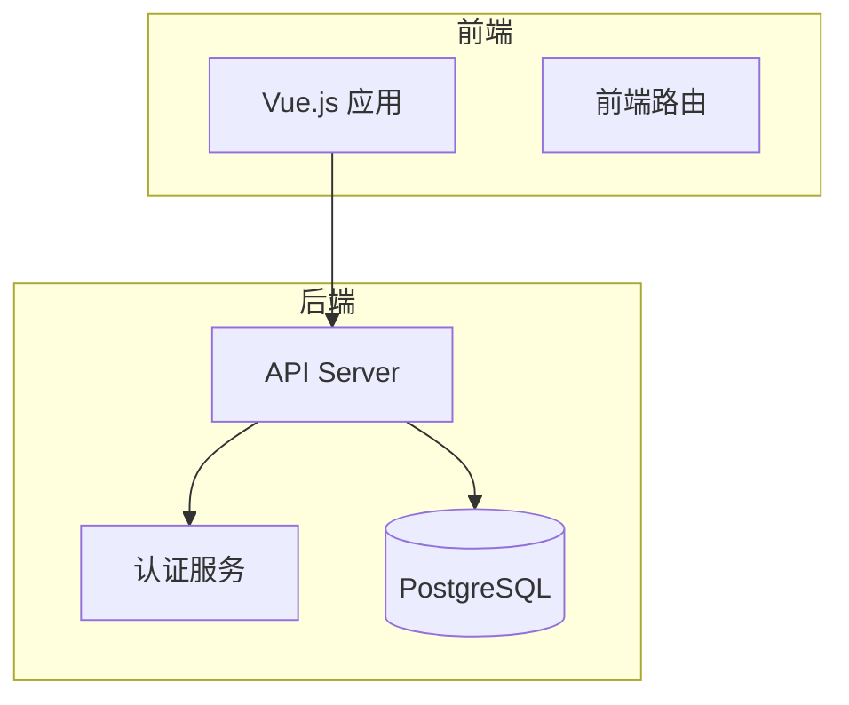
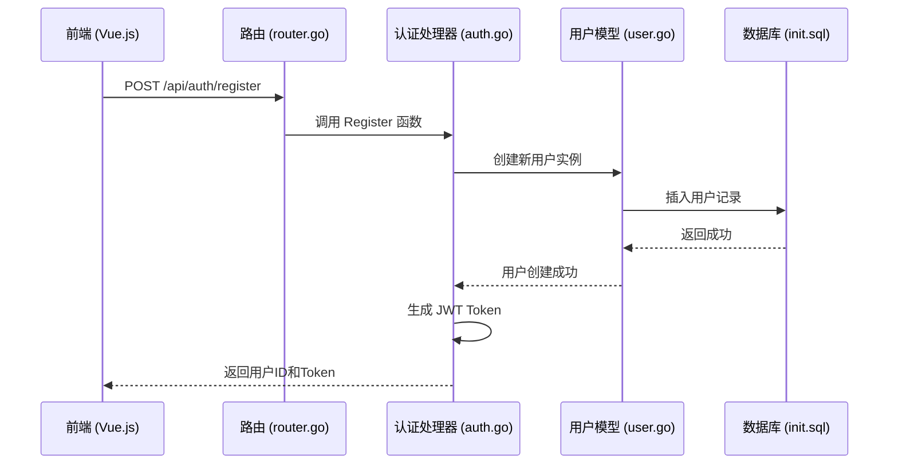
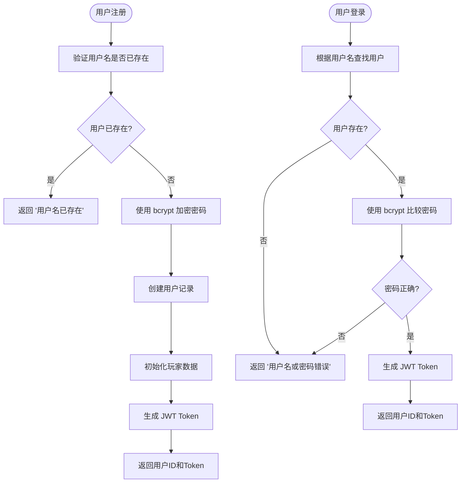
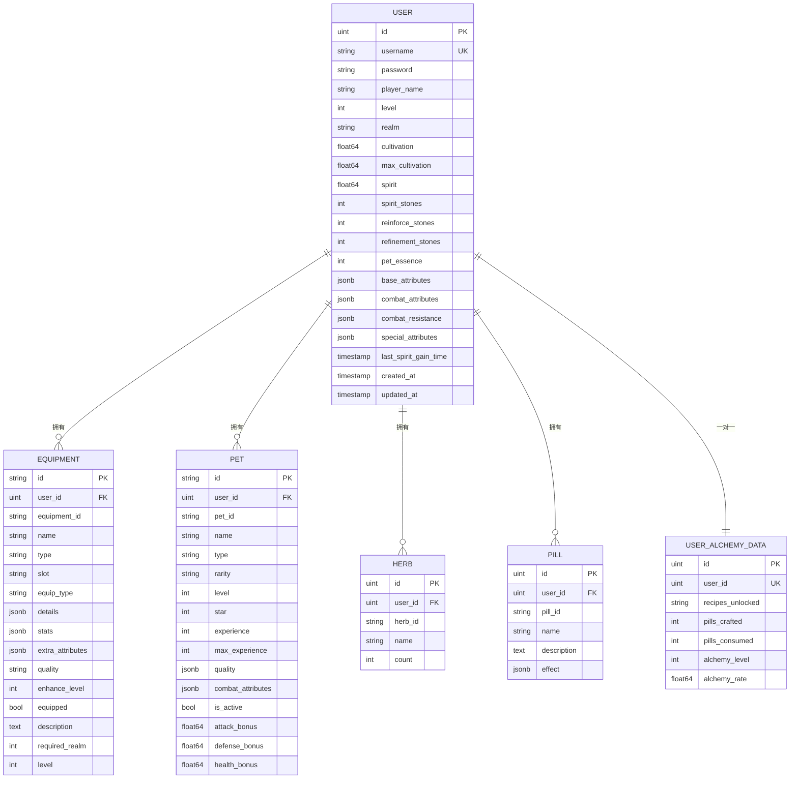

# 用户模型

<cite>
**本文档引用的文件**   
- [user.go](file://server-go/internal/models/user.go)
- [init.sql](file://server-go/init.sql)
- [auth.go](file://server-go/internal/http/handlers/auth/auth.go)
- [db.go](file://server-go/internal/db/db.go)
- [equipment.go](file://server-go/internal/models/equipment.go)
- [pet.go](file://server-go/internal/models/pet.go)
- [herb.go](file://server-go/internal/models/herb.go)
- [pill.go](file://server-go/internal/models/pill.go)
- [user_alchemy_data.go](file://server-go/internal/models/user_alchemy_data.go)
- [router.go](file://server-go/internal/http/router/router.go)
- [auth.go](file://server-go/internal/http/middleware/auth.go)
</cite>

## 目录
1. [简介](#简介)
2. [项目结构](#项目结构)
3. [核心组件](#核心组件)
4. [架构概述](#架构概述)
5. [详细组件分析](#详细组件分析)
6. [依赖分析](#依赖分析)
7. [性能考虑](#性能考虑)
8. [故障排除指南](#故障排除指南)
9. [结论](#结论)

## 简介
本文件详细描述了修仙系统中的用户模型，基于 `user.go` 文件中的 Go 结构体和 `init.sql` 文件中的数据库表定义。文档涵盖了用户实体的所有字段（如 ID、用户名、密码哈希、修为等级、境界等）及其数据类型、约束条件（主键、唯一性、非空等）和默认值。同时，解释了用户在修仙系统中的核心地位，包括其与其他模型（如装备、灵宠、丹药）的关联关系。文档还说明了用户数据的持久化策略、安全存储机制（如密码加密），并提供了实际代码片段展示模型定义与数据库映射方式。此外，涵盖了用户生命周期管理，如注册、登录、状态更新等业务规则。

## 项目结构
本项目采用分层架构设计，主要分为前端（`src/`）、后端服务（`server-go/`）和静态资源（`docs/`、`public/`）。后端服务使用 Go 语言开发，基于 Gin 框架处理 HTTP 请求，GORM 作为 ORM 工具与 PostgreSQL 数据库交互。用户模型定义在 `server-go/internal/models/user.go` 文件中，数据库表结构定义在 `server-go/init.sql` 文件中。



**Diagram sources**
- [user.go](file://server-go/internal/models/user.go#L1-L47)
- [init.sql](file://server-go/init.sql#L10-L31)

**Section sources**
- [user.go](file://server-go/internal/models/user.go#L1-L47)
- [init.sql](file://server-go/init.sql#L10-L31)

## 核心组件
用户模型是修仙系统的核心实体，负责存储玩家的基础信息、修为数据、灵力状态以及战斗属性。该模型通过 GORM 映射到 PostgreSQL 数据库的 `users` 表，确保数据的持久化和一致性。用户模型不仅用于认证（注册和登录），还作为玩家在游戏世界中的身份标识，关联着装备、灵宠、丹药等多个子系统。

**Section sources**
- [user.go](file://server-go/internal/models/user.go#L12-L47)
- [init.sql](file://server-go/init.sql#L10-L31)

## 架构概述
系统采用典型的 MVC（Model-View-Controller）架构，用户模型作为 Model 层的核心部分，通过 Controller（如 `auth.go` 中的处理器）接收来自前端的请求，并通过 Service 层（隐含在处理器逻辑中）进行业务处理，最终通过 GORM 与数据库交互。认证流程使用 JWT（JSON Web Token）实现无状态会话管理，确保用户登录状态的安全性。



**Diagram sources**
- [router.go](file://server-go/internal/http/router/router.go#L26)
- [auth.go](file://server-go/internal/http/handlers/auth/auth.go#L41)
- [user.go](file://server-go/internal/models/user.go#L78)
- [init.sql](file://server-go/init.sql#L10)

## 详细组件分析
### 用户模型分析
用户模型定义了玩家在修仙系统中的所有核心属性。以下是对 `User` 结构体各字段的详细分析：

#### 字段定义与数据库映射
| 字段名 (Go 结构体) | 字段名 (数据库) | 数据类型 | 约束条件 | 默认值 | 说明 |
| :--- | :--- | :--- | :--- | :--- | :--- |
| `ID` | `id` | `uint` / `SERIAL` | 主键, 自增 | 无 | 用户唯一标识符 |
| `Username` | `username` | `string` / `VARCHAR(255)` | 唯一索引, 非空 | 无 | 登录用户名 |
| `Password` | `password` | `string` / `VARCHAR(255)` | 非空 | 无 | 密码哈希值 |
| `PlayerName` | `player_name` | `string` / `VARCHAR(255)` | 可为空 | 无 | 玩家显示名称 |
| `Level` | `level` | `int` / `INTEGER` | 无 | `1` | 修为等级 |
| `Realm` | `realm` | `string` / `VARCHAR(255)` | 可为空 | 无 | 当前境界 (如 "练气期一层") |
| `Cultivation` | `cultivation` | `float64` / `DOUBLE PRECISION` | 无 | `0` | 当前修为值 |
| `MaxCultivation` | `max_cultivation` | `float64` / `DOUBLE PRECISION` | 无 | `100` | 当前境界所需最大修为值 |
| `Spirit` | `spirit` | `float64` / `DOUBLE PRECISION` | 无 | `0` | 灵力值 |
| `SpiritStones` | `spirit_stones` | `int` / `INTEGER` | 无 | `0` | 灵石数量 |
| `ReinforceStones` | `reinforce_stones` | `int` / `INTEGER` | 无 | `0` | 强化石数量 |
| `RefinementStones` | `refinement_stones` | `int` / `INTEGER` | 无 | `0` | 精炼石数量 |
| `PetEssence` | `pet_essence` | `int` / `INTEGER` | 无 | `0` | 灵宠精华数量 |

**Section sources**
- [user.go](file://server-go/internal/models/user.go#L13-L28)
- [init.sql](file://server-go/init.sql#L11-L23)

#### 复杂属性与JSON存储
用户模型使用 JSONB 字段存储复杂的、结构化的属性，这提供了良好的灵活性和查询能力。

```mermaid
classDiagram
class User {
+ID uint
+Username string
+Password string
+PlayerName string
+Level int
+Realm string
+Cultivation float64
+MaxCultivation float64
+Spirit float64
+SpiritStones int
+ReinforceStones int
+RefinementStones int
+PetEssence int
+BaseAttributes datatypes.JSON
+CombatAttributes datatypes.JSON
+CombatResistance datatypes.JSON
+SpecialAttributes datatypes.JSON
+LastSpiritGainTime time.Time
+CreatedAt time.Time
+UpdatedAt time.Time
}
User : BaseAttributes {"attack" : 10,"health" : 100,"defense" : 5,"speed" : 10}
User : CombatAttributes {"critRate" : 0,"comboRate" : 0,"counterRate" : 0,"stunRate" : 0,"dodgeRate" : 0,"vampireRate" : 0}
User : CombatResistance {"critResist" : 0,"comboResist" : 0,"counterResist" : 0,"stunResist" : 0,"dodgeResist" : 0,"vampireResist" : 0}
User : SpecialAttributes {"healBoost" : 0,"critDamageBoost" : 0,"critDamageReduce" : 0,"finalDamageBoost" : 0,"finalDamageReduce" : 0,"combatBoost" : 0,"resistanceBoost" : 0}
```

**Diagram sources**
- [user.go](file://server-go/internal/models/user.go#L30-L33)
- [init.sql](file://server-go/init.sql#L24-L27)

**Section sources**
- [user.go](file://server-go/internal/models/user.go#L30-L33)
- [init.sql](file://server-go/init.sql#L24-L27)

#### 用户生命周期与业务规则
用户的生命周期从注册开始，经过登录、游戏内活动，直到数据更新。



**Diagram sources**
- [auth.go](file://server-go/internal/http/handlers/auth/auth.go#L41)
- [auth.go](file://server-go/internal/http/handlers/auth/auth.go#L129)

**Section sources**
- [auth.go](file://server-go/internal/http/handlers/auth/auth.go#L41-L129)

## 依赖分析
用户模型是整个系统的核心，与其他多个模型存在关联关系。



**Diagram sources**
- [user.go](file://server-go/internal/models/user.go#L13)
- [equipment.go](file://server-go/internal/models/equipment.go#L9)
- [pet.go](file://server-go/internal/models/pet.go#L9)
- [herb.go](file://server-go/internal/models/herb.go#L7)
- [pill.go](file://server-go/internal/models/pill.go#L9)
- [user_alchemy_data.go](file://server-go/internal/models/user_alchemy_data.go#L6)

**Section sources**
- [user.go](file://server-go/internal/models/user.go#L13-L47)
- [equipment.go](file://server-go/internal/models/equipment.go#L7-L34)
- [pet.go](file://server-go/internal/models/pet.go#L7-L34)
- [herb.go](file://server-go/internal/models/herb.go#L5-L17)
- [pill.go](file://server-go/internal/models/pill.go#L7-L21)
- [user_alchemy_data.go](file://server-go/internal/models/user_alchemy_data.go#L5-L17)

## 性能考虑
- **索引优化**: 数据库为 `users` 表的 `username` 和 `last_spirit_gain_time` 字段创建了索引，确保了用户认证和灵力更新查询的高效性。
- **JSONB 查询**: PostgreSQL 的 JSONB 字段支持高效的索引和查询，允许对 `BaseAttributes` 等复杂字段进行快速检索。
- **连接池**: GORM 和数据库驱动通常会使用连接池，避免了频繁创建和销毁数据库连接的开销。

## 故障排除指南
- **注册失败**: 检查日志中是否出现 "用户名已存在" 错误。确保 `username` 字段的唯一性约束。
- **登录失败**: 检查日志中是否出现 "用户名或密码错误"。确认密码是否已正确使用 bcrypt 加密存储。
- **JWT 令牌无效**: 检查环境变量 `JWT_SECRET` 是否正确配置。确认令牌是否已过期（有效期为30天）。
- **数据库连接失败**: 检查 `db.go` 文件中的数据库连接配置（`DB_HOST`, `DB_PORT`, `DB_NAME`, `DB_USER`, `DB_PASSWORD`）是否正确。

**Section sources**
- [auth.go](file://server-go/internal/http/handlers/auth/auth.go#L62)
- [auth.go](file://server-go/internal/http/handlers/auth/auth.go#L150)
- [auth.go](file://server-go/internal/http/handlers/auth/auth.go#L24)
- [db.go](file://server-go/internal/db/db.go#L14)

## 结论
用户模型是修仙系统数据架构的基石。它通过清晰的字段定义、合理的数据库约束和安全的密码存储机制，为玩家提供了一个稳定可靠的身份和数据存储方案。其与装备、灵宠、丹药等模型的关联关系，构建了一个完整的虚拟修仙世界。通过 JWT 实现的认证机制，保证了系统的安全性和可扩展性。该模型的设计充分考虑了性能和可维护性，为系统的长期发展奠定了坚实的基础。