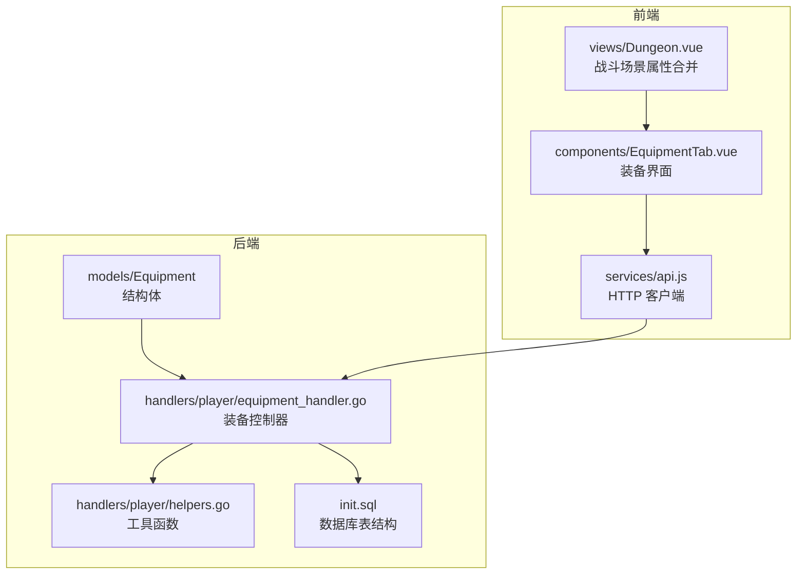
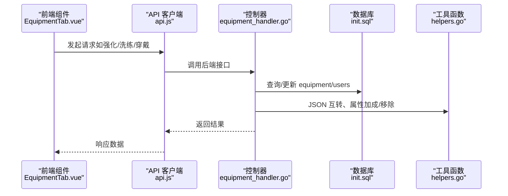
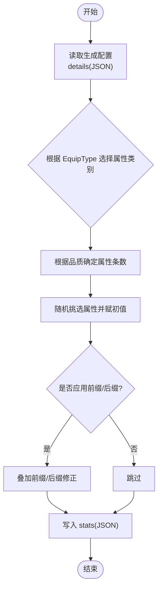
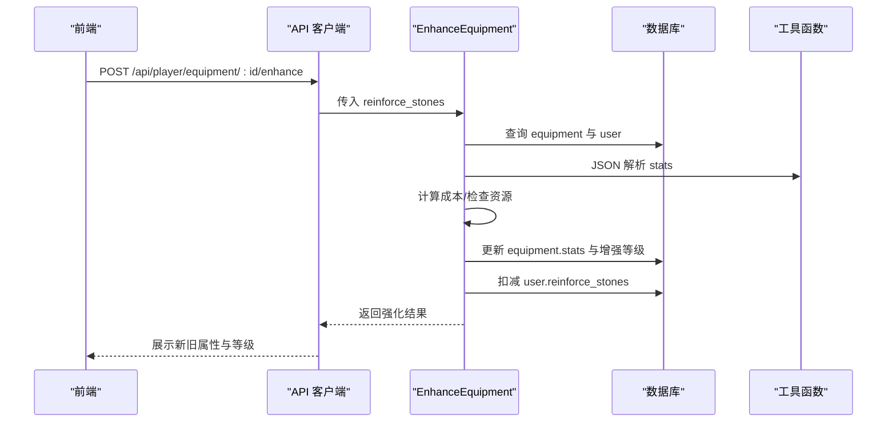
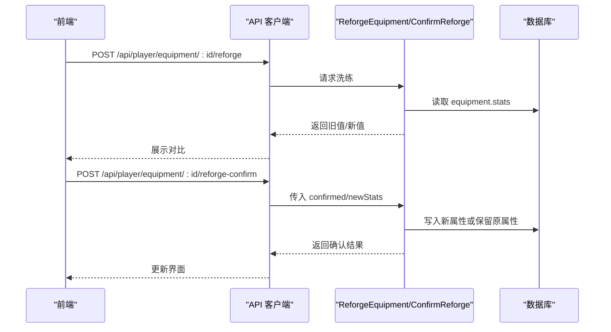
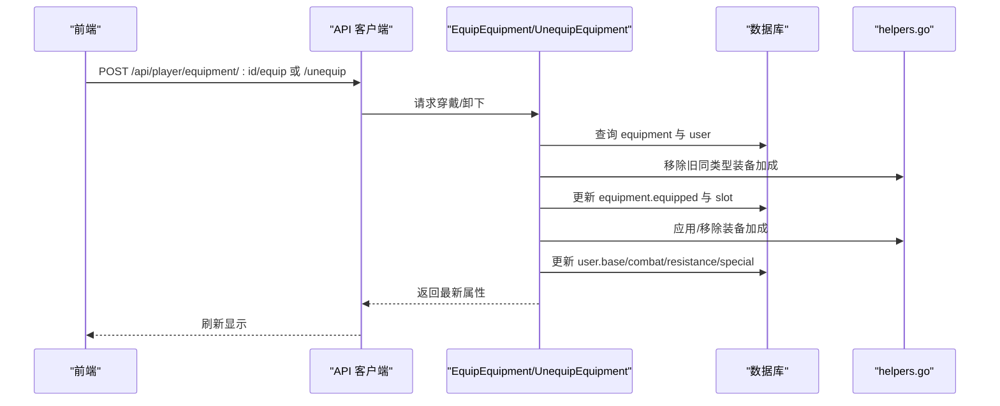
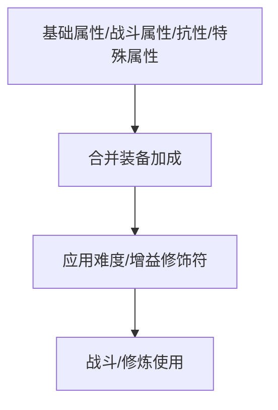
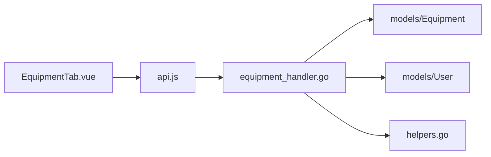

# 装备模型

<cite>
**本文引用的文件**
- [server-go/internal/models/equipment.go](file://server-go/internal/models/equipment.go)
- [server-go/init.sql](file://server-go/init.sql)
- [server-go/internal/http/handlers/player/equipment_handler.go](file://server-go/internal/http/handlers/player/equipment_handler.go)
- [server-go/internal/http/handlers/player/helpers.go](file://server-go/internal/http/handlers/player/helpers.go)
- [装备属性生成设定.md](file://装备属性生成设定.md)
- [装备系统需求文档.md](file://装备系统需求文档.md)
- [src/services/api.js](file://src/services/api.js)
- [src/components/EquipmentTab.vue](file://src/components/EquipmentTab.vue)
- [src/views/Dungeon.vue](file://src/views/Dungeon.vue)
</cite>

## 目录
1. [简介](#简介)
2. [项目结构](#项目结构)
3. [核心组件](#核心组件)
4. [架构总览](#架构总览)
5. [详细组件分析](#详细组件分析)
6. [依赖分析](#依赖分析)
7. [性能考虑](#性能考虑)
8. [故障排查指南](#故障排查指南)
9. [结论](#结论)
10. [附录](#附录)

## 简介
本文件围绕“装备模型”的设计与实现展开，结合后端模型、数据库表结构、业务处理器与前端交互，系统阐述以下内容：
- Equipment 结构体字段构成与数据库表字段映射关系
- 装备属性的动态生成与持久化方式（JSON 字段）
- 随机属性、前缀/后缀系统、强化机制对最终数值的影响
- 装备与用户的归属关系（外键约束）
- 装备在战斗、修炼等场景中的数据访问模式
- 示例说明：创建、穿戴、强化过程中的数据流转

## 项目结构
后端采用 Go + Gin + GORM 的分层结构，装备相关的核心位置如下：
- 模型层：Equipment 定义于 models 包，对应数据库 equipment 表
- 数据库初始化：init.sql 定义了 users 与 equipment 等表结构及索引
- 控制器层：equipment_handler.go 提供装备列表、详情、穿戴、卸下、强化、洗练、出售等接口
- 辅助工具：helpers.go 提供 JSON 与 map 的互转、装备/宠物属性加成与移除等工具函数
- 前端交互：src/services/api.js 与 src/components/EquipmentTab.vue 负责调用后端接口与展示
- 战斗场景：Dungeon.vue 展示了最终属性合并逻辑（不包含宠物加成）

图表来源
- [server-go/internal/models/equipment.go](file://server-go/internal/models/equipment.go#L1-L34)
- [server-go/init.sql](file://server-go/init.sql#L105-L123)
- [server-go/internal/http/handlers/player/equipment_handler.go](file://server-go/internal/http/handlers/player/equipment_handler.go#L1-L120)
- [server-go/internal/http/handlers/player/helpers.go](file://server-go/internal/http/handlers/player/helpers.go#L1-L60)
- [src/services/api.js](file://src/services/api.js#L470-L525)
- [src/components/EquipmentTab.vue](file://src/components/EquipmentTab.vue#L114-L198)
- [src/views/Dungeon.vue](file://src/views/Dungeon.vue#L393-L429)

章节来源
- [server-go/internal/models/equipment.go](file://server-go/internal/models/equipment.go#L1-L34)
- [server-go/init.sql](file://server-go/init.sql#L105-L123)
- [server-go/internal/http/handlers/player/equipment_handler.go](file://server-go/internal/http/handlers/player/equipment_handler.go#L1-L120)

## 核心组件
- Equipment 结构体：承载装备的标识、归属、类型、槽位、品质、强化等级、是否已穿戴、描述、所需境界、等级等元数据；以及 details、stats、extra_attributes 三个 JSON 字段用于存放生成的属性配置与实际生效属性。
- users 与 equipment 表：users.id 与 equipment.user_id 建立外键关系，保证装备归属唯一性与完整性。
- 控制器接口：提供获取列表/详情、穿戴/卸下、强化、洗练、确认洗练、出售、批量出售等能力。
- 工具函数：JSON 与 map 的互转、装备属性加成/移除、宠物属性加成/移除。

章节来源
- [server-go/internal/models/equipment.go](file://server-go/internal/models/equipment.go#L1-L34)
- [server-go/init.sql](file://server-go/init.sql#L105-L123)
- [server-go/internal/http/handlers/player/equipment_handler.go](file://server-go/internal/http/handlers/player/equipment_handler.go#L176-L222)
- [server-go/internal/http/handlers/player/helpers.go](file://server-go/internal/http/handlers/player/helpers.go#L14-L35)

## 架构总览
后端通过 Gin 路由将前端请求转发至对应的处理器，处理器读取/更新数据库中的 equipment 与 users 记录，并在穿戴/卸下时对用户的基础属性、战斗属性、战斗抗性、特殊属性进行加成或移除。前端通过 API 客户端调用后端接口，展示强化、洗练、穿戴等操作结果。

图表来源
- [src/components/EquipmentTab.vue](file://src/components/EquipmentTab.vue#L114-L198)
- [src/services/api.js](file://src/services/api.js#L470-L525)
- [server-go/internal/http/handlers/player/equipment_handler.go](file://server-go/internal/http/handlers/player/equipment_handler.go#L224-L323)
- [server-go/internal/http/handlers/player/helpers.go](file://server-go/internal/http/handlers/player/helpers.go#L14-L35)
- [server-go/init.sql](file://server-go/init.sql#L105-L123)

## 详细组件分析

### Equipment 结构体与数据库表映射
- 字段说明
  - 标识与归属：ID（UUID 主键）、UserID（整型外键，指向 users.id）
  - 基本信息：EquipmentID、Name、Type
  - 槽位与类型：Slot（可空字符串）、EquipType（可空字符串）
  - 属性容器：Details（JSON，存放属性生成配置）、Stats（JSON，存放实际生效属性）、ExtraAttributes（JSON，扩展属性）
  - 游戏属性：Quality（品质）、EnhanceLevel（强化等级，默认 0）、Equipped（是否已穿戴，默认 false）
  - 描述与门槛：Description（可空文本）、RequiredRealm（所需境界，默认 1）、Level（等级，默认 1）
- 数据库表结构
  - equipment 表包含上述字段，其中 user_id 为外键，引用 users(id)，并建立索引 idx_equipment_user_id 以优化查询。

章节来源
- [server-go/internal/models/equipment.go](file://server-go/internal/models/equipment.go#L1-L34)
- [server-go/init.sql](file://server-go/init.sql#L105-L123)

### 装备属性的动态生成与持久化
- 属性生成规则
  - 根据 EquipType 字段生成相关属性类别（如 faqi、guanjin、daopao、yunlv、fabao），并按品质决定属性条数（common/uncommon/rare/epic/legendary/mythic 对应不同条数组合）。
  - 属性类别包括：基础属性（attack/health/defense/speed）、战斗属性（critRate/comboRate/counterRate/stunRate/dodgeRate/vampireRate）、战斗抗性（critResist/comboResist/counterResist/stunResist/dodgeResist/vampireResist）、特殊属性（healBoost/critDamageBoost/critDamageReduce/finalDamageBoost/finalDamageReduce/combatBoost/resistanceBoost）。
- 持久化方式
  - details：存放生成时的配置（如 EquipType、品质、期望生成的属性类别与条数等）
  - stats：存放最终生效的属性键值对（JSON 字典）
  - extra_attributes：扩展属性（如前缀/后缀附加的固定数值或百分比）
- 生成流程（概念示意）
  - 依据 EquipType 与品质，确定可生成的属性集合与条数上限
  - 随机挑选若干属性，按规则赋予初始数值
  - 可能引入前缀/后缀系统（例如在 details 中记录前缀/后缀模板，在应用时叠加到 stats）
  - 将最终结果写入 stats，同时将生成配置写入 details

图表来源
- [装备属性生成设定.md](file://装备属性生成设定.md#L1-L46)
- [server-go/internal/models/equipment.go](file://server-go/internal/models/equipment.go#L1-L34)

章节来源
- [装备属性生成设定.md](file://装备属性生成设定.md#L1-L46)
- [server-go/internal/models/equipment.go](file://server-go/internal/models/equipment.go#L1-L34)

### 强化机制与数值影响
- 成本与上限
  - 每次强化的成本随等级递增（当前等级的线性函数），上限为 100 级
  - 每次强化将所有属性按固定倍率提升（示例：1.1 倍）
  - 强化成功后更新 EnhanceLevel 与 RequiredRealm（每 10 级提升一次）
- 数据流
  - 前端传入 reinforce_stones 数量，后端校验用户持有的强化石是否足够
  - 若足够，对 stats 中的每个属性乘以倍率，更新 equipment 记录，并扣减用户强化石
  - 返回旧值、新值、新等级、新所需境界等信息

图表来源
- [server-go/internal/http/handlers/player/equipment_handler.go](file://server-go/internal/http/handlers/player/equipment_handler.go#L224-L323)
- [src/services/api.js](file://src/services/api.js#L470-L477)
- [src/components/EquipmentTab.vue](file://src/components/EquipmentTab.vue#L626-L654)

章节来源
- [server-go/internal/http/handlers/player/equipment_handler.go](file://server-go/internal/http/handlers/player/equipment_handler.go#L224-L323)
- [src/services/api.js](file://src/services/api.js#L470-L477)
- [src/components/EquipmentTab.vue](file://src/components/EquipmentTab.vue#L626-L654)

### 洗练机制与随机属性
- 流程
  - 前端请求洗练，后端解析当前 stats，生成新属性（示例：对每个属性在一定范围内随机浮动）
  - 返回旧值与新值供前端确认
  - 用户确认后，将新属性写回 equipment.stats；取消则保留原属性
- 注意事项
  - 洗练前后均需校验装备存在性与属性有效性
  - 洗练成本与资源消耗策略可按需求扩展

图表来源
- [server-go/internal/http/handlers/player/equipment_handler.go](file://server-go/internal/http/handlers/player/equipment_handler.go#L325-L434)
- [src/services/api.js](file://src/services/api.js#L486-L525)
- [src/components/EquipmentTab.vue](file://src/components/EquipmentTab.vue#L200-L222)
- [src/components/EquipmentTab.vue](file://src/components/EquipmentTab.vue#L656-L709)

章节来源
- [server-go/internal/http/handlers/player/equipment_handler.go](file://server-go/internal/http/handlers/player/equipment_handler.go#L325-L434)
- [src/services/api.js](file://src/services/api.js#L486-L525)
- [src/components/EquipmentTab.vue](file://src/components/EquipmentTab.vue#L200-L222)
- [src/components/EquipmentTab.vue](file://src/components/EquipmentTab.vue#L656-L709)

### 穿戴/卸下与属性加成
- 穿戴
  - 校验 EquipType 存在性，查找同类型已装备的其他装备并移除其属性
  - 将新装备设为已穿戴，更新 Slot（若未显式指定则使用 EquipType）
  - 解析装备 stats，将其加到用户的基础属性、战斗属性、战斗抗性、特殊属性上
  - 若存在出战灵宠，先移除其加成，再应用装备加成，最后重新应用灵宠除百分比加成外的数值加成
  - 更新用户属性并返回最新属性集
- 卸下
  - 将装备标记为未穿戴并清空 Slot
  - 解析装备 stats，从用户属性中移除相应加成
  - 若存在出战灵宠，同样先移除再恢复
  - 更新用户属性并返回最新属性集

图表来源
- [server-go/internal/http/handlers/player/equipment_handler.go](file://server-go/internal/http/handlers/player/equipment_handler.go#L436-L701)
- [server-go/internal/http/handlers/player/helpers.go](file://server-go/internal/http/handlers/player/helpers.go#L50-L179)

章节来源
- [server-go/internal/http/handlers/player/equipment_handler.go](file://server-go/internal/http/handlers/player/equipment_handler.go#L436-L701)
- [server-go/internal/http/handlers/player/helpers.go](file://server-go/internal/http/handlers/player/helpers.go#L50-L179)

### 装备与用户的归属关系
- 外键约束
  - equipment.user_id 引用 users.id，保证每件装备都属于某个用户
- 索引
  - idx_equipment_user_id 用于加速按用户查询装备列表
- 场景约束
  - 所有操作均先校验当前登录用户与装备归属一致，防止越权访问

章节来源
- [server-go/init.sql](file://server-go/init.sql#L105-L123)
- [server-go/init.sql](file://server-go/init.sql#L153-L166)
- [server-go/internal/http/handlers/player/equipment_handler.go](file://server-go/internal/http/handlers/player/equipment_handler.go#L36-L56)

### 装备在战斗、修炼等场景中的数据访问模式
- 战斗场景（秘境）
  - 前端在渲染战斗面板时，将玩家基础属性与装备加成合并（不包含宠物加成），并应用难度修饰符
  - 合并逻辑体现为：基础属性直接相加，战斗属性取最小 1，特殊属性直接相加
- 修炼场景
  - 修炼系统通常依赖玩家基础属性与特殊属性（如 combatBoost、resistanceBoost 等）进行计算，装备强化与洗练直接影响这些数值

图表来源
- [src/views/Dungeon.vue](file://src/views/Dungeon.vue#L393-L429)

章节来源
- [src/views/Dungeon.vue](file://src/views/Dungeon.vue#L393-L429)

### 示例：创建、穿戴、强化过程中的数据流转
- 创建
  - 生成 details（包含 EquipType、品质、期望属性条数等）
  - 生成 stats（按规则与随机性得到的初始属性）
  - 写入 equipment 记录（初始 EnhanceLevel=0，Equipped=false）
- 穿戴
  - 校验 EquipType 存在性
  - 若已有同类型已穿戴装备，则先移除其加成
  - 应用新装备加成到用户属性，更新 equipment.equipped 与 slot
- 强化
  - 计算成本并校验资源
  - 对 stats 中各属性乘以倍率，更新 EnhanceLevel 与 RequiredRealm
  - 扣减用户强化石并返回结果

章节来源
- [server-go/internal/http/handlers/player/equipment_handler.go](file://server-go/internal/http/handlers/player/equipment_handler.go#L224-L323)
- [server-go/internal/http/handlers/player/equipment_handler.go](file://server-go/internal/http/handlers/player/equipment_handler.go#L436-L701)
- [server-go/internal/models/equipment.go](file://server-go/internal/models/equipment.go#L1-L34)

## 依赖分析
- 模块耦合
  - equipment_handler.go 依赖 models.Equipment、models.User、helpers.go 的工具函数
  - helpers.go 提供 JSON 互转与属性加成/移除逻辑，被多个处理器复用
  - 前端通过 api.js 统一调用后端接口，避免直接操作后端模型
- 外部依赖
  - GORM（数据访问）、Zap（日志）、Gin（路由）
- 潜在风险
  - JSON 字段的解析与校验需严格处理空值与异常
  - 穿戴/卸下时对用户属性的加减需保证幂等与一致性

图表来源
- [server-go/internal/http/handlers/player/equipment_handler.go](file://server-go/internal/http/handlers/player/equipment_handler.go#L1-L120)
- [server-go/internal/http/handlers/player/helpers.go](file://server-go/internal/http/handlers/player/helpers.go#L1-L60)
- [src/components/EquipmentTab.vue](file://src/components/EquipmentTab.vue#L114-L198)
- [src/services/api.js](file://src/services/api.js#L470-L525)

章节来源
- [server-go/internal/http/handlers/player/equipment_handler.go](file://server-go/internal/http/handlers/player/equipment_handler.go#L1-L120)
- [server-go/internal/http/handlers/player/helpers.go](file://server-go/internal/http/handlers/player/helpers.go#L1-L60)
- [src/components/EquipmentTab.vue](file://src/components/EquipmentTab.vue#L114-L198)
- [src/services/api.js](file://src/services/api.js#L470-L525)

## 性能考虑
- 查询优化
  - 使用 idx_equipment_user_id 加速按用户查询
  - 列表查询支持按 equip_type/quality/equipped 过滤，建议在高频查询字段上建立索引
- 写入优化
  - 穿戴/卸下时一次性更新用户属性 JSON 字段，减少多次往返
  - 强化/洗练仅更新必要字段，避免全量覆盖
- 前端缓存
  - 前端仅缓存当前选中装备与少量状态，避免冗余数据

## 故障排查指南
- 常见问题
  - 装备未找到：检查用户 ID 与装备 ID 是否匹配，确认外键约束有效
  - 强化石不足：确认用户 reinforce_stones 是否满足成本计算
  - EquipType 为空：穿戴时必须提供有效 EquipType，否则拒绝穿戴
  - 属性溢出：战斗属性上限为 1，需在合并时做 clamp
- 日志与监控
  - 控制器中记录关键入参与出参，便于定位问题
  - 建议在 helpers.go 的属性加减处增加边界检查与告警

章节来源
- [server-go/internal/http/handlers/player/equipment_handler.go](file://server-go/internal/http/handlers/player/equipment_handler.go#L36-L56)
- [server-go/internal/http/handlers/player/equipment_handler.go](file://server-go/internal/http/handlers/player/equipment_handler.go#L224-L323)
- [server-go/internal/http/handlers/player/equipment_handler.go](file://server-go/internal/http/handlers/player/equipment_handler.go#L436-L701)
- [server-go/internal/http/handlers/player/helpers.go](file://server-go/internal/http/handlers/player/helpers.go#L181-L222)

## 结论
本设计以 JSON 字段承载属性生成与运行时数值，配合严格的外键与索引，实现了灵活而可扩展的装备系统。通过穿戴/卸下、强化、洗练等机制，装备对玩家属性的加成得以精确控制。前端与后端职责清晰分离，后端集中管理状态与计算，既保证了公平性，也为后续扩展（如前缀/后缀系统、多维属性生成）提供了良好基础。

## 附录
- API 规范要点
  - 获取玩家装备列表：支持按 equip_type/quality/equipped 过滤
  - 装备强化：按等级递增的成本，成功后更新 stats 与等级
  - 装备洗练：返回新旧属性供确认，确认后写回
  - 装备穿戴/卸下：自动处理同类型已穿戴装备的替换与属性加减
- 前端注意事项
  - 穿戴/卸下后需刷新用户属性展示
  - 强化/洗练后及时更新本地缓存与 UI

章节来源
- [装备系统需求文档.md](file://装备系统需求文档.md#L90-L151)
- [server-go/internal/http/handlers/player/equipment_handler.go](file://server-go/internal/http/handlers/player/equipment_handler.go#L58-L174)
- [server-go/internal/http/handlers/player/equipment_handler.go](file://server-go/internal/http/handlers/player/equipment_handler.go#L224-L323)
- [server-go/internal/http/handlers/player/equipment_handler.go](file://server-go/internal/http/handlers/player/equipment_handler.go#L325-L434)
- [server-go/internal/http/handlers/player/equipment_handler.go](file://server-go/internal/http/handlers/player/equipment_handler.go#L436-L701)