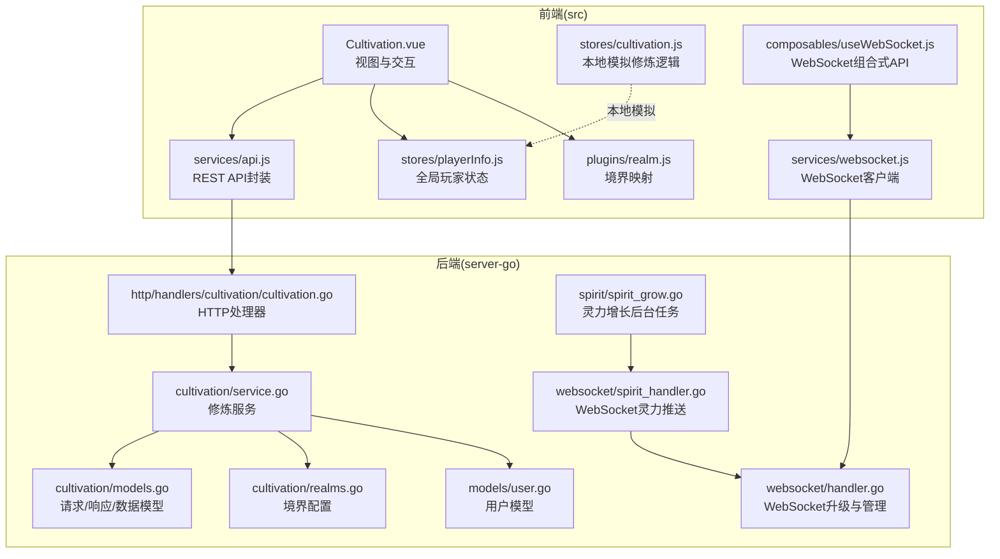
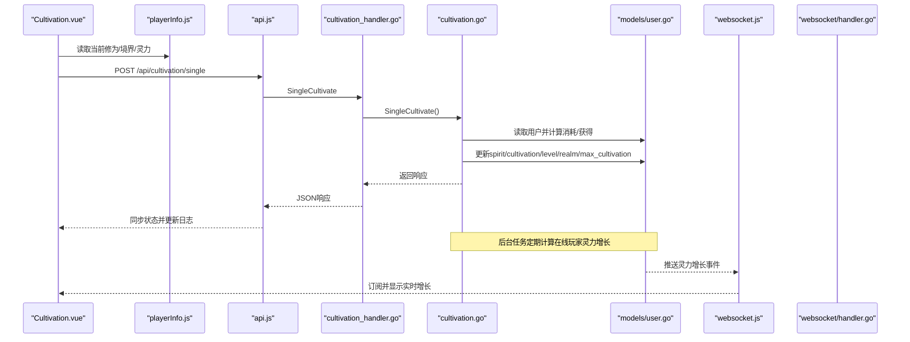
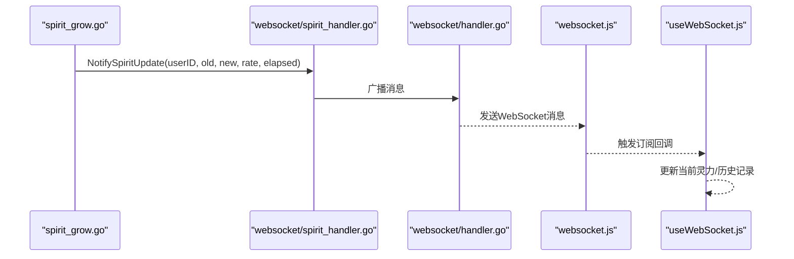
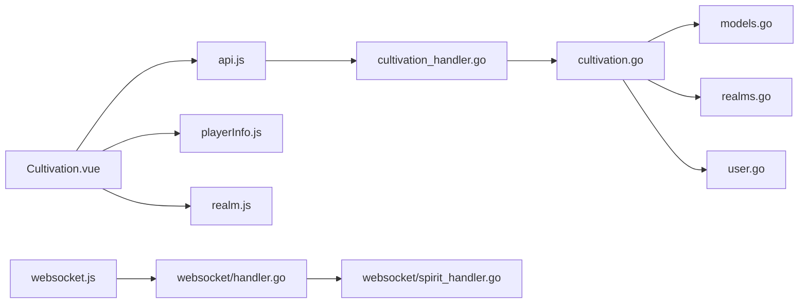
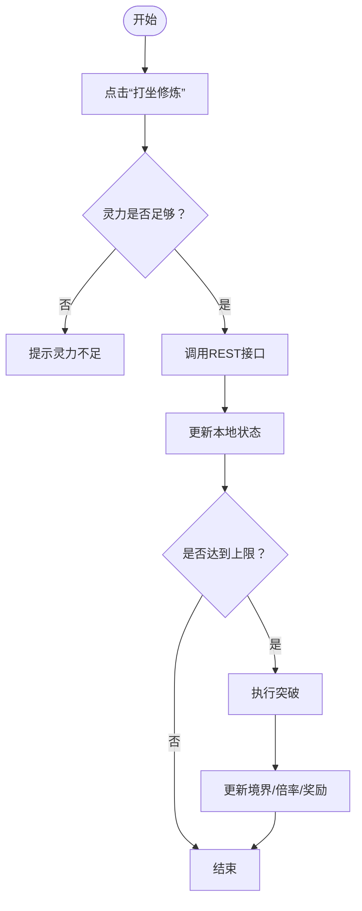

# 修炼系统

<cite>
**本文引用的文件**
- [Cultivation.vue](file://src/views/Cultivation.vue)
- [cultivation.js](file://src/stores/cultivation.js)
- [playerInfo.js](file://src/stores/playerInfo.js)
- [api.js](file://src/services/api.js)
- [useWebSocket.js](file://src/composables/useWebSocket.js)
- [websocket.js](file://src/services/websocket.js)
- [cultivation.go](file://server-go/internal/cultivation/service.go)
- [models.go](file://server-go/internal/cultivation/models.go)
- [realms.go](file://server-go/internal/cultivation/realms.go)
- [cultivation_handler.go](file://server-go/internal/http/handlers/cultivation/cultivation.go)
- [user_model.go](file://server-go/internal/models/user.go)
- [spirit_grow.go](file://server-go/internal/spirit/spirit_grow.go)
- [spirit_handler.go](file://server-go/internal/websocket/spirit_handler.go)
- [handler.go](file://server-go/internal/websocket/handler.go)
- [realm.js](file://src/plugins/realm.js)
</cite>

## 目录
1. [简介](#简介)
2. [项目结构](#项目结构)
3. [核心组件](#核心组件)
4. [架构总览](#架构总览)
5. [详细组件分析](#详细组件分析)
6. [依赖关系分析](#依赖关系分析)
7. [性能考量](#性能考量)
8. [故障排查指南](#故障排查指南)
9. [结论](#结论)
10. [附录](#附录)

## 简介
本文件系统性阐述“修炼系统”的完整实现机制，覆盖前端视图组件的UI交互、Pinia状态管理器的数据流处理、后端服务的算法与数据模型，以及前后端通过REST API的状态同步与WebSocket实时通知。同时，结合境界定义模型，说明从炼气期到渡劫期的成长路径；给出典型用户操作流程（单次修炼与连续修炼）及性能优化策略与边界情况处理建议。

## 项目结构
- 前端位于 src/，包含视图组件、状态管理、API封装与WebSocket组合式API。
- 后端位于 server-go/，包含修炼服务、HTTP处理器、领域模型与WebSocket处理器。
- 境界定义在后端cultivation子系统中，前端通过插件映射。

图表来源
- [Cultivation.vue](file://src/views/Cultivation.vue#L1-L282)
- [cultivation.js](file://src/stores/cultivation.js#L1-L52)
- [playerInfo.js](file://src/stores/playerInfo.js#L1-L112)
- [api.js](file://src/services/api.js#L1-L120)
- [useWebSocket.js](file://src/composables/useWebSocket.js#L1-L136)
- [websocket.js](file://src/services/websocket.js#L45-L163)
- [cultivation_handler.go](file://server-go/internal/http/handlers/cultivation/cultivation.go#L1-L122)
- [cultivation.go](file://server-go/internal/cultivation/service.go#L1-L355)
- [models.go](file://server-go/internal/cultivation/models.go#L1-L89)
- [realms.go](file://server-go/internal/cultivation/realms.go#L1-L192)
- [user_model.go](file://server-go/internal/models/user.go#L1-L48)
- [spirit_grow.go](file://server-go/internal/spirit/spirit_grow.go#L1-L192)
- [spirit_handler.go](file://server-go/internal/websocket/spirit_handler.go#L97-L121)
- [handler.go](file://server-go/internal/websocket/handler.go#L1-L100)

章节来源
- [Cultivation.vue](file://src/views/Cultivation.vue#L1-L282)
- [cultivation.go](file://server-go/internal/cultivation/service.go#L1-L355)

## 核心组件
- 前端视图组件：负责用户交互、按钮触发、日志展示与状态同步。
- Pinia状态管理：集中维护玩家属性、修炼消耗与获得、境界与修为上限等。
- 后端服务：实现单次修炼、一键突破、境界突破、修炼消耗与获得计算、数据持久化。
- HTTP处理器：暴露REST端点，供前端调用。
- WebSocket：推送灵力增长等实时事件。
- 境界模型：定义从练气期到大罗期的完整成长路径。

章节来源
- [Cultivation.vue](file://src/views/Cultivation.vue#L1-L282)
- [cultivation.js](file://src/stores/cultivation.js#L1-L52)
- [cultivation.go](file://server-go/internal/cultivation/service.go#L1-L355)
- [cultivation_handler.go](file://server-go/internal/http/handlers/cultivation/cultivation.go#L1-L122)
- [realms.go](file://server-go/internal/cultivation/realms.go#L1-L192)

## 架构总览
前端通过REST API与后端交互，后端在数据库中持久化玩家状态；同时，后端通过定时任务计算在线玩家的灵力增长，并通过WebSocket向客户端推送实时事件。前端也通过WebSocket订阅灵力增长事件，实现即时反馈。

图表来源
- [Cultivation.vue](file://src/views/Cultivation.vue#L90-L179)
- [api.js](file://src/services/api.js#L1-L120)
- [cultivation_handler.go](file://server-go/internal/http/handlers/cultivation/cultivation.go#L20-L51)
- [cultivation.go](file://server-go/internal/cultivation/service.go#L76-L151)
- [user_model.go](file://server-go/internal/models/user.go#L1-L48)
- [websocket.js](file://src/services/websocket.js#L45-L163)
- [handler.go](file://server-go/internal/websocket/handler.go#L37-L73)

## 详细组件分析

### 前端视图组件：Cultivation.vue
- 交互能力
  - 单次修炼：调用REST接口，扣减灵力，增加修为，若达到上限则执行突破。
  - 自动修炼：循环调用单次修炼，直至灵力不足或用户停止，每次间隔1秒。
  - 一键突破：调用REST接口，按剩余修为计算所需灵力，一次性突破。
  - 数据同步：挂载时拉取修炼数据，每10秒轮询刷新。
- 状态更新
  - 本地更新玩家状态（修为、境界、最大修为、灵力、修炼效率等）。
  - 日志面板记录修炼与突破事件。
- 键盘快捷键：空格键触发单次修炼。

章节来源
- [Cultivation.vue](file://src/views/Cultivation.vue#L90-L209)

### Pinia状态管理器：stores/cultivation.js 与 stores/playerInfo.js
- playerInfo.js
  - 维护全局玩家状态：等级、境界、修为、最大修为、灵力、灵力倍率、修炼倍率、幸运值、解锁境界等。
  - 作为前端数据源，供视图组件读取与更新。
- stores/cultivation.js
  - 提供本地模拟的修炼与突破动作，便于离线演示或前端调试。
  - 实际生产以后端为准，前端仅做本地更新与UI反馈。

章节来源
- [playerInfo.js](file://src/stores/playerInfo.js#L1-L112)
- [cultivation.js](file://src/stores/cultivation.js#L1-L52)

### 后端服务：cultivation/service.go
- 单次修炼 SingleCultivate
  - 读取用户，计算当前等级的修炼消耗与获得，考虑幸运与修炼倍率。
  - 扣减灵力，累加修为，若达到上限则执行突破。
  - 更新BaseAttributes（含spiritRate、cultivationRate、unlockedRealms等）。
  - 返回成功响应，包含本次获得修为、消耗灵力、当前修为与突破详情。
- 一键突破 CultivateUntilBreakthrough
  - 计算剩余修为与单次消耗/获得，估算所需次数与总灵力消耗。
  - 若灵力不足则返回错误；否则一次性扣减并推进到下一境界。
- 突破 performBreakthrough
  - 更新等级、境界、最大修为，重置修为为0。
  - 奖励灵力与提升灵力获取倍率，并更新解锁境界列表。
- 数据获取 GetCultivationData
  - 返回当前等级、境界、修为、最大修为、灵力、修炼消耗、获得、倍率与解锁境界。

章节来源
- [cultivation.go](file://server-go/internal/cultivation/service.go#L76-L238)
- [models.go](file://server-go/internal/cultivation/models.go#L1-L89)

### HTTP处理器：http/handlers/cultivation/cultivation.go
- SingleCultivate：处理单次修炼请求，调用服务层并返回JSON响应。
- CultivateUntilBreakthrough：处理一键突破请求，返回突破结果。
- GetCultivationData：返回当前修炼数据。

章节来源
- [cultivation_handler.go](file://server-go/internal/http/handlers/cultivation/cultivation.go#L20-L121)

### 境界定义模型：cultivation/realms.go
- 定义从练气期到大罗期的完整成长路径，每期九层，每层对应最大修为上限。
- 提供根据等级获取境界信息、获取下一境界、获取最大等级等工具函数。

章节来源
- [realms.go](file://server-go/internal/cultivation/realms.go#L1-L192)

### 用户模型：models/user.go
- 包含玩家基础属性、修为、灵力、等级、境界、上次灵力增长时间等字段。
- BaseAttributes以JSON存储，支持spiritRate、cultivationRate、unlockedRealms等扩展属性。

章节来源
- [user_model.go](file://server-go/internal/models/user.go#L1-L48)

### WebSocket实时通知
- WebSocket升级：基于Gin路由升级HTTP为WebSocket，校验userId与token。
- 灵力增长推送：后台任务检测在线玩家，计算灵力增长后通过WebSocket推送“spirit:grow”事件。
- 前端订阅：useWebSocket.js提供订阅接口，websocket.js负责连接、心跳与消息分发。

图表来源
- [spirit_grow.go](file://server-go/internal/spirit/spirit_grow.go#L120-L174)
- [spirit_handler.go](file://server-go/internal/websocket/spirit_handler.go#L97-L121)
- [handler.go](file://server-go/internal/websocket/handler.go#L37-L73)
- [websocket.js](file://src/services/websocket.js#L45-L163)
- [useWebSocket.js](file://src/composables/useWebSocket.js#L1-L136)

## 依赖关系分析
- 前端依赖
  - 视图组件依赖API封装与状态管理器；状态管理器依赖realm插件进行境界映射。
- 后端依赖
  - 服务层依赖模型与领域常量；HTTP处理器依赖服务层；WebSocket处理器依赖连接管理器。
- 数据一致性
  - 前端优先使用后端返回的修炼数据；定时同步保证数据一致性。

图表来源
- [Cultivation.vue](file://src/views/Cultivation.vue#L1-L282)
- [api.js](file://src/services/api.js#L1-L120)
- [playerInfo.js](file://src/stores/playerInfo.js#L1-L112)
- [realm.js](file://src/plugins/realm.js#L1-L174)
- [cultivation_handler.go](file://server-go/internal/http/handlers/cultivation/cultivation.go#L1-L122)
- [cultivation.go](file://server-go/internal/cultivation/service.go#L1-L355)
- [models.go](file://server-go/internal/cultivation/models.go#L1-L89)
- [realms.go](file://server-go/internal/cultivation/realms.go#L1-L192)
- [user_model.go](file://server-go/internal/models/user.go#L1-L48)
- [websocket.js](file://src/services/websocket.js#L45-L163)
- [handler.go](file://server-go/internal/websocket/handler.go#L1-L100)
- [spirit_handler.go](file://server-go/internal/websocket/spirit_handler.go#L97-L121)

## 性能考量
- 前端
  - 自动修炼采用1秒间隔，避免频繁请求导致UI卡顿。
  - 每10秒同步一次修炼数据，减少网络开销。
  - WebSocket订阅仅在需要时启用，组件卸载时及时取消订阅。
- 后端
  - 灵力增长后台任务按秒扫描在线玩家，避免高并发写入。
  - WebSocket广播使用带缓冲通道，防止阻塞。
  - 响应体字段精简，仅传输必要数据。

[本节为通用指导，无需列出具体文件来源]

## 故障排查指南
- 单次修炼失败
  - 检查灵力是否足够；查看后端错误日志与响应。
  - 确认前端已同步最新数据后再发起请求。
- 一键突破失败
  - 确认剩余修为与所需灵力计算是否合理；检查灵力是否充足。
- WebSocket无法接收灵力增长事件
  - 确认连接参数userId与token有效；检查连接状态与订阅是否正确。
  - 查看后端日志是否存在推送错误。
- 数据不同步
  - 确认前端定时同步逻辑正常；检查网络请求与响应。

章节来源
- [Cultivation.vue](file://src/views/Cultivation.vue#L138-L179)
- [cultivation_handler.go](file://server-go/internal/http/handlers/cultivation/cultivation.go#L20-L121)
- [websocket.js](file://src/services/websocket.js#L45-L163)
- [useWebSocket.js](file://src/composables/useWebSocket.js#L1-L136)

## 结论
该修炼系统通过清晰的前后端职责划分与REST+WebSocket协同，实现了从炼气期到大罗期的完整成长路径。前端负责交互与状态呈现，后端负责核心算法与数据持久化，并通过定时任务与实时推送保障用户体验。通过合理的性能与边界处理策略，系统具备良好的扩展性与稳定性。

[本节为总结性内容，无需列出具体文件来源]

## 附录

### 典型用户操作流程示例

- 单次修炼
  - 前端点击“打坐修炼”，调用REST接口。
  - 后端计算消耗与获得，更新数据库，返回响应。
  - 前端更新本地状态与日志，必要时触发突破逻辑。

- 连续修炼
  - 前端开启自动修炼，循环调用单次修炼，每次间隔1秒。
  - 当灵力不足或用户停止时终止循环。

图表来源
- [Cultivation.vue](file://src/views/Cultivation.vue#L90-L179)
- [cultivation.go](file://server-go/internal/cultivation/service.go#L76-L151)

### 境界成长路径（炼气期到渡劫期）
- 炼气期：1-9层，每层最大修为递增。
- 筑基期：10-18层。
- 金丹期：19-27层。
- 元婴期：28-36层。
- 化神期：37-45层。
- 返虚期：46-54层。
- 合体期：55-63层。
- 大乘期：64-72层。
- 渡劫期：73-81层。

章节来源
- [realms.go](file://server-go/internal/cultivation/realms.go#L1-L192)
- [realm.js](file://src/plugins/realm.js#L1-L174)