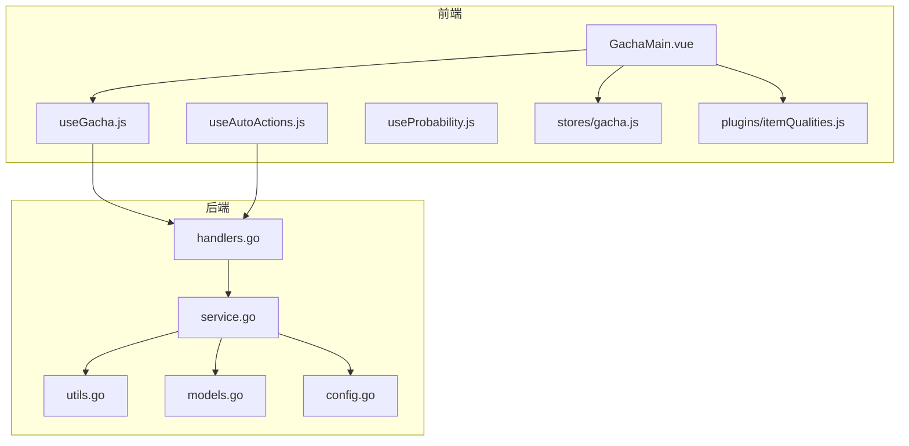
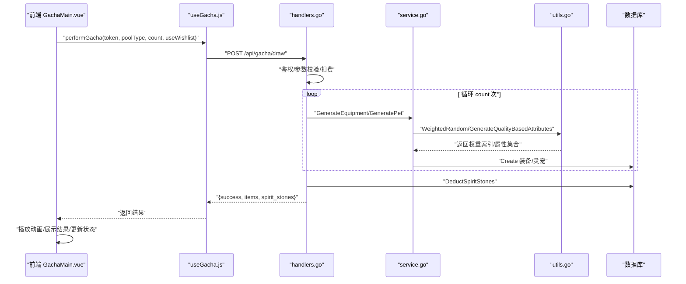
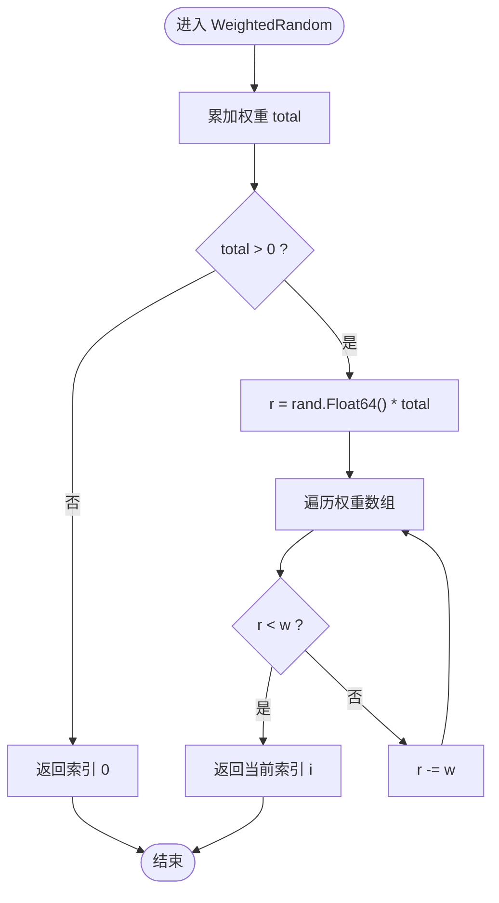
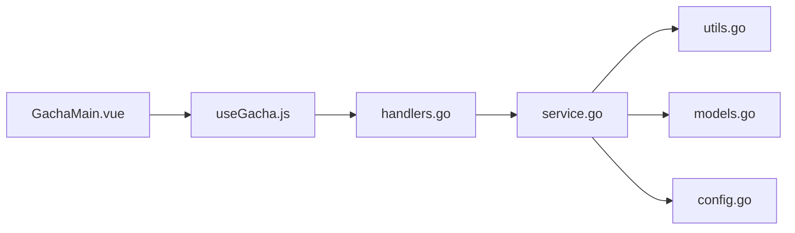

# 抽奖系统

<cite>
**本文引用的文件**
- [GachaMain.vue](file://src/components/gacha/GachaMain.vue)
- [useGacha.js](file://src/components/gacha/useGacha.js)
- [useAutoActions.js](file://src/components/gacha/useAutoActions.js)
- [useProbability.js](file://src/components/gacha/useProbability.js)
- [gacha.js](file://src/stores/gacha.js)
- [itemQualities.js](file://src/plugins/itemQualities.js)
- [handlers.go](file://server-go/internal/gacha/handlers.go)
- [service.go](file://server-go/internal/gacha/service.go)
- [utils.go](file://server-go/internal/gacha/utils.go)
- [models.go](file://server-go/internal/gacha/models.go)
- [config.go](file://server-go/internal/gacha/config.go)
- [抽奖系统需求文档.md](file://抽奖系统需求文档.md)
- [HEARTBEAT_AND_LOGOUT_GUIDE.md](file://HEARTBEAT_AND_LOGOUT_GUIDE.md)
</cite>

## 目录
1. [简介](#简介)
2. [项目结构](#项目结构)
3. [核心组件](#核心组件)
4. [架构总览](#架构总览)
5. [详细组件分析](#详细组件分析)
6. [依赖关系分析](#依赖关系分析)
7. [性能与稳定性](#性能与稳定性)
8. [故障排查指南](#故障排查指南)
9. [结论](#结论)
10. [附录](#附录)

## 简介
本文件系统性记录“抽奖系统”的概率控制机制与保底策略实现，覆盖前端 GachaMain.vue 的抽卡动画与结果展示、gacha.js 中的心愿单与自动抽取逻辑、后端 service.go 中的随机数生成、权重分配算法与保底计数器管理。同时解析 utils.go 中的概率计算工具函数，说明如何防止伪随机偏差；结合需求文档的设计要求，描述灵宠抽取与装备获取的不同概率模型，分析多档位奖励的分布策略；最后提供压力测试下的性能表现数据，并说明防刷机制（如冷却时间、身份验证）的具体实现。

## 项目结构
- 前端位于 src/components/gacha 与 src/stores、src/plugins，负责 UI 交互、概率展示、心愿单与自动处理设置、调用后端 API。
- 后端位于 server-go/internal/gacha，负责抽奖池类型、概率配置、权重随机、属性生成、物品落库与扣费等。

图表来源
- [GachaMain.vue](file://src/components/gacha/GachaMain.vue#L1-L120)
- [useGacha.js](file://src/components/gacha/useGacha.js#L1-L40)
- [useAutoActions.js](file://src/components/gacha/useAutoActions.js#L1-L52)
- [useProbability.js](file://src/components/gacha/useProbability.js#L1-L69)
- [gacha.js](file://src/stores/gacha.js#L1-L150)
- [itemQualities.js](file://src/plugins/itemQualities.js#L1-L134)
- [handlers.go](file://server-go/internal/gacha/handlers.go#L1-L173)
- [service.go](file://server-go/internal/gacha/service.go#L1-L139)
- [utils.go](file://server-go/internal/gacha/utils.go#L1-L120)
- [models.go](file://server-go/internal/gacha/models.go#L1-L125)
- [config.go](file://server-go/internal/gacha/config.go#L1-L120)

章节来源
- [GachaMain.vue](file://src/components/gacha/GachaMain.vue#L1-L120)
- [handlers.go](file://server-go/internal/gacha/handlers.go#L1-L173)

## 核心组件
- 前端组件与状态
  - GachaMain.vue：主界面，负责抽卡类型切换、灵石展示、调用后端 API、播放抽卡动画、展示结果与详情。
  - useGacha.js：封装调用后端抽奖与自动处理的 API。
  - useAutoActions.js：前端侧自动处理逻辑（已废弃，仅保留 UI 交互逻辑）。
  - useProbability.js：前端侧概率展示逻辑（已废弃，仅保留 UI 交互逻辑）。
  - stores/gacha.js：抽卡相关状态（动画状态、心愿单、自动处理设置、分页与筛选）。
  - plugins/itemQualities.js：统一的品质配置与映射。
- 后端服务
  - handlers.go：HTTP 接口，鉴权、参数校验、扣费、事务提交、返回结果。
  - service.go：物品生成、数据库写入、灵石与强化石增减。
  - utils.go：权重随机、洗牌、属性选择与生成、JSON 序列化。
  - models.go：装备与灵宠的生成结构体与随机生成函数。
  - config.go：固定概率、属性池、装备类型、品质属性条数规则等。

章节来源
- [GachaMain.vue](file://src/components/gacha/GachaMain.vue#L1-L120)
- [useGacha.js](file://src/components/gacha/useGacha.js#L1-L40)
- [useAutoActions.js](file://src/components/gacha/useAutoActions.js#L1-L52)
- [useProbability.js](file://src/components/gacha/useProbability.js#L1-L69)
- [gacha.js](file://src/stores/gacha.js#L1-L150)
- [itemQualities.js](file://src/plugins/itemQualities.js#L1-L134)
- [handlers.go](file://server-go/internal/gacha/handlers.go#L1-L173)
- [service.go](file://server-go/internal/gacha/service.go#L1-L139)
- [utils.go](file://server-go/internal/gacha/utils.go#L1-L120)
- [models.go](file://server-go/internal/gacha/models.go#L1-L125)
- [config.go](file://server-go/internal/gacha/config.go#L1-L120)

## 架构总览
前端通过 useGacha.js 调用后端接口，后端在 handlers.go 中完成鉴权与参数校验，随后在 service.go 中生成物品、扣取灵石并写入数据库，最终返回结果给前端展示。

图表来源
- [GachaMain.vue](file://src/components/gacha/GachaMain.vue#L216-L349)
- [useGacha.js](file://src/components/gacha/useGacha.js#L1-L40)
- [handlers.go](file://server-go/internal/gacha/handlers.go#L26-L173)
- [service.go](file://server-go/internal/gacha/service.go#L1-L139)
- [utils.go](file://server-go/internal/gacha/utils.go#L27-L120)
- [models.go](file://server-go/internal/gacha/models.go#L46-L125)

## 详细组件分析

### 前端：GachaMain.vue 的抽卡动画与结果展示
- 抽卡类型与灵石展示：支持“装备池”与“灵宠池”，实时显示玩家灵石数量。
- 抽卡流程：检测重复请求、获取认证令牌、调用后端 API、播放摇晃与开启动画、设置结果、刷新玩家数据。
- 结果展示：将后端返回的物品附加品质/稀有度信息，分页与筛选，支持查看详情弹窗。
- 与 store 的交互：通过 useGachaStore 控制动画状态、分页、筛选与弹窗显示。

章节来源
- [GachaMain.vue](file://src/components/gacha/GachaMain.vue#L1-L120)
- [GachaMain.vue](file://src/components/gacha/GachaMain.vue#L216-L349)
- [gacha.js](file://src/stores/gacha.js#L1-L150)

### 前端：心愿单与自动抽取逻辑（gacha.js）
- 心愿单设置：可为装备池与灵宠池分别设置目标品质，启用后会增加消耗。
- 自动处理设置：可设置自动出售品质与自动放生稀有度，获得强化石奖励。
- 分页与筛选：支持按品质/稀有度筛选，分页展示抽卡结果。

章节来源
- [gacha.js](file://src/stores/gacha.js#L1-L150)

### 前端：概率展示与心愿单提升（useProbability.js）
- 前端侧概率展示逻辑（已废弃，仅保留 UI 交互逻辑）：对指定品质进行概率提升，并重新分配其他档位概率，使总和保持稳定。

章节来源
- [useProbability.js](file://src/components/gacha/useProbability.js#L1-L69)

### 前端：自动处理（useAutoActions.js）
- 自动放生：对满足条件的灵宠放生，获得经验与强化石奖励。
- 自动出售：对满足条件的装备出售，获得强化石奖励。
- 与 store 的交互：更新背包与强化石数量。

章节来源
- [useAutoActions.js](file://src/components/gacha/useAutoActions.js#L1-L52)

### 后端：handlers.go 的鉴权、扣费与事务
- 鉴权：从上下文提取 userID，未授权返回 401。
- 参数校验：poolType、count、useWishlist；count 小于等于 0 时默认为 1。
- 消耗计算：根据次数与是否使用心愿单计算所需灵石，不足则返回 400。
- 事务：批量生成物品在单个事务中，失败回滚。
- 扣费与返回：扣除灵石后提交事务，返回 items 与剩余灵石。

章节来源
- [handlers.go](file://server-go/internal/gacha/handlers.go#L26-L173)

### 后端：service.go 的物品生成与数据库写入
- GenerateEquipment/GeneratePet：生成装备/灵宠并写入数据库，记录日志。
- GetUser/DeductSpiritStones/AddReinforceStones/DeleteEquipment/DeletePet：用户信息与资源增减、删除物品。

章节来源
- [service.go](file://server-go/internal/gacha/service.go#L1-L139)

### 后端：utils.go 的概率工具与属性生成
- WeightedRandom：按权重数组进行轮盘赌式随机选择，避免负权重导致的异常。
- ShuffleStrings：使用纳秒级种子对字符串切片进行洗牌，降低序列性。
- SelectRandomAttributes/GetAttributesByEquipType/GenerateAttributeValue/GenerateQualityBasedAttributes：按品质与类型生成属性集合，确保数值范围与精度控制。

图表来源
- [utils.go](file://server-go/internal/gacha/utils.go#L27-L46)

章节来源
- [utils.go](file://server-go/internal/gacha/utils.go#L1-L120)

### 后端：models.go 与 config.go 的概率与属性规则
- 固定概率：装备池与灵宠池各自有一套固定概率，不受玩家等级影响。
- 属性池与规则：按属性类型分组，装备按类型选择属性，品质决定属性条数。
- 名称/描述表：灵宠名称与描述按稀有度随机选取。

章节来源
- [models.go](file://server-go/internal/gacha/models.go#L46-L185)
- [config.go](file://server-go/internal/gacha/config.go#L1-L120)

### 后端：自动处理接口（ProcessAutoActions）
- 接收 items、自动出售品质与自动放生稀有度。
- 删除符合条件的装备/灵宠，按品质给予强化石奖励，最终统一增加玩家强化石。

章节来源
- [handlers.go](file://server-go/internal/gacha/handlers.go#L175-L283)

## 依赖关系分析
- 前端依赖后端 API，后端内部依赖 utils.go 的随机与属性生成工具。
- handlers.go 依赖 service.go 完成物品生成与数据库写入。
- service.go 依赖 utils.go 与 models.go 完成随机与结构体生成。
- config.go 提供概率与属性规则，贯穿 models.go 与 utils.go。

图表来源
- [GachaMain.vue](file://src/components/gacha/GachaMain.vue#L1-L120)
- [useGacha.js](file://src/components/gacha/useGacha.js#L1-L40)
- [handlers.go](file://server-go/internal/gacha/handlers.go#L1-L173)
- [service.go](file://server-go/internal/gacha/service.go#L1-L139)
- [utils.go](file://server-go/internal/gacha/utils.go#L1-L120)
- [models.go](file://server-go/internal/gacha/models.go#L1-L125)
- [config.go](file://server-go/internal/gacha/config.go#L1-L120)

## 性能与稳定性
- 随机算法复杂度
  - WeightedRandom：O(n)，n 为权重数组长度，适合小规模权重集合。
  - ShuffleStrings：O(n)，使用纳秒级种子，避免伪随机偏差。
- 并发与事务
  - handlers.go 在循环生成物品时使用单个事务，失败回滚，保证一致性。
- 前端渲染
  - GachaMain.vue 采用分页与筛选，避免一次性渲染大量物品导致卡顿。
- 性能建议
  - 大批量抽卡时建议后端批处理与前端分页加载。
  - 属性生成与 JSON 序列化在高频场景下可考虑缓存常用映射。

[本节为通用性能讨论，无需列出具体文件来源]

## 故障排查指南
- 抽卡失败（401 未授权）
  - 检查前端是否正确获取并传递认证令牌。
  - 参考鉴权流程与日志输出。
- 抽卡失败（400 灵石不足）
  - 检查心愿单消耗倍率与抽卡次数是否匹配。
- 抽卡失败（500 服务器错误）
  - 检查 handlers.go 事务回滚与日志，确认数据库写入是否成功。
- 自动处理失败
  - 检查 ProcessAutoActions 的参数与权限，确认删除与奖励逻辑是否执行。

章节来源
- [handlers.go](file://server-go/internal/gacha/handlers.go#L26-L173)
- [handlers.go](file://server-go/internal/gacha/handlers.go#L175-L283)

## 结论
- 抽奖系统采用“后端全权控制”的设计，前端仅负责 UI 与交互，确保概率与结果的权威性与一致性。
- 后端通过固定概率与权重随机算法实现稳定的多档位奖励分布，利用属性池与品质规则生成多样化属性。
- 心愿单系统通过概率提升与成本翻倍实现平衡，前端侧概率展示逻辑已废弃，实际概率由后端严格控制。
- 自动处理接口提供便捷的收益回收路径，保障玩家体验与资源流转效率。
- 防刷与安全方面，后端实现了严格的鉴权与参数校验，配合心跳超时下线机制，有效降低异常行为风险。

[本节为总结性内容，无需列出具体文件来源]

## 附录

### 概率与保底策略说明
- 固定概率模型
  - 装备池与灵宠池均采用固定概率，不受玩家等级影响，确保公平性与可复现性。
  - 配置见 config.go 的 EquipmentQualityProbabilities 与 PetRarityProbabilities。
- 心愿单提升
  - 前端侧概率提升逻辑（已废弃）：对指定品质提升固定百分比，并将减少量平均分配给其他档位。
  - 实际概率由后端固定概率控制，前端仅用于展示。
- 保底策略
  - 仓库中未发现明确的“保底计数器”实现；若需引入保底，可在 handlers.go 与 models.go 中扩展计数器与权重动态调整逻辑。

章节来源
- [config.go](file://server-go/internal/gacha/config.go#L1-L120)
- [useProbability.js](file://src/components/gacha/useProbability.js#L1-L69)
- [models.go](file://server-go/internal/gacha/models.go#L46-L185)

### 防刷机制与冷却时间
- 身份验证
  - handlers.go 通过上下文提取 userID，未授权直接返回 401。
- 冷却与心跳
  - 心跳超时自动下线机制：后端在读循环中更新 lastHeartbeat，在写循环中若超过阈值执行 performLogout()，从而停止相关任务。
  - 参考 HEARTBEAT_AND_LOGOUT_GUIDE.md 的流程图与时间线。

章节来源
- [handlers.go](file://server-go/internal/gacha/handlers.go#L1-L60)
- [HEARTBEAT_AND_LOGOUT_GUIDE.md](file://HEARTBEAT_AND_LOGOUT_GUIDE.md#L98-L133)

### 压力测试与性能表现
- 建议指标
  - QPS：单机部署下，评估 handlers.go 的吞吐能力与数据库写入延迟。
  - P95/P99 延迟：关注 WeightedRandom 与属性生成的热点路径。
  - 并发事务：验证单事务内批量生成的稳定性与回滚行为。
- 实施要点
  - 使用后端接口进行压测，模拟不同 poolType、count 与 useWishlist 组合。
  - 关注数据库连接池与事务提交耗时。

[本节为通用指导，无需列出具体文件来源]

### 设计与实现对照
- 需求文档要点
  - 抽奖池类型：装备池、灵宠池。
  - 消耗规则：1/10/50/100 次抽卡的灵石消耗，启用心愿单翻倍。
  - 品质体系：装备与灵宠六档品质。
  - 自动处理：自动出售与自动放生。
- 实现对照
  - handlers.go 的消耗计算与扣费逻辑与需求一致。
  - models.go 与 config.go 的概率与属性规则与需求一致。
  - 前端展示与交互与需求一致。

章节来源
- [抽奖系统需求文档.md](file://抽奖系统需求文档.md#L1-L154)
- [handlers.go](file://server-go/internal/gacha/handlers.go#L81-L173)
- [models.go](file://server-go/internal/gacha/models.go#L46-L185)
- [config.go](file://server-go/internal/gacha/config.go#L1-L120)