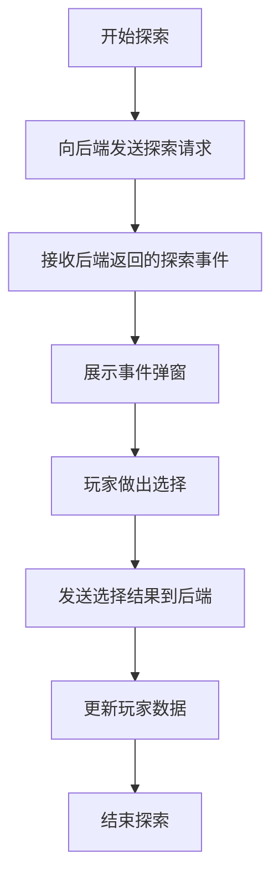
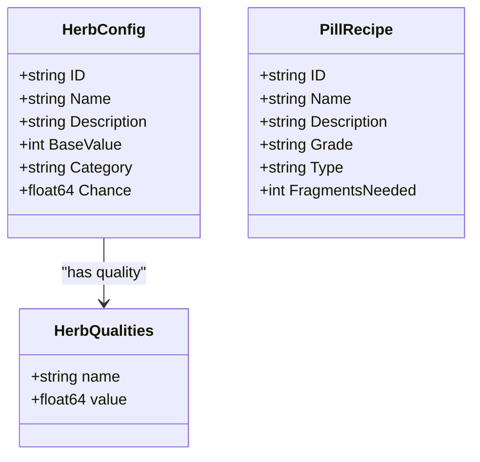
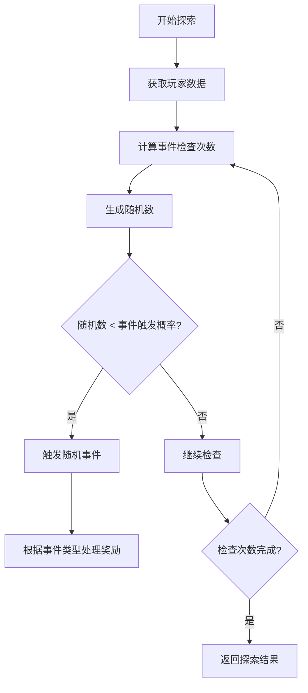
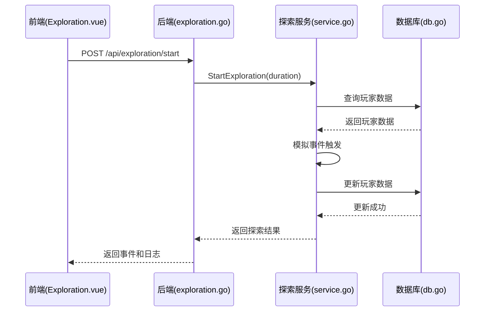
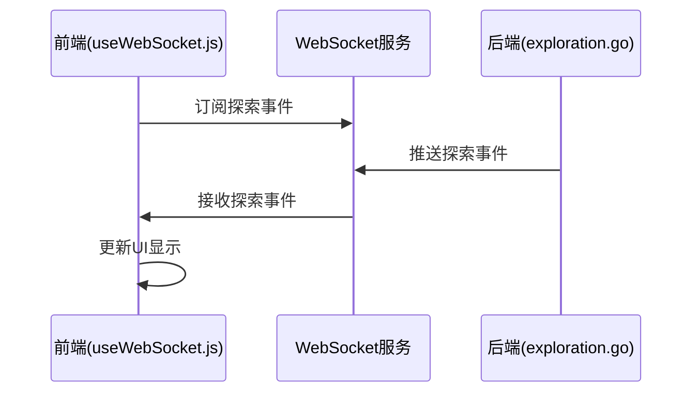
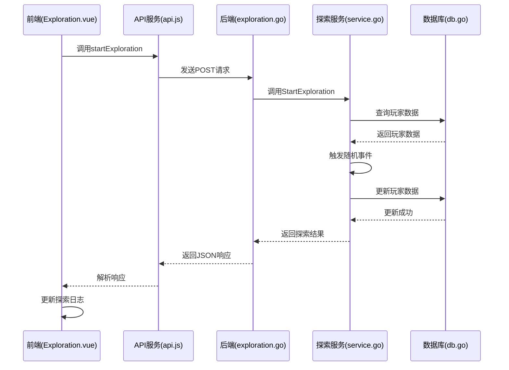

# 探索系统

<cite>
**本文档引用的文件**   
- [Exploration.vue](file://src/views/Exploration.vue)
- [config.go](file://server-go/internal/exploration/config.go)
- [service.go](file://server-go/internal/exploration/service.go)
- [models.go](file://server-go/internal/exploration/models.go)
- [exploration.go](file://server-go/internal/http/handlers/exploration/exploration.go)
- [user.go](file://server-go/internal/models/user.go)
- [herb.go](file://server-go/internal/models/herb.go)
- [pill_fragment.go](file://server-go/internal/models/pill_fragment.go)
- [playerInfo.js](file://src/stores/playerInfo.js)
- [api.js](file://src/services/api.js)
- [useWebSocket.js](file://src/composables/useWebSocket.js)
</cite>

## 目录
1. [简介](#简介)
2. [地图推进机制与前端可视化](#地图推进机制与前端可视化)
3. [探索节点配置与资源收集逻辑](#探索节点配置与资源收集逻辑)
4. [探索耗时计算与随机事件触发概率模型](#探索耗时计算与随机事件触发概率模型)
5. [探索进度的持久化存储与中断恢复机制](#探索进度的持久化存储与中断恢复机制)
6. [数据库交互优化与WebSocket实时推送](#数据库交互优化与websocket实时推送)
7. [典型探索路径时序图](#典型探索路径时序图)

## 简介
探索系统是修仙游戏中核心的玩家成长与资源获取机制，通过结合前端地图可视化组件与后端区域解锁算法，为玩家提供沉浸式的冒险体验。本系统从前端`Exploration.vue`的地图交互到后端`exploration/service.go`中的区域解锁算法，实现了完整的探索流程。系统定义了详细的探索节点配置结构，包括灵草、丹方残页等资源的获取逻辑，并通过复杂的概率模型控制随机事件的触发。探索进度通过数据库持久化存储，支持中断恢复，并利用WebSocket实现探索结果的实时推送，确保玩家能够即时获得探索反馈。

## 地图推进机制与前端可视化

探索系统的前端实现主要在`Exploration.vue`组件中，该组件通过WebSocket与后端保持实时通信，为玩家提供动态的探索体验。组件通过`startExploration`方法发起探索请求，向后端发送探索时长参数，启动探索流程。探索过程中，前端通过事件弹窗机制展示随机触发的探索事件，如发现物品、遭遇妖兽等，并提供选择项供玩家决策。

**图源**
- [Exploration.vue](file://src/views/Exploration.vue#L43-L74)

**本节来源**
- [Exploration.vue](file://src/views/Exploration.vue#L1-L223)

## 探索节点配置与资源收集逻辑

探索系统的资源收集逻辑在`config.go`和`service.go`中定义，通过配置化的节点结构实现多样化的资源获取。系统定义了`HerbConfigs`和`PillRecipes`两个核心配置，分别管理灵草和丹方残页的属性。每种灵草都有唯一的ID、名称、描述、基础价值、分类和发现概率，这些配置决定了玩家在探索过程中可能获得的资源类型和价值。

**图源**
- [config.go](file://server-go/internal/exploration/config.go#L18-L139)
- [models.go](file://server-go/internal/exploration/models.go#L60-L78)

**本节来源**
- [config.go](file://server-go/internal/exploration/config.go#L5-L264)
- [service.go](file://server-go/internal/exploration/service.go#L324-L354)

## 探索耗时计算与随机事件触发概率模型

探索系统的耗时计算和事件触发概率模型在`service.go`中实现，通过玩家属性和随机算法的结合，创造动态的探索体验。系统根据探索时长（以毫秒为单位）计算事件检查次数，每1秒进行一次事件触发检查。事件触发概率受玩家幸运值影响，基础触发概率为30%，通过`calculateLuck`方法从玩家的`base_attributes`中获取幸运值进行调整。

**图源**
- [service.go](file://server-go/internal/exploration/service.go#L28-L62)

**本节来源**
- [service.go](file://server-go/internal/exploration/service.go#L41-L56)

## 探索进度的持久化存储与中断恢复机制

探索系统的持久化存储机制通过数据库操作实现，确保玩家数据在探索过程中的安全性和一致性。系统使用GORM作为ORM工具，与PostgreSQL数据库交互，将探索结果持久化存储。当玩家触发探索事件时，系统会立即更新数据库中的玩家数据，如灵石数量、修为值等。对于灵草和丹方残页等资源，系统会创建或更新相应的数据库记录，确保资源不会因客户端中断而丢失。

**图源**
- [service.go](file://server-go/internal/exploration/service.go#L28-L74)
- [exploration.go](file://server-go/internal/http/handlers/exploration/exploration.go#L19-L65)

**本节来源**
- [service.go](file://server-go/internal/exploration/service.go#L27-L74)
- [db.go](file://server-go/internal/db/db.go#L11-L44)

## 数据库交互优化与WebSocket实时推送

探索系统的数据库交互通过批量更新和事务管理进行优化，减少数据库连接次数，提高性能。系统在处理探索事件时，会将多个数据库操作合并为一次更新，如同时更新修为和灵力值。WebSocket实时推送机制在`useWebSocket.js`中实现，前端通过订阅探索事件，实时接收后端推送的探索结果，无需轮询服务器，降低了网络开销。

**图源**
- [useWebSocket.js](file://src/composables/useWebSocket.js#L68-L73)
- [exploration.go](file://server-go/internal/http/handlers/exploration/exploration.go#L47-L65)

**本节来源**
- [useWebSocket.js](file://src/composables/useWebSocket.js#L1-L319)
- [service.go](file://server-go/internal/exploration/service.go#L48-L56)

## 典型探索路径时序图

以下时序图展示了玩家从开始探索到完成探索的完整流程，包括前端、后端和数据库的交互。

**图源**
- [Exploration.vue](file://src/views/Exploration.vue#L43-L74)
- [api.js](file://src/services/api.js#L1-L800)
- [service.go](file://server-go/internal/exploration/service.go#L28-L74)

**本节来源**
- [Exploration.vue](file://src/views/Exploration.vue#L43-L74)
- [api.js](file://src/services/api.js#L1-L800)
- [service.go](file://server-go/internal/exploration/service.go#L28-L74)