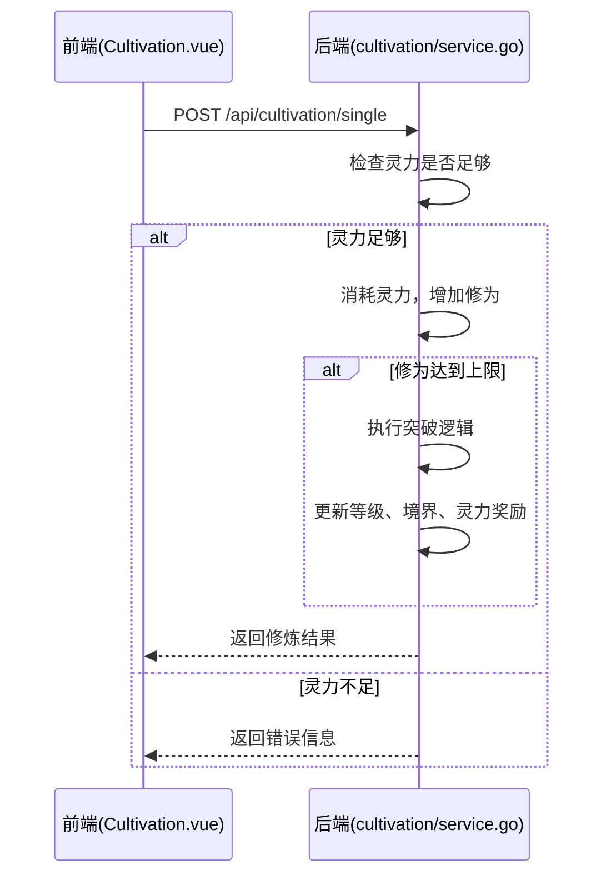
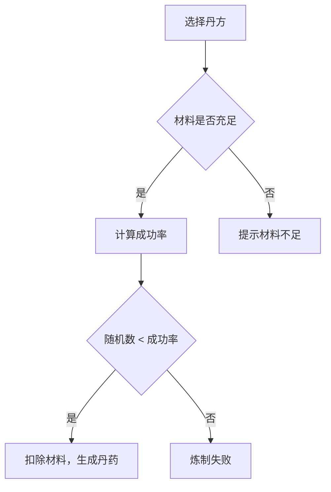
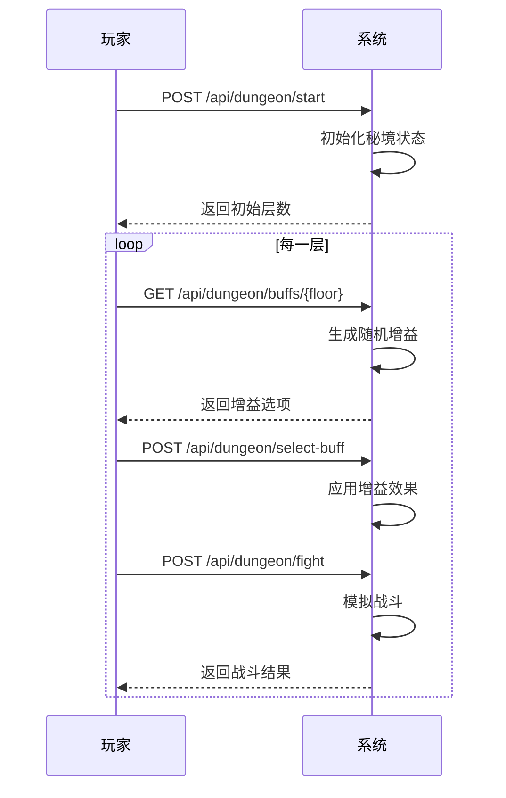
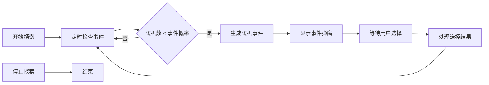
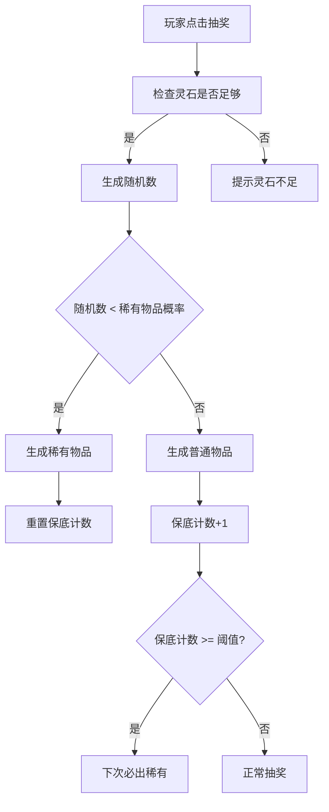

# 核心功能模块

<cite>
**本文档引用的文件**   
- [Cultivation.vue](file://src/views/Cultivation.vue)
- [cultivation/service.go](file://server-go/internal/cultivation/service.go)
- [cultivation/cultivation.go](file://server-go/internal/http/handlers/cultivation/cultivation.go)
- [Alchemy.vue](file://src/views/Alchemy.vue)
- [alchemy/service.go](file://server-go/internal/alchemy/service.go)
- [alchemy/alchemy.go](file://server-go/internal/http/handlers/alchemy/alchemy.go)
- [Dungeon.vue](file://src/views/Dungeon.vue)
- [dungeon/service.go](file://server-go/internal/dungeon/service.go)
- [dungeon/dungeon.go](file://server-go/internal/http/handlers/dungeon/dungeon.go)
- [Exploration.vue](file://src/views/Exploration.vue)
- [exploration/service.go](file://server-go/internal/exploration/service.go)
- [exploration/exploration.go](file://server-go/internal/http/handlers/exploration/exploration.go)
- [Gacha.vue](file://src/views/Gacha.vue)
- [gacha/service.go](file://server-go/internal/gacha/service.go)
- [gacha/gacha.go](file://server-go/internal/http/handlers/gacha/gacha.go)
</cite>

## 目录
1. [修炼系统](#修炼系统)
2. [炼丹系统](#炼丹系统)
3. [秘境系统](#秘境系统)
4. [探索系统](#探索系统)
5. [抽奖系统](#抽奖系统)

## 修炼系统

修炼系统是玩家提升修为和境界的核心功能，通过打坐修炼积累修为，达到一定阈值后可尝试突破至更高境界。前端视图组件`Cultivation.vue`提供了打坐修炼、自动修炼和一键突破等操作界面，后端逻辑由`cultivation/service.go`中的`CultivationService`实现。

前端`Cultivation.vue`通过调用`/api/cultivation/single`和`/api/cultivation/breakthrough` API与后端交互。当玩家点击“打坐修炼”时，前端调用`SingleCultivate`方法，该方法首先检查玩家灵力是否足够，然后消耗指定灵力并增加修为。如果修为达到当前境界上限，则触发突破逻辑。`CultivateUntilBreakthrough`方法实现了“一键突破”功能，它会计算达到突破所需的所有灵力消耗，并一次性完成修炼和突破过程。

后端的境界突破机制在`performBreakthrough`方法中实现。当玩家修为达到当前境界上限时，系统会获取下一个境界的配置，更新玩家的等级、境界名称和最大修为。突破成功后，玩家将获得灵力奖励，并提升灵力获取速率（`spiritRate`）。此外，系统还会记录玩家已解锁的境界，确保玩家可以回溯查看所有已达到的境界。

**图源**
- [Cultivation.vue](file://src/views/Cultivation.vue)
- [cultivation/service.go](file://server-go/internal/cultivation/service.go)

**章节源**
- [Cultivation.vue](file://src/views/Cultivation.vue#L90-L208)
- [cultivation/service.go](file://server-go/internal/cultivation/service.go#L76-L238)

## 炼丹系统

炼丹系统允许玩家通过消耗灵草材料来炼制丹药，丹药可提供各种增益效果。前端`Alchemy.vue`展示了玩家已解锁的丹方列表，玩家可以选择丹方并查看所需材料和预期效果。后端逻辑由`alchemy/service.go`中的`AlchemyService`管理。

炼丹系统的配方解锁机制基于丹方残页。玩家可以通过探索、战斗或购买获得丹方残页，当收集到足够数量的残页后，即可合成完整的丹方。后端`BuyFragment`方法处理残页购买逻辑，它会检查玩家灵石是否足够，扣除相应灵石，并更新残页数量。当残页数量达到丹方配置中指定的`FragmentsNeeded`时，系统会自动解锁该丹方。

炼制丹药的成功率由`CraftPill`方法计算。成功率受丹方品阶、玩家幸运值（`luck`）和炼丹效率（`alchemyRate`）影响。基础成功率由丹方品阶决定，品阶越高，成功率越低。玩家的幸运值和炼丹效率会作为乘数提升最终成功率。炼制成功后，系统会从玩家背包中扣除相应材料，并生成丹药记录。

**图源**
- [Alchemy.vue](file://src/views/Alchemy.vue)
- [alchemy/service.go](file://server-go/internal/alchemy/service.go)

**章节源**
- [Alchemy.vue](file://src/views/Alchemy.vue#L174-L248)
- [alchemy/service.go](file://server-go/internal/alchemy/service.go#L349-L454)

## 秘境系统

秘境系统是一个Roguelike风格的挑战玩法，玩家在秘境中逐层推进，每层可选择一个增益效果来强化自身，随后与敌人进行战斗。前端`Dungeon.vue`提供了难度选择、增益选择和战斗界面。后端逻辑由`dungeon/service.go`中的`DungeonService`实现。

秘境的增益选择机制在`GetRandomBuffs`方法中实现。系统会根据当前层数和难度，从不同的增益池（普通、稀有、史诗）中随机选择三个增益选项。特殊层数（如第5层、第10层）会提高稀有和史诗增益的出现概率。玩家选择增益后，`SelectBuffAndApplyEffects`方法会将增益效果应用到玩家的战斗属性上，并记录在`buffEffects`映射中。

战斗流程由`StartFight`方法模拟。系统会根据玩家和敌人的战斗属性（攻击力、防御力、速度等）进行回合制战斗。伤害计算考虑了暴击、连击、吸血、眩晕等多种因素。战斗结果由双方属性和随机数共同决定，胜利后玩家可获得灵石奖励。

**图源**
- [Dungeon.vue](file://src/views/Dungeon.vue)
- [dungeon/service.go](file://server-go/internal/dungeon/service.go)

**章节源**
- [Dungeon.vue](file://src/views/Dungeon.vue#L596-L770)
- [dungeon/service.go](file://server-go/internal/dungeon/service.go#L69-L158)

## 探索系统

探索系统允许玩家在修仙世界中随机遭遇各种事件，如发现物品、遭遇妖兽等。前端`Exploration.vue`提供了一个简单的开始和停止探索按钮，以及一个事件弹窗来处理随机事件。后端逻辑由`exploration/service.go`中的`ExplorationService`实现。

探索系统的地图推进逻辑基于时间驱动。当玩家点击“开始探索”时，前端会调用`/api/exploration/start` API，并传入探索时长。后端`StartExploration`方法会根据探索时长和玩家的幸运值（`luck`）来计算事件触发概率。在探索期间，系统会定期检查是否触发事件，如果触发，则生成一个随机事件并返回给前端。

事件处理由`HandleEventChoice`方法完成。前端在用户做出选择后，调用`/api/exploration/event-choice` API，后端根据事件类型和用户选择执行相应逻辑，如增加修为、扣除灵力或给予奖励。

**图源**
- [Exploration.vue](file://src/views/Exploration.vue)
- [exploration/service.go](file://server-go/internal/exploration/service.go)

**章节源**
- [Exploration.vue](file://src/views/Exploration.vue#L42-L150)
- [exploration/service.go](file://server-go/internal/exploration/service.go#L28-L74)

## 抽奖系统

抽奖系统是玩家获取稀有装备和灵宠的主要途径。前端`Gacha.vue`是一个简单的容器组件，实际逻辑由`GachaMain.vue`及其相关组件实现。后端逻辑由`gacha/service.go`中的函数实现，如`GenerateEquipment`和`GeneratePet`。

抽奖系统的概率控制和保底机制主要在`DrawGacha`函数中实现。系统会根据预设的概率分布来决定抽到的物品类型（装备、灵宠、材料等）。保底机制通过记录连续未抽中稀有物品的次数来实现，当次数达到阈值时，下一次抽奖必定获得稀有物品。

**图源**
- [Gacha.vue](file://src/views/Gacha.vue)
- [gacha/service.go](file://server-go/internal/gacha/service.go)

**章节源**
- [Gacha.vue](file://src/views/Gacha.vue#L1-L12)
- [gacha/service.go](file://server-go/internal/gacha/service.go#L1-L139)