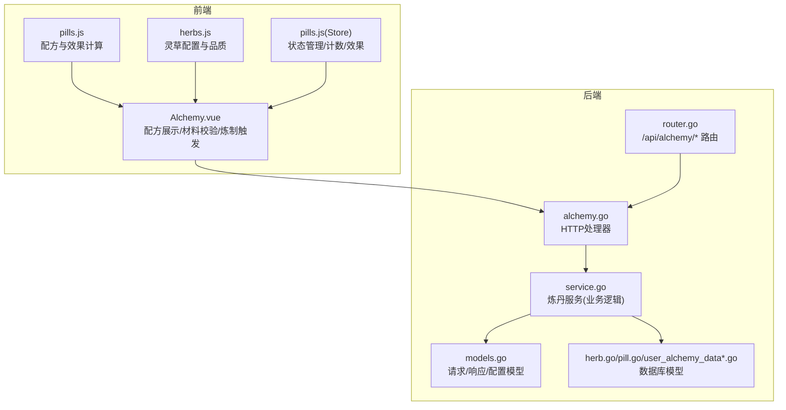
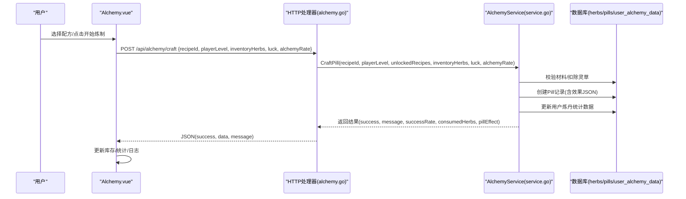
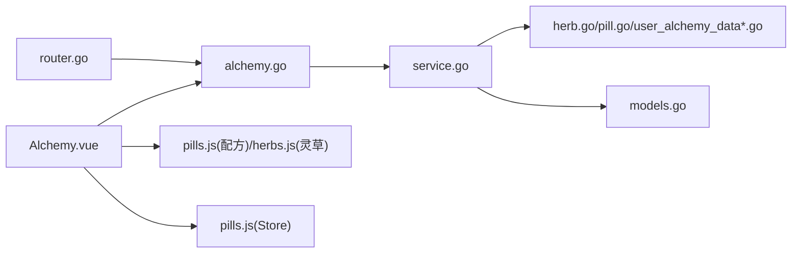

# 炼丹系统

<cite>
**本文引用的文件**
- [README_炼丹系统.md](file://README_炼丹系统.md)
- [Alchemy.vue](file://src/views/Alchemy.vue)
- [pills.js（前端插件）](file://src/plugins/pills.js)
- [herbs.js（前端插件）](file://src/plugins/herbs.js)
- [pills.js（前端状态）](file://src/stores/pills.js)
- [alchemy.go（后端处理器）](file://server-go/internal/http/handlers/alchemy/alchemy.go)
- [service.go（后端服务）](file://server-go/internal/alchemy/service.go)
- [models.go（后端模型）](file://server-go/internal/alchemy/models.go)
- [herb.go（后端模型）](file://server-go/internal/models/herb.go)
- [pill.go（后端模型）](file://server-go/internal/models/pill.go)
- [user_alchemy_data.go（后端模型）](file://server-go/internal/models/user_alchemy_data.go)
- [user_alchemy_data_db.go（后端模型）](file://server-go/internal/models/user_alchemy_data_db.go)
- [router.go（后端路由）](file://server-go/internal/http/router/router.go)
- [init.sql（数据库初始化）](file://server-go/init.sql)
</cite>

## 目录
1. [简介](#简介)
2. [项目结构](#项目结构)
3. [核心组件](#核心组件)
4. [架构总览](#架构总览)
5. [详细组件分析](#详细组件分析)
6. [依赖关系分析](#依赖关系分析)
7. [性能考量](#性能考量)
8. [故障排查指南](#故障排查指南)
9. [结论](#结论)
10. [附录](#附录)

## 简介
本文件面向炼丹系统的前端与后端实现，系统目标是提供完整的丹药制作体验：包括配方展示、灵草选择与炼制动画、成功率计算、品质与效果生成、配方解锁与多阶段炼制流程，以及从HTTP请求到数据库持久化的完整数据流。本文将结合README_炼丹系统.md的设计思路，系统化阐述前后端职责边界、数据模型、API调用链路与错误处理策略。

## 项目结构
炼丹系统由前端Vue3组件与后端Go服务共同构成，二者通过REST接口交互。前端负责配方展示、材料校验、成功率判定与UI反馈；后端负责配方配置、炼制逻辑、材料扣减、丹药创建与统计数据维护。

图表来源
- [Alchemy.vue](file://src/views/Alchemy.vue#L1-L358)
- [pills.js（前端插件）](file://src/plugins/pills.js#L1-L270)
- [herbs.js（前端插件）](file://src/plugins/herbs.js#L1-L164)
- [pills.js（前端状态）](file://src/stores/pills.js#L1-L94)
- [router.go（后端路由）](file://server-go/internal/http/router/router.go#L115-L124)
- [alchemy.go（后端处理器）](file://server-go/internal/http/handlers/alchemy/alchemy.go#L1-L305)
- [service.go（后端服务）](file://server-go/internal/alchemy/service.go#L1-L670)
- [models.go（后端模型）](file://server-go/internal/alchemy/models.go#L1-L198)
- [herb.go（后端模型）](file://server-go/internal/models/herb.go#L1-L17)
- [pill.go（后端模型）](file://server-go/internal/models/pill.go#L1-L21)
- [user_alchemy_data.go（后端模型）](file://server-go/internal/models/user_alchemy_data.go#L1-L17)
- [user_alchemy_data_db.go（后端模型）](file://server-go/internal/models/user_alchemy_data_db.go#L1-L21)

章节来源
- [router.go（后端路由）](file://server-go/internal/http/router/router.go#L115-L124)
- [Alchemy.vue](file://src/views/Alchemy.vue#L1-L358)

## 核心组件
- 前端组件
  - Alchemy.vue：配方选择、材料需求展示、效果预览、炼制按钮、日志面板与动画样式。
  - pills.js（前端插件）：配方配置、成功率计算、效果值计算。
  - herbs.js（前端插件）：灵草配置与品质概率。
  - pills.js（前端状态）：残页、已掌握配方、炼制次数、活动效果等状态管理。
- 后端服务
  - alchemy.go：路由注册与HTTP处理器，封装请求参数、调用服务层并返回标准化响应。
  - service.go：炼丹服务，包含配方配置、成功率计算、材料校验、炼制判定、材料扣减、丹药创建与统计数据更新。
  - models.go：请求/响应/配置模型，定义炼丹相关数据结构。
  - 数据库模型：herb.go、pill.go、user_alchemy_data*.go，映射herbs、pills、user_alchemy_data表。

章节来源
- [Alchemy.vue](file://src/views/Alchemy.vue#L1-L358)
- [pills.js（前端插件）](file://src/plugins/pills.js#L1-L270)
- [herbs.js（前端插件）](file://src/plugins/herbs.js#L1-L164)
- [pills.js（前端状态）](file://src/stores/pills.js#L1-L94)
- [alchemy.go（后端处理器）](file://server-go/internal/http/handlers/alchemy/alchemy.go#L1-L305)
- [service.go（后端服务）](file://server-go/internal/alchemy/service.go#L1-L670)
- [models.go（后端模型）](file://server-go/internal/alchemy/models.go#L1-L198)
- [herb.go（后端模型）](file://server-go/internal/models/herb.go#L1-L17)
- [pill.go（后端模型）](file://server-go/internal/models/pill.go#L1-L21)
- [user_alchemy_data.go（后端模型）](file://server-go/internal/models/user_alchemy_data.go#L1-L17)
- [user_alchemy_data_db.go（后端模型）](file://server-go/internal/models/user_alchemy_data_db.go#L1-L21)

## 架构总览
炼丹系统采用“前端展示+后端服务”的分层架构。前端负责用户交互与本地状态管理，后端负责业务规则与数据持久化。API覆盖配方列表、配方详情、炼制、购买残页与配置获取。

图表来源
- [Alchemy.vue](file://src/views/Alchemy.vue#L174-L248)
- [alchemy.go（后端处理器）](file://server-go/internal/http/handlers/alchemy/alchemy.go#L140-L217)
- [service.go（后端服务）](file://server-go/internal/alchemy/service.go#L349-L454)
- [pill.go（后端模型）](file://server-go/internal/models/pill.go#L1-L21)
- [herb.go（后端模型）](file://server-go/internal/models/herb.go#L1-L17)
- [user_alchemy_data_db.go（后端模型）](file://server-go/internal/models/user_alchemy_data_db.go#L1-L21)

## 详细组件分析

### 前端组件：Alchemy.vue
- 功能要点
  - 配方展示：按“已掌握”过滤显示，支持选择与查看详情。
  - 材料需求：展示每种灵草的需求量与拥有量，实时状态提示。
  - 效果预览：显示效果数值、持续时间与成功率。
  - 炼制按钮：校验材料与配方掌握状态，发起炼制请求。
  - 日志面板：记录炼制成功/失败事件。
  - 动画样式：成功/失败的视觉反馈（涟漪/抖动）。
- 数据流
  - 初始化：调用GET /api/alchemy/recipes，携带playerLevel参数。
  - 炼制：POST /api/alchemy/craft，携带recipeId、playerLevel、unlockedRecipes、inventoryHerbs、luck、alchemyRate。
  - 购买残页：POST /api/alchemy/buy-fragment，携带recipeId、quantity、currentFragments、unlockedRecipes。
- 错误处理
  - 材料不足：禁用按钮并提示。
  - 未掌握配方：提示“未掌握该丹方”。
  - 炼制失败：提示失败原因并记录日志。

章节来源
- [Alchemy.vue](file://src/views/Alchemy.vue#L1-L358)
- [router.go（后端路由）](file://server-go/internal/http/router/router.go#L115-L124)

### 前端插件：pills.js（配方与效果）
- 配方配置：12个丹方，包含品阶、类型、材料需求、基础效果与残页需求。
- 成功率计算：基于品阶成功率与幸运值乘积。
- 效果值计算：基础效果×类型倍数×等级倍数（1+(playerLevel-1)×0.1）。
- 炼制判定：随机数与成功率比较，决定成功/失败。

章节来源
- [pills.js（前端插件）](file://src/plugins/pills.js#L1-L270)

### 前端插件：herbs.js（灵草）
- 灵草种类与基础价值、类别与掉落概率。
- 品质概率：普通→仙品，不同品质倍数不同。
- 价值计算：基础价值×品质倍数。

章节来源
- [herbs.js（前端插件）](file://src/plugins/herbs.js#L1-L164)

### 前端状态：pills.js（Store）
- 状态：残页数量、已掌握配方、炼制次数、活动效果列表。
- 行为：获得残页、尝试炼制（本地）、使用丹药（本地计时与清理）。
- 注意：README指出当前为前端本地实现，后端API尚未完全落地。

章节来源
- [pills.js（前端状态）](file://src/stores/pills.js#L1-L94)
- [README_炼丹系统.md](file://README_炼丹系统.md#L143-L167)

### 后端处理器：alchemy.go
- 路由注册：/api/alchemy/configs、/api/alchemy/recipes、/api/alchemy/recipes/:recipeId、/api/alchemy/craft、/api/alchemy/buy-fragment。
- 参数绑定与校验：请求体JSON绑定、默认值处理（playerLevel、luck、alchemyRate）。
- 日志：zap记录入参与出参，便于排障。
- 错误处理：统一返回success/message/data/error结构。

章节来源
- [alchemy.go（后端处理器）](file://server-go/internal/http/handlers/alchemy/alchemy.go#L1-L305)
- [router.go（后端路由）](file://server-go/internal/http/router/router.go#L115-L124)

### 后端服务：service.go（炼丹服务）
- 配置与模型
  - 品阶配置：grade1-grade9，包含难度系数、基础成功率与残页需求。
  - 丹药类型：spirit、cultivation、attribute、special，对应倍数。
  - 灵草配置：15种灵草ID与名称。
  - 丹方配置：12个配方，含材料需求、基础效果与残页需求。
- 核心逻辑
  - GetAllRecipes：构建配方详情，包含当前效果、成功率、材料信息与用户状态。
  - GetRecipeDetail：按ID获取配方详情。
  - calculatePillEffect：效果值=基础效果×类型倍数×等级倍数。
  - CraftPill：校验配方掌握、材料充足、计算成功率并判定；成功则扣减材料、创建Pill记录、更新统计数据。
  - BuyFragment：计算价格（按品阶线性增长）、扣减灵石、更新残页数量，必要时解锁配方。
  - GetUserAlchemyData：从数据库读取用户炼丹数据（残页、已解锁配方、统计数据）。
- 数据持久化
  - herbs：按user_id与herb_id扣减count。
  - pills：创建新记录，effect字段保存JSON效果。
  - user_alchemy_data：pills_crafted等统计数据更新。

章节来源
- [service.go（后端服务）](file://server-go/internal/alchemy/service.go#L1-L670)
- [models.go（后端模型）](file://server-go/internal/alchemy/models.go#L1-L198)
- [herb.go（后端模型）](file://server-go/internal/models/herb.go#L1-L17)
- [pill.go（后端模型）](file://server-go/internal/models/pill.go#L1-L21)
- [user_alchemy_data.go（后端模型）](file://server-go/internal/models/user_alchemy_data.go#L1-L17)
- [user_alchemy_data_db.go（后端模型）](file://server-go/internal/models/user_alchemy_data_db.go#L1-L21)

### 数据模型与数据库
- herbarium表（herbs）
  - 字段：user_id、herb_id、name、count。
  - 作用：存储用户灵草库存。
- pills表
  - 字段：user_id、pill_id、name、description、effect(JSON)。
  - 作用：存储炼制成功的丹药及其效果。
- user_alchemy_data表
  - 字段：user_id、recipes_unlocked(JSON)、pills_crafted、pills_consumed、alchemy_level、alchemy_rate。
  - 作用：存储用户炼丹统计数据与解锁状态。
- 索引：针对各表user_id建立索引，提升查询与关联性能。

章节来源
- [init.sql（数据库初始化）](file://server-go/init.sql#L47-L83)

## 依赖关系分析
- 前端依赖
  - Alchemy.vue依赖APIService进行HTTP调用，依赖pills.js与herbs.js进行本地计算与展示，依赖pills.js(Store)进行状态管理。
- 后端依赖
  - alchemy.go依赖AlchemyService；AlchemyService依赖数据库模型与GORM；service.go依赖models.go中的配置与数据结构。
- 路由依赖
  - router.go集中注册/alchemt路由组，统一鉴权中间件保护。

图表来源
- [Alchemy.vue](file://src/views/Alchemy.vue#L1-L358)
- [pills.js（前端插件）](file://src/plugins/pills.js#L1-L270)
- [herbs.js（前端插件）](file://src/plugins/herbs.js#L1-L164)
- [pills.js（前端状态）](file://src/stores/pills.js#L1-L94)
- [router.go（后端路由）](file://server-go/internal/http/router/router.go#L115-L124)
- [alchemy.go（后端处理器）](file://server-go/internal/http/handlers/alchemy/alchemy.go#L1-L305)
- [service.go（后端服务）](file://server-go/internal/alchemy/service.go#L1-L670)
- [models.go（后端模型）](file://server-go/internal/alchemy/models.go#L1-L198)
- [herb.go（后端模型）](file://server-go/internal/models/herb.go#L1-L17)
- [pill.go（后端模型）](file://server-go/internal/models/pill.go#L1-L21)
- [user_alchemy_data.go（后端模型）](file://server-go/internal/models/user_alchemy_data.go#L1-L17)
- [user_alchemy_data_db.go（后端模型）](file://server-go/internal/models/user_alchemy_data_db.go#L1-L21)

## 性能考量
- 前端材料检查：遍历配方材料与背包灵草，复杂度约O(n×m)，README指出存在O(n²)优化空间，建议使用哈希映射加速。
- 后端炼制判定：成功率计算与材料扣减均为O(1)~O(m)，瓶颈主要在数据库写入与事务一致性。
- 数据库索引：init.sql已为关键字段建立索引，有助于提升查询与更新性能。
- 建议
  - 前端：将inventoryHerbs改为herbId→count的映射，避免重复遍历。
  - 后端：批量扣减材料时减少多次UPDATE，考虑一次性事务或批量写入。

章节来源
- [README_炼丹系统.md](file://README_炼丹系统.md#L194-L207)
- [init.sql（数据库初始化）](file://server-go/init.sql#L154-L166)

## 故障排查指南
- 常见错误与定位
  - 未授权：路由层鉴权失败，返回401。
  - 请求参数错误：JSON绑定失败，返回400。
  - 用户不存在/数据异常：服务层查询失败，返回500。
  - 材料不足：炼制时校验失败，返回400并提示。
  - 未掌握配方：炼制前校验失败，返回400并提示。
  - 灵石不足：购买残页时校验失败，返回400并提示。
- 日志与可观测性
  - alchemy.go使用zap记录入参与出参，便于定位问题。
- 前端提示
  - Alchemy.vue对材料不足、未掌握配方、炼制失败进行明确提示与日志记录。

章节来源
- [alchemy.go（后端处理器）](file://server-go/internal/http/handlers/alchemy/alchemy.go#L24-L80)
- [alchemy.go（后端处理器）](file://server-go/internal/http/handlers/alchemy/alchemy.go#L140-L217)
- [alchemy.go（后端处理器）](file://server-go/internal/http/handlers/alchemy/alchemy.go#L219-L276)
- [Alchemy.vue](file://src/views/Alchemy.vue#L174-L248)

## 结论
炼丹系统在设计上实现了清晰的前后端分工：前端负责用户体验与本地计算，后端负责核心业务逻辑与数据持久化。README强调了成功率与效果值的多层倍数计算、配方三阶段解锁流程与购买残页机制。当前后端API已具备基础能力，但README亦指出部分功能（如购买残页UI、丹药效果应用、后端API实装）尚未完全落地，后续可围绕性能优化与功能补齐推进。

## 附录

### API定义与调用链
- 获取所有配方
  - 方法：GET
  - 路径：/api/alchemy/recipes
  - 查询参数：playerLevel
  - 返回：success、data(recipes, grades, types, playerStats)
- 获取单个配方详情
  - 方法：GET
  - 路径：/api/alchemy/recipes/:recipeId
  - 查询参数：playerLevel
  - 返回：success、data(recipeDetail)
- 炼制丹药
  - 方法：POST
  - 路径：/api/alchemy/craft
  - 请求体：recipeId、playerLevel、unlockedRecipes[]、inventoryHerbs{herbId: count}、luck、alchemyRate
  - 返回：success、data({success, message, successRate, consumedHerbs, pillEffect})
- 购买残页
  - 方法：POST
  - 路径：/api/alchemy/buy-fragment
  - 请求体：recipeId、quantity、currentFragments、unlockedRecipes[]
  - 返回：success、data({success, message, fragmentsOwned, recipeUnlocked})
- 获取配置
  - 方法：GET
  - 路径：/api/alchemy/configs
  - 返回：success、data({grades, types, recipes, herbs})

章节来源
- [router.go（后端路由）](file://server-go/internal/http/router/router.go#L115-L124)
- [alchemy.go（后端处理器）](file://server-go/internal/http/handlers/alchemy/alchemy.go#L24-L80)
- [alchemy.go（后端处理器）](file://server-go/internal/http/handlers/alchemy/alchemy.go#L82-L138)
- [alchemy.go（后端处理器）](file://server-go/internal/http/handlers/alchemy/alchemy.go#L140-L217)
- [alchemy.go（后端处理器）](file://server-go/internal/http/handlers/alchemy/alchemy.go#L219-L276)
- [alchemy.go（后端处理器）](file://server-go/internal/http/handlers/alchemy/alchemy.go#L278-L305)

### 成功率与效果值计算
- 成功率计算
  - 最终成功率 = 品阶成功率 × 幸运值 × 炼丹技能加成
  - README示例：四品×1.1幸运×1.2技能=79.2%
- 效果值计算
  - 最终效果 = 基础效果 × 类型倍数 × 等级倍数（1 + (玩家等级-1)×0.1）
  - README示例：等级10的聚灵丹=0.2×1.0×1.9=0.38（38%）

章节来源
- [README_炼丹系统.md](file://README_炼丹系统.md#L115-L133)
- [README_炼丹系统.md](file://README_炼丹系统.md#L117-L125)
- [service.go（后端服务）](file://server-go/internal/alchemy/service.go#L332-L347)
- [pills.js（前端插件）](file://src/plugins/pills.js#L236-L248)

### 配方解锁机制与多阶段炼制
- 三阶段流程
  - 第1阶段：获得丹方残页（探索或购买）
  - 第2阶段：自动合成完整丹方（残页达到需求数）
  - 第3阶段：掌握丹方（可开始炼制）
- README数据
  - 品阶成功率：一品90%、二品80%、…、九品10%
  - 残页成本：单片残页成本=品阶数字×100灵石（一品100/片，四品400/片）

章节来源
- [README_炼丹系统.md](file://README_炼丹系统.md#L28-L42)
- [README_炼丹系统.md](file://README_炼丹系统.md#L93-L103)
- [README_炼丹系统.md](file://README_炼丹系统.md#L135-L139)

### 丹药品质生成规则（基于item_qualities.go）
- 说明：item_qualities.go定义了装备/宠物的品质配置，炼丹系统当前未直接使用该文件；炼丹的灵草品质在herbs.js中定义，用于掉落与价值计算。
- 建议：若未来引入“丹药品质”，可参考该文件的结构进行扩展。

章节来源
- [item_qualities.go（后端模型）](file://server-go/internal/models/item_qualities.go#L1-L96)
- [herbs.js（前端插件）](file://src/plugins/herbs.js#L1-L164)

### 炼丹耗时机制与失败处理策略
- 耗时机制
  - README未给出炼制耗时的具体实现；当前后端service.go未涉及时间戳或定时任务，炼制即时完成。
- 失败处理
  - 成功：扣减材料、创建Pill记录、更新统计数据。
  - 失败：仍扣减材料（README解释为游戏平衡），返回失败消息与成功率。

章节来源
- [service.go（后端服务）](file://server-go/internal/alchemy/service.go#L349-L454)
- [README_炼丹系统.md](file://README_炼丹系统.md#L245-L247)

### 前端炼制动画与交互
- Alchemy.vue提供成功/失败的视觉反馈（涟漪/抖动），并集成日志面板记录炼制结果。

章节来源
- [Alchemy.vue](file://src/views/Alchemy.vue#L318-L358)