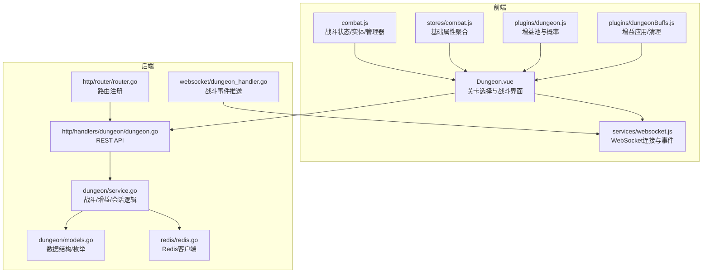
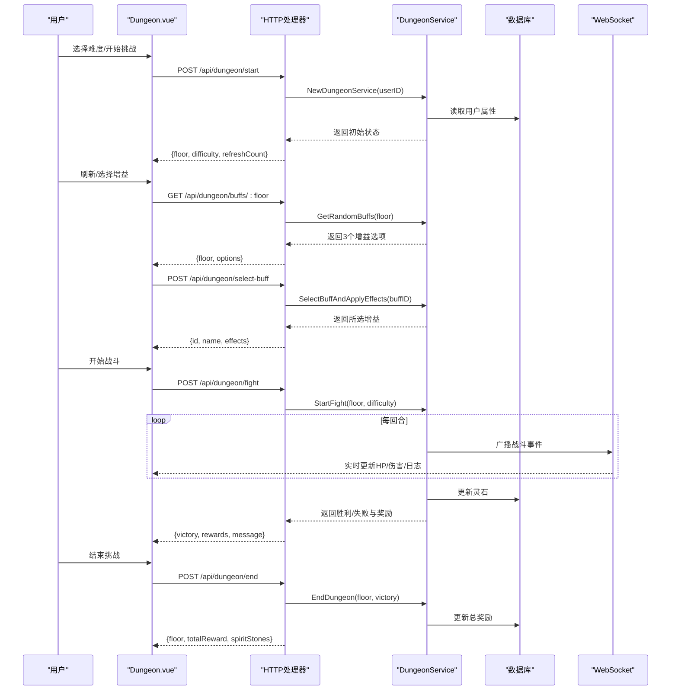
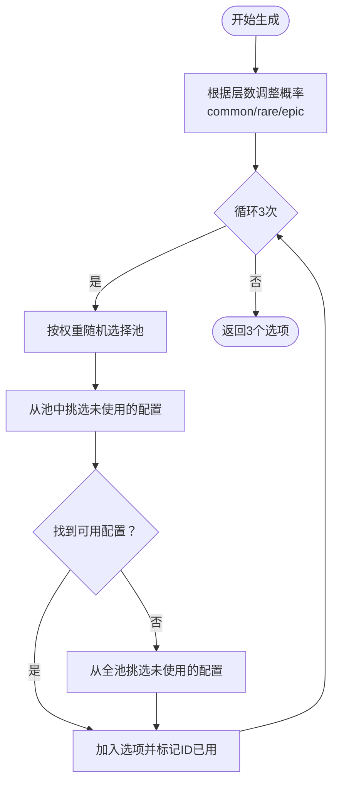
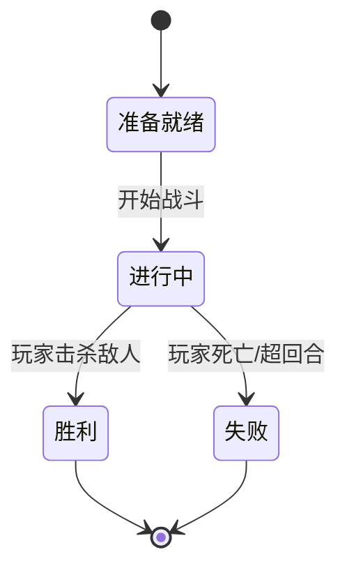
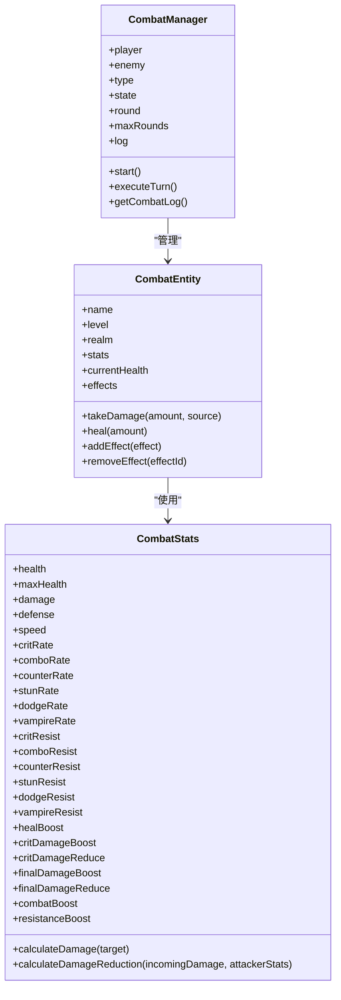
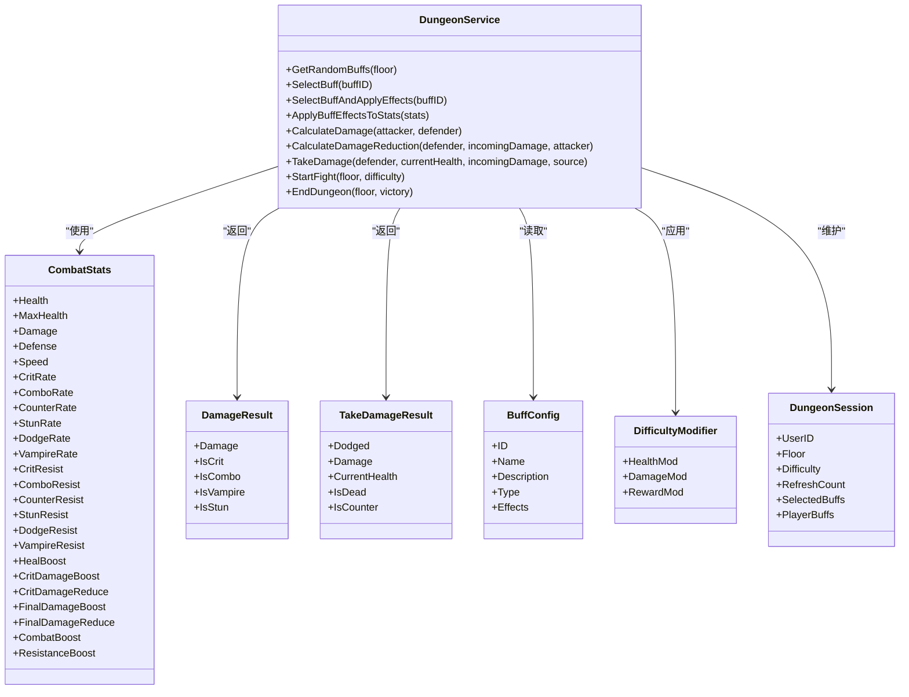
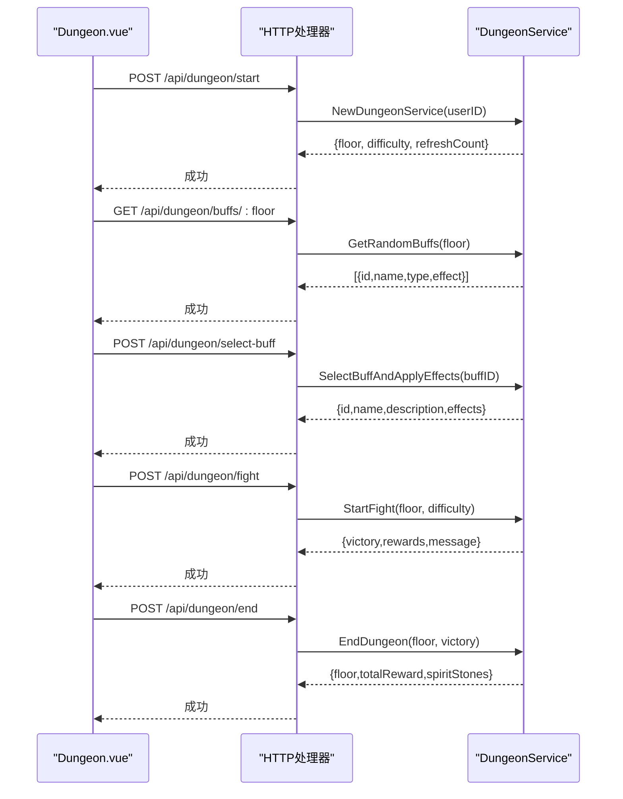
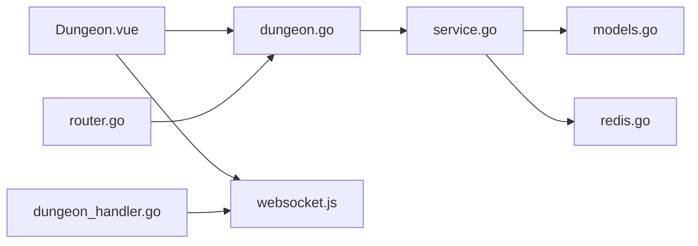

# 秘境系统

<cite>
**本文引用的文件**
- [Dungeon.vue](file://src/views/Dungeon.vue)
- [combat.js](file://src/plugins/combat.js)
- [combat.js（store）](file://src/stores/combat.js)
- [dungeon.js（前端插件）](file://src/plugins/dungeon.js)
- [dungeonBuffs.js](file://src/plugins/dungeonBuffs.js)
- [websocket.js](file://src/services/websocket.js)
- [models.go（后端）](file://server-go/internal/dungeon/models.go)
- [service.go（后端）](file://server-go/internal/dungeon/service.go)
- [dungeon.go（HTTP处理器）](file://server-go/internal/http/handlers/dungeon/dungeon.go)
- [dungeon_handler.go（WebSocket处理器）](file://server-go/internal/websocket/dungeon_handler.go)
- [redis.go（Redis客户端）](file://server-go/internal/redis/redis.go)
- [router.go（路由注册）](file://server-go/internal/http/router/router.go)
- [DUNGEON_MIGRATION_SUMMARY.md](file://DUNGEON_MIGRATION_SUMMARY.md)
</cite>

## 目录
1. [简介](#简介)
2. [项目结构](#项目结构)
3. [核心组件](#核心组件)
4. [架构总览](#架构总览)
5. [详细组件分析](#详细组件分析)
6. [依赖关系分析](#依赖关系分析)
7. [性能考量](#性能考量)
8. [故障排查指南](#故障排查指南)
9. [结论](#结论)
10. [附录](#附录)

## 简介
本文件面向“秘境系统”的Roguelike玩法，从前端Dungeon.vue的关卡选择界面到后端dungeon/service.go的战斗逻辑计算，系统性解析以下关键点：
- 增益Buff的随机生成机制（概率分布、层数影响、品质权重）
- 战斗流程的状态机设计（普通攻击、技能释放、死亡判定）
- 前端combat.js中的战斗数据状态管理
- 实体定义与伤害计算模型（models.go中的CombatStats与后端service.go的计算函数）
- 用户挑战全过程的数据交互路径（开始挑战、中途退出、胜利结算）
- 与Redis缓存的集成方式（用于持久化会话与状态一致性）

## 项目结构
秘境系统由前后端协同实现：
- 前端：Vue3页面负责UI与用户交互；插件负责战斗状态与增益效果；store负责基础属性聚合
- 后端：Go服务封装业务逻辑；HTTP处理器提供REST API；WebSocket处理器推送实时事件；Redis提供缓存能力

图表来源
- [Dungeon.vue](file://src/views/Dungeon.vue#L1-L200)
- [combat.js](file://src/plugins/combat.js#L1-L120)
- [combat.js（store）](file://src/stores/combat.js#L1-L45)
- [dungeon.js（前端插件）](file://src/plugins/dungeon.js#L1-L120)
- [dungeonBuffs.js](file://src/plugins/dungeonBuffs.js#L1-L54)
- [websocket.js](file://src/services/websocket.js#L1-L120)
- [dungeon.go（HTTP处理器）](file://server-go/internal/http/handlers/dungeon/dungeon.go#L1-L120)
- [service.go（后端）](file://server-go/internal/dungeon/service.go#L1-L120)
- [models.go（后端）](file://server-go/internal/dungeon/models.go#L1-L80)
- [dungeon_handler.go（WebSocket处理器）](file://server-go/internal/websocket/dungeon_handler.go#L1-L80)
- [redis.go（Redis客户端）](file://server-go/internal/redis/redis.go#L1-L34)
- [router.go（路由注册）](file://server-go/internal/http/router/router.go#L1-L120)

章节来源
- [DUNGEON_MIGRATION_SUMMARY.md](file://DUNGEON_MIGRATION_SUMMARY.md#L1-L49)

## 核心组件
- 前端Dungeon.vue：负责难度选择、增益选项刷新与选择、战斗发起与结果展示
- 前端combat.js：定义战斗状态机、CombatStats、CombatEntity、CombatManager与生成敌人逻辑
- 前端store/combat.js：聚合基础属性、战斗属性、特殊属性，供Dungeon.vue计算玩家属性
- 前端plugins/dungeon.js：定义增益池与概率（后端已接管该逻辑）
- 前端plugins/dungeonBuffs.js：应用/清理增益效果
- 后端dungeon/models.go：定义请求/响应、战斗属性、伤害结果、难度修饰符、增益配置与会话
- 后端dungeon/service.go：实现增益随机生成、战斗模拟、伤害计算、增益效果叠加、难度修正、奖励发放
- 后端http/handlers/dungeon/dungeon.go：REST API入口，校验参数并调用服务层
- 后端websocket/dungeon_handler.go：战斗事件广播（开始、回合、胜利、失败、宝箱）
- 后端redis/redis.go：Redis客户端初始化
- 后端router/router.go：注册秘境相关路由

章节来源
- [Dungeon.vue](file://src/views/Dungeon.vue#L1-L200)
- [combat.js](file://src/plugins/combat.js#L1-L120)
- [combat.js（store）](file://src/stores/combat.js#L1-L45)
- [dungeon.js（前端插件）](file://src/plugins/dungeon.js#L1-L120)
- [dungeonBuffs.js](file://src/plugins/dungeonBuffs.js#L1-L54)
- [models.go（后端）](file://server-go/internal/dungeon/models.go#L1-L120)
- [service.go（后端）](file://server-go/internal/dungeon/service.go#L1-L120)
- [dungeon.go（HTTP处理器）](file://server-go/internal/http/handlers/dungeon/dungeon.go#L1-L120)
- [dungeon_handler.go（WebSocket处理器）](file://server-go/internal/websocket/dungeon_handler.go#L1-L80)
- [redis.go（Redis客户端）](file://server-go/internal/redis/redis.go#L1-L34)
- [router.go（路由注册）](file://server-go/internal/http/router/router.go#L1-L120)

## 架构总览
秘境系统采用“前端渲染+后端计算”的模式：
- 前端负责UI与用户交互，调用后端REST API获取增益、发起战斗、结束挑战
- 后端负责核心业务逻辑：增益随机生成、战斗模拟、伤害计算、难度修正、奖励发放
- WebSocket用于实时推送战斗事件，增强用户体验
- Redis作为可选的缓存层，用于持久化会话与状态一致性（当前仓库未见直接使用Redis的代码，但提供了初始化入口）

图表来源
- [dungeon.go（HTTP处理器）](file://server-go/internal/http/handlers/dungeon/dungeon.go#L1-L275)
- [service.go（后端）](file://server-go/internal/dungeon/service.go#L300-L490)
- [dungeon_handler.go（WebSocket处理器）](file://server-go/internal/websocket/dungeon_handler.go#L1-L144)
- [DUNGEON_MIGRATION_SUMMARY.md](file://DUNGEON_MIGRATION_SUMMARY.md#L1-L49)

## 详细组件分析

### 增益Buff的随机生成机制
- 品质概率随层数动态调整：每10层史诗概率提升至20%，每5层稀有概率提升至35%
- 从common/rare/epic三个池中按权重抽取，若当前池无可用项则回退到全池
- 生成3个不重复的增益选项，包含ID、名称、描述、类型与效果映射
- 前端不再自行生成，改为调用后端接口获取

图表来源
- [service.go（后端）](file://server-go/internal/dungeon/service.go#L68-L158)
- [dungeon.go（HTTP处理器）](file://server-go/internal/http/handlers/dungeon/dungeon.go#L68-L117)

章节来源
- [service.go（后端）](file://server-go/internal/dungeon/service.go#L68-L158)
- [dungeon.go（HTTP处理器）](file://server-go/internal/http/handlers/dungeon/dungeon.go#L68-L117)

### 战斗流程与状态机设计
- 前端状态机：READY → IN_PROGRESS → VICTORY/DEFEAT
- 每回合根据速度决定先后手，计算伤害、判定闪避/反击/眩晕/吸血，应用最终减伤与暴击减免
- 后端战斗模拟：按回合推进，记录日志，超过最大回合数判定失败
- 死亡判定：任一方生命值归零即结束

图表来源
- [combat.js](file://src/plugins/combat.js#L1-L120)
- [service.go（后端）](file://server-go/internal/dungeon/service.go#L300-L490)

章节来源
- [combat.js](file://src/plugins/combat.js#L1-L120)
- [service.go（后端）](file://server-go/internal/dungeon/service.go#L300-L490)

### 前端战斗数据状态管理（combat.js）
- CombatStats：基础属性、战斗属性、抗性、特殊属性
- calculateDamage：计算基础伤害、暴击、连击、吸血、眩晕、最终增伤
- calculateDamageReduction：防御减伤、暴击伤害减免、最终减伤
- CombatEntity：受击、闪避、反击、治疗
- CombatManager：回合执行、日志记录、状态推进

图表来源
- [combat.js](file://src/plugins/combat.js#L1-L362)

章节来源
- [combat.js](file://src/plugins/combat.js#L1-L362)

### 实体定义与伤害计算模型（models.go与service.go）
- models.go定义CombatStats、DamageResult、TakeDamageResult、DifficultyModifier、BuffConfig、DungeonSession等
- service.go实现伤害计算、伤害减免、被伤害判定、增益效果叠加、难度修正、敌人属性随层数递增

图表来源
- [models.go（后端）](file://server-go/internal/dungeon/models.go#L1-L136)
- [service.go（后端）](file://server-go/internal/dungeon/service.go#L1-L200)

章节来源
- [models.go（后端）](file://server-go/internal/dungeon/models.go#L1-L136)
- [service.go（后端）](file://server-go/internal/dungeon/service.go#L1-L200)

### 用户挑战全过程的数据交互路径
- 开始挑战：POST /api/dungeon/start → 返回初始状态（层数、难度、刷新次数）
- 获取增益：GET /api/dungeon/buffs/:floor → 返回3个增益选项
- 选择增益：POST /api/dungeon/select-buff → 返回所选增益
- 开始战斗：POST /api/dungeon/fight → 返回胜利/失败、回合数、日志、奖励
- 结束挑战：POST /api/dungeon/end → 返回总奖励与灵石

图表来源
- [dungeon.go（HTTP处理器）](file://server-go/internal/http/handlers/dungeon/dungeon.go#L1-L275)
- [service.go（后端）](file://server-go/internal/dungeon/service.go#L300-L490)

章节来源
- [dungeon.go（HTTP处理器）](file://server-go/internal/http/handlers/dungeon/dungeon.go#L1-L275)
- [service.go（后端）](file://server-go/internal/dungeon/service.go#L300-L490)

### 与Redis缓存的集成方式
- 仓库提供了Redis客户端初始化入口，便于后续扩展会话与状态持久化
- 当前秘境实现未直接使用Redis，但可将其用于：
  - 会话状态存储（当前层数、已选增益、刷新次数）
  - 战斗过程的中间状态缓存（用于断线重连/状态恢复）
  - 全局排行榜或挑战统计的缓存

章节来源
- [redis.go（Redis客户端）](file://server-go/internal/redis/redis.go#L1-L34)

## 依赖关系分析
- 前端Dungeon.vue依赖HTTP API与WebSocket；依赖combat.js与store/combat.js进行属性计算
- 后端HTTP处理器依赖DungeonService；DungeonService依赖models.go中的数据结构与db/models
- WebSocket处理器依赖ConnectionManager进行事件广播
- 路由注册集中于router.go，统一暴露5个秘境相关端点

图表来源
- [Dungeon.vue](file://src/views/Dungeon.vue#L1-L200)
- [dungeon.go（HTTP处理器）](file://server-go/internal/http/handlers/dungeon/dungeon.go#L1-L120)
- [service.go（后端）](file://server-go/internal/dungeon/service.go#L1-L120)
- [models.go（后端）](file://server-go/internal/dungeon/models.go#L1-L80)
- [dungeon_handler.go（WebSocket处理器）](file://server-go/internal/websocket/dungeon_handler.go#L1-L80)
- [redis.go（Redis客户端）](file://server-go/internal/redis/redis.go#L1-L34)
- [router.go（路由注册）](file://server-go/internal/http/router/router.go#L1-L120)

章节来源
- [Dungeon.vue](file://src/views/Dungeon.vue#L1-L200)
- [dungeon.go（HTTP处理器）](file://server-go/internal/http/handlers/dungeon/dungeon.go#L1-L120)
- [service.go（后端）](file://server-go/internal/dungeon/service.go#L1-L120)
- [models.go（后端）](file://server-go/internal/dungeon/models.go#L1-L80)
- [dungeon_handler.go（WebSocket处理器）](file://server-go/internal/websocket/dungeon_handler.go#L1-L80)
- [redis.go（Redis客户端）](file://server-go/internal/redis/redis.go#L1-L34)
- [router.go（路由注册）](file://server-go/internal/http/router/router.go#L1-L120)

## 性能考量
- 前端战斗模拟建议仅用于演示或离线预演，正式战斗应由后端计算并推送结果，避免客户端作弊与状态漂移
- 增益生成与战斗模拟均为O(1)/O(n)简单操作，性能瓶颈主要在数据库读写与WebSocket广播
- WebSocket事件节流：BroadcastMultipleEvents中对事件间隔进行了限速，避免过于密集的推送
- 奖励计算与难度修正为常数时间，建议在数据库层面使用批量更新减少往返

## 故障排查指南
- 增益获取失败：检查后端日志与参数校验（难度、楼层），确认服务层GetRandomBuffs是否抛错
- 选择增益失败：确认buffID存在且未被禁用，查看服务层SelectBuff的错误返回
- 开始战斗失败：检查StartFight参数合法性与数据库读取用户属性是否成功
- WebSocket未收到事件：检查连接状态、心跳机制与事件类型订阅是否正确
- Redis连接失败：确认环境变量REDIS_URL与Redis服务可达

章节来源
- [dungeon.go（HTTP处理器）](file://server-go/internal/http/handlers/dungeon/dungeon.go#L1-L275)
- [dungeon_handler.go（WebSocket处理器）](file://server-go/internal/websocket/dungeon_handler.go#L1-L144)
- [redis.go（Redis客户端）](file://server-go/internal/redis/redis.go#L1-L34)

## 结论
秘境系统通过前后端分离实现了稳定的Roguelike体验：
- 前端专注UI与交互，后端专注业务与一致性
- 增益随机生成与战斗模拟均在后端完成，确保公平性
- WebSocket提供实时反馈，提升沉浸感
- Redis作为基础设施已准备就绪，可用于未来扩展会话与状态持久化

## 附录
- API端点概览（来自迁移总结）
  - POST /api/dungeon/start：开始秘境
  - GET /api/dungeon/buffs/:floor：获取增益选项
  - POST /api/dungeon/select-buff：选择增益
  - POST /api/dungeon/fight：开始战斗
  - POST /api/dungeon/end：结束挑战

章节来源
- [DUNGEON_MIGRATION_SUMMARY.md](file://DUNGEON_MIGRATION_SUMMARY.md#L1-L49)