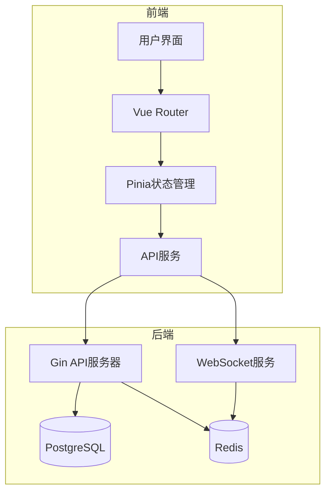
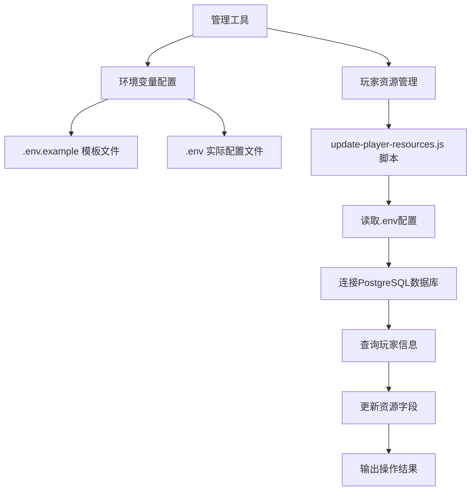
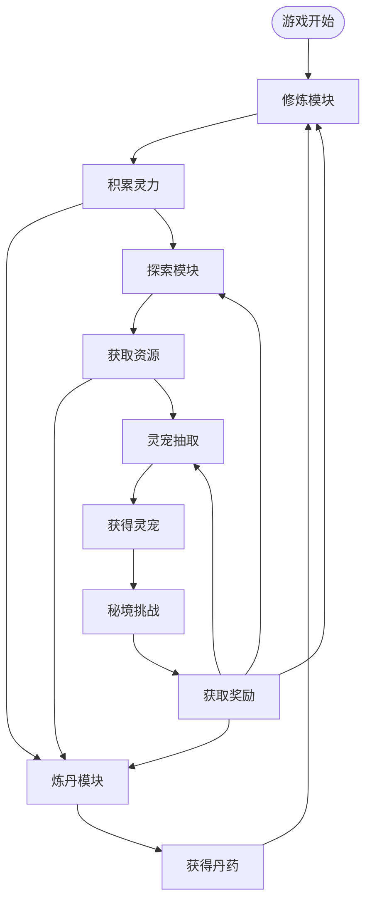
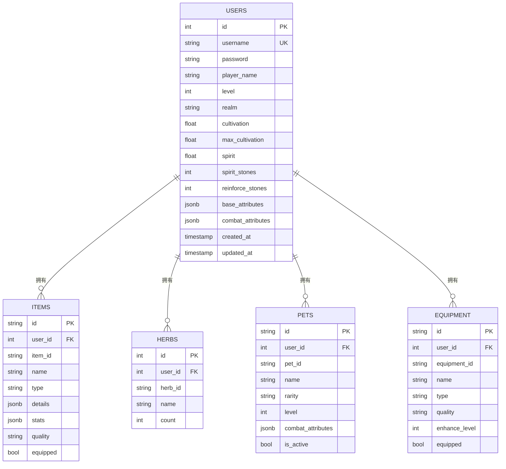
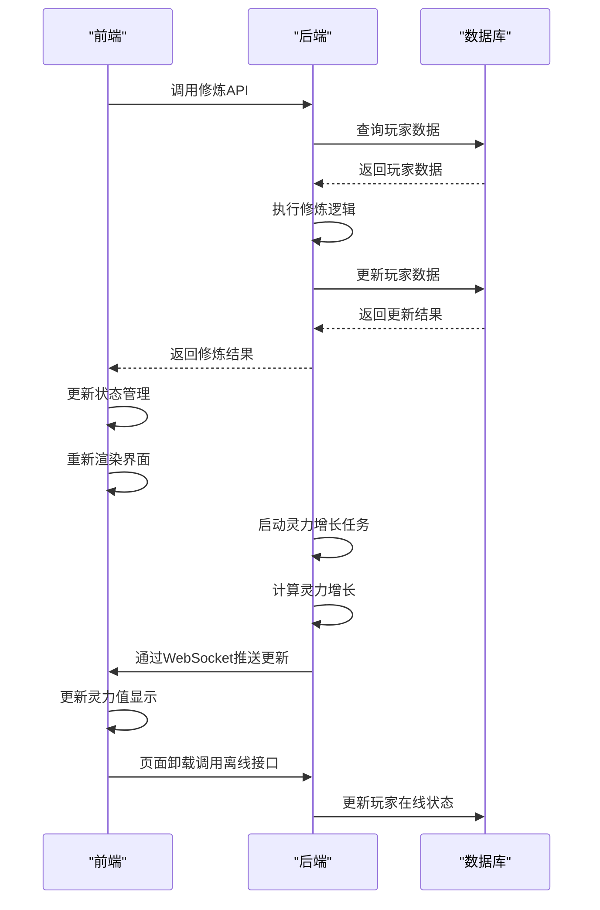

# 系统概述

<cite>
**本文档引用文件**   
- [main.go](file://server-go/cmd/server/main.go)
- [router.go](file://server-go/internal/http/router/router.go)
- [App.vue](file://src/App.vue)
- [main.js](file://src/main.js)
- [router/index.js](file://src/router/index.js)
- [api.js](file://src/services/api.js)
- [init.sql](file://server-go/init.sql)
- [user.go](file://server-go/internal/models/user.go)
- [playerInfo.js](file://src/stores/playerInfo.js)
- [cultivation/service.go](file://server-go/internal/cultivation/service.go)
- [gacha/service.go](file://server-go/internal/gacha/service.go)
- [.env](file://.env)
- [.env.example](file://.env.example)
- [update-player-resources.js](file://update-player-resources.js)
- [README_UPDATE_RESOURCES.md](file://README_UPDATE_RESOURCES.md)
</cite>

## 更新摘要
**已做更改**   
- 在"技术架构与前后端分离设计"部分添加了关于数据库配置和环境变量管理的新内容
- 新增了"管理工具与数据库配置"章节，详细说明了.env文件和玩家资源更新脚本的使用
- 更新了文档中的文件引用列表，包含了新添加的配置和管理工具文件

## 目录
1. [项目定位与目标用户](#项目定位与目标用户)
2. [技术架构与前后端分离设计](#技术架构与前后端分离设计)
3. [管理工具与数据库配置](#管理工具与数据库配置)
4. [核心功能模块与交互逻辑](#核心功能模块与交互逻辑)
5. [系统数据模型与数据库设计](#系统数据模型与数据库设计)
6. [模块协同工作机制](#模块协同工作机制)
7. [基础概念框架](#基础概念框架)

## 项目定位与目标用户

xiuxian-go项目是一个以修仙题材为核心的全栈网页游戏，旨在为玩家提供沉浸式的修真体验。该项目通过融合传统修仙文化元素与现代游戏机制，构建了一个包含修炼、炼丹、秘境、探索和灵宠抽取等多元玩法的虚拟修仙世界。目标用户群体主要为对东方玄幻题材感兴趣的游戏玩家，特别是喜欢角色养成、资源管理和随机性玩法的休闲玩家。项目设计初衷是创造一个既符合修仙世界观设定，又具备良好游戏平衡性和可玩性的在线游戏平台，让玩家能够通过策略性决策和持续投入，体验从凡人到仙人的成长历程。

**Section sources**
- [main.go](file://server-go/cmd/server/main.go#L1-L107)
- [App.vue](file://src/App.vue#L1-L654)

## 技术架构与前后端分离设计

本项目采用典型的前后端分离架构，前端基于Vue 3框架构建用户界面，后端使用Go语言配合Gin框架处理业务逻辑。前端技术栈包括Vue 3、Pinia状态管理、Naive UI组件库和Vite构建工具，实现了响应式用户界面和模块化的状态管理。后端技术栈采用Go语言的Gin框架作为Web服务器，配合PostgreSQL作为主数据库存储持久化数据，Redis用于缓存和实时通信，WebSocket协议支持实时交互功能。

系统通过RESTful API和WebSocket协议实现前后端通信。前端通过Axios库调用后端提供的REST API获取数据和提交操作，同时利用WebSocket建立长连接，实现实时数据推送和状态同步。这种架构设计使得前后端可以独立开发和部署，提高了系统的可维护性和扩展性。前端负责用户界面渲染和交互逻辑，后端专注于业务规则执行和数据持久化，两者通过明确定义的接口进行协作。

**Diagram sources **
- [main.js](file://src/main.js#L1-L31)
- [main.go](file://server-go/cmd/server/main.go#L1-L107)
- [router.go](file://server-go/internal/http/router/router.go#L1-L126)

**Section sources**
- [package.json](file://package.json#L1-L42)
- [go.mod](file://server-go/go.mod#L1-L64)

## 管理工具与数据库配置

为方便项目管理和开发，系统引入了环境变量配置和管理工具。数据库连接配置通过`.env`和`.env.example`文件进行管理，实现了配置的分离和安全性。`.env.example`文件作为模板，包含了数据库连接所需的基本配置项，包括主机地址、端口、数据库名称、用户名和密码。开发者在实际使用时，需要复制`.env.example`文件为`.env`，并根据实际环境修改相应的配置参数。

系统还提供了一个名为`update-player-resources.js`的管理脚本，用于管理员直接修改玩家资源。该脚本通过Node.js实现，可以直接操作数据库，为指定ID的玩家增加或减少各种资源，包括灵石、强化石、洗练石、灵宠精华和灵力。脚本使用PostgreSQL客户端库连接数据库，执行资源更新操作，并在控制台输出更新前后的玩家信息，确保操作的透明性和可追溯性。

**Diagram sources**
- [.env](file://.env#L1-L6)
- [.env.example](file://.env.example#L1-L6)
- [update-player-resources.js](file://update-player-resources.js#L1-L134)

**Section sources**
- [.env](file://.env#L1-L6)
- [.env.example](file://.env.example#L1-L6)
- [update-player-resources.js](file://update-player-resources.js#L1-L134)
- [README_UPDATE_RESOURCES.md](file://README_UPDATE_RESOURCES.md#L1-L66)

## 核心功能模块与交互逻辑

系统核心玩法由多个相互关联的模块组成，包括修炼、炼丹、秘境、探索和灵宠抽取等。修炼模块是游戏的基础，玩家通过消耗灵力进行打坐修炼，积累修为以突破境界，提升角色等级和属性。炼丹模块允许玩家使用采集的灵草炼制丹药，提升角色能力或获得特殊效果。秘境模块提供挑战性的副本玩法，玩家需要策略性地选择增益效果，战胜敌人获取奖励。探索模块模拟随机事件，玩家在探索过程中可能获得资源或触发特殊事件。灵宠抽取模块通过概率性机制让玩家获取各种灵宠，增强战斗能力。

这些模块之间存在紧密的交互关系。修炼产生的灵力是进行炼丹和探索的基础资源，炼丹获得的丹药可以提升修炼效率或战斗属性，探索获取的资源可用于炼丹或强化装备，秘境挑战的奖励可以用于提升灵宠能力。这种环环相扣的设计形成了正向反馈循环，激励玩家在不同玩法之间切换，保持游戏的新鲜感和策略深度。

**Diagram sources **
- [Cultivation.vue](file://src/views/Cultivation.vue#L1-L282)
- [cultivation/service.go](file://server-go/internal/cultivation/service.go#L1-L355)
- [gacha/service.go](file://server-go/internal/gacha/service.go#L1-L139)

**Section sources**
- [App.vue](file://src/App.vue#L1-L654)
- [router/index.js](file://src/router/index.js#L1-L37)

## 系统数据模型与数据库设计

系统采用PostgreSQL作为主数据库，设计了多个表来存储玩家数据和游戏配置。核心数据模型包括用户表（users）、物品表（items）、灵草表（herbs）、丹药表（pills）、灵宠表（pets）和装备表（equipment）等。用户表存储玩家的基本信息、修为、灵力和各种资源数量。物品表记录玩家拥有的各类物品，包括装备和消耗品。灵草表和丹药表分别存储采集的灵草和炼制的丹药。灵宠表记录玩家抽取的灵宠及其属性。装备表存储玩家获得的装备及其强化等级。

数据库设计遵循规范化原则，同时考虑查询性能。通过外键约束维护数据完整性，例如物品表中的user_id字段引用用户表的id字段。为提高查询效率，在常用查询字段上创建索引，如用户表的username字段和物品表的user_id字段。JSONB类型用于存储复杂的嵌套数据结构，如角色的战斗属性和装备的额外属性，既保持了数据的灵活性，又支持高效的查询操作。

**Diagram sources **
- [init.sql](file://server-go/init.sql#L1-L166)
- [user.go](file://server-go/internal/models/user.go#L1-L48)

**Section sources**
- [init.sql](file://server-go/init.sql#L1-L166)

## 模块协同工作机制

各功能模块通过后端API和前端状态管理协同工作，形成完整的用户体验。当玩家在前端界面进行操作时，如点击"打坐修炼"按钮，前端通过API服务调用后端的修炼接口。后端接收到请求后，验证用户身份，检查资源是否充足，执行修炼逻辑，更新数据库中的玩家数据，并返回结果。前端接收到响应后，更新Pinia状态管理中的玩家数据，触发界面重新渲染，实时反映玩家状态的变化。

实时功能通过WebSocket实现。后端启动灵力增长后台任务，定期计算玩家的灵力增长，并通过WebSocket连接将更新推送到前端。前端接收到消息后，更新玩家的灵力值，实现灵力的自动增长效果。这种机制避免了前端频繁轮询后端接口，降低了服务器负载，同时提供了流畅的实时体验。玩家离线状态通过页面卸载事件监听器处理，当检测到页面关闭时，前端主动调用离线接口，确保玩家状态的准确同步。

**Diagram sources **
- [api.js](file://src/services/api.js#L1-L1131)
- [main.go](file://server-go/cmd/server/main.go#L1-L107)
- [playerInfo.js](file://src/stores/playerInfo.js#L1-L112)

**Section sources**
- [main.js](file://src/main.js#L1-L31)
- [main.go](file://server-go/cmd/server/main.go#L1-L107)

## 基础概念框架

为帮助初学者理解整个系统，建立以下基础概念框架：玩家角色是游戏的核心实体，拥有境界、修为、灵力等基本属性。境界代表玩家的修仙层次，通过积累修为突破提升。修为是衡量玩家修炼进度的指标，达到当前境界上限后可尝试突破。灵力是执行各种操作的基础资源，随时间自动增长，也可通过修炼获得。灵石是游戏内的主要货币，用于抽取灵宠和购买资源。装备和灵宠是增强角色能力的重要途径，可通过抽取、探索或挑战获得。

游戏采用循环渐进的成长模型，玩家从低级境界开始，通过不断修炼和探索，逐步提升实力，挑战更高难度的内容。每个功能模块都围绕这个核心成长模型设计，提供不同的成长路径和策略选择。这种设计既保证了游戏的可理解性，又为深度玩家提供了丰富的策略空间。通过理解这些基础概念及其相互关系，玩家可以更好地规划自己的修仙之路，最大化游戏体验。

**Section sources**
- [App.vue](file://src/App.vue#L1-L654)
- [playerInfo.js](file://src/stores/playerInfo.js#L1-L112)
- [cultivation/service.go](file://server-go/internal/cultivation/service.go#L1-L355)