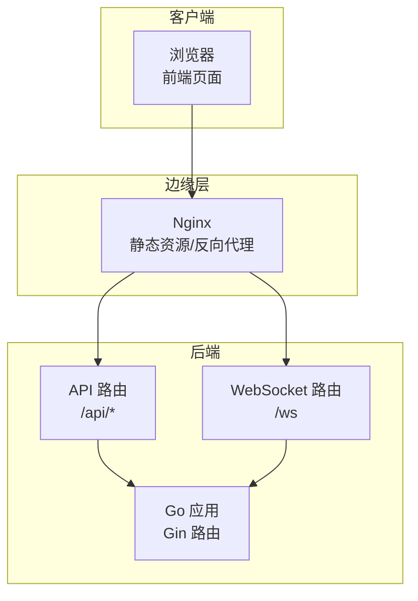
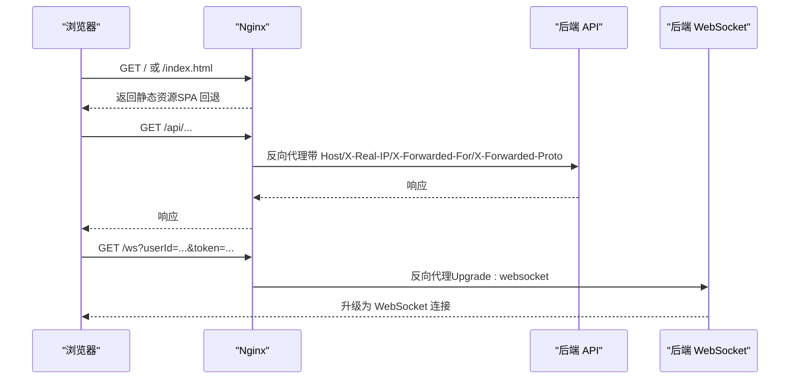
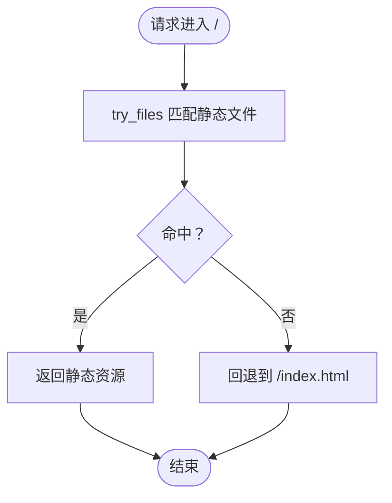
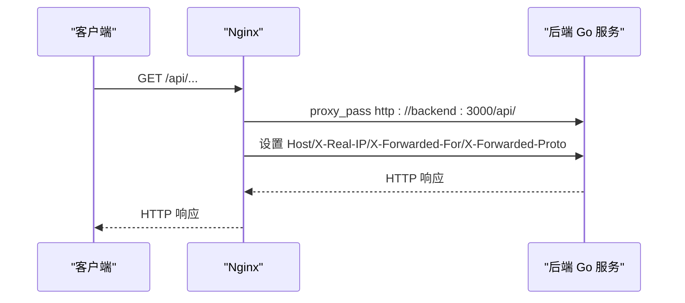
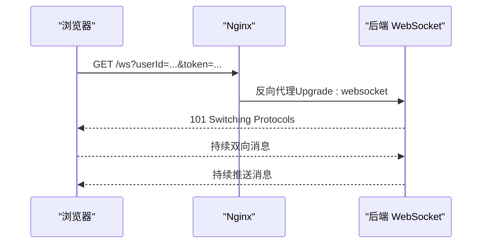
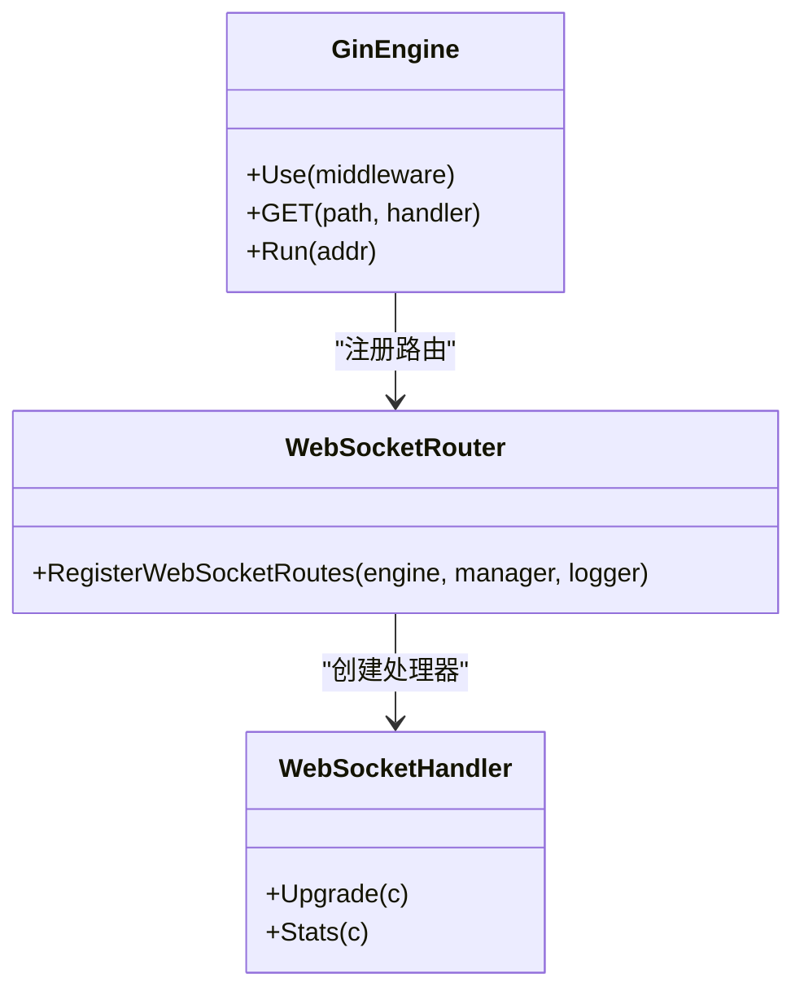
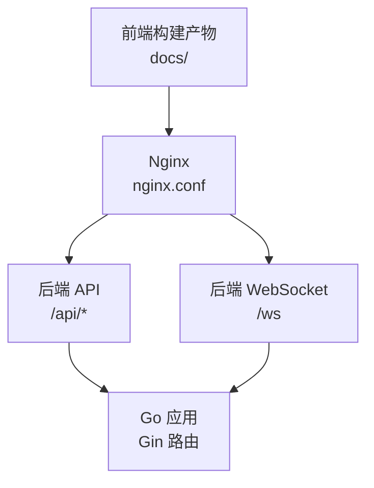

# 反向代理与静态服务

<cite>
**本文引用的文件**
- [nginx.conf](file://nginx.conf)
- [Dockerfile.nginx](file://Dockerfile.nginx)
- [server-go/cmd/server/main.go](file://server-go/cmd/server/main.go)
- [server-go/internal/websocket/router.go](file://server-go/internal/websocket/router.go)
- [server-go/internal/websocket/handler.go](file://server-go/internal/websocket/handler.go)
- [src/services/websocket.js](file://src/services/websocket.js)
- [src/composables/useWebSocket.js](file://src/composables/useWebSocket.js)
- [WebSocket改造完整实现指南.md](file://WebSocket改造完整实现指南.md)
- [WebSocket实现完成总结.md](file://WebSocket实现完成总结.md)
- [server-go/docker-compose.yml](file://server-go/docker-compose.yml)
</cite>

## 目录
1. [引言](#引言)
2. [项目结构](#项目结构)
3. [核心组件](#核心组件)
4. [架构总览](#架构总览)
5. [详细组件分析](#详细组件分析)
6. [依赖关系分析](#依赖关系分析)
7. [性能考量](#性能考量)
8. [故障排查指南](#故障排查指南)
9. [结论](#结论)
10. [附录](#附录)

## 引言
本文件围绕仓库中的 Nginx 配置与前后端协作展开，目标是全面解析 nginx.conf 的 HTTP 服务器配置、静态资源服务路径（/ 与 /index.html）、API 请求的反向代理规则，并重点说明 WebSocket 连接升级（Upgrade: websocket）的配置实现，确保实时通信畅通。同时，结合现有配置与后端实现，给出负载均衡、SSL 终止、Gzip 压缩与缓存策略的配置方法建议，以及配置测试、语法检查与热重载操作指南，最后提供 502 Bad Gateway 等常见代理错误的排查步骤。

## 项目结构
该仓库采用“前端构建产物由 Nginx 提供静态服务，后端 Go 服务通过 Nginx 反向代理”的典型架构：
- 前端构建产物位于 docs/，Dockerfile.nginx 在构建完成后复制到 Nginx 的静态目录，供 Nginx 提供静态资源服务。
- Nginx 将 /api/ 请求转发至后端 Go 服务（容器内域名 backend:3000），并设置必要的头部以便后端识别客户端信息与协议。
- WebSocket 通过 /ws 端点由后端 Gin 路由注册，前端通过 ws/wss 连接后端，Nginx 需要支持 Upgrade/Connection 头部以完成升级。

图表来源
- [Dockerfile.nginx](file://Dockerfile.nginx#L23-L35)
- [nginx.conf](file://nginx.conf#L1-L23)
- [server-go/cmd/server/main.go](file://server-go/cmd/server/main.go#L83-L95)
- [server-go/internal/websocket/router.go](file://server-go/internal/websocket/router.go#L8-L17)

章节来源
- [Dockerfile.nginx](file://Dockerfile.nginx#L23-L35)
- [nginx.conf](file://nginx.conf#L1-L23)

## 核心组件
- Nginx 静态资源服务：根路径 / 提供前端构建产物，支持 SPA 的 index.html 回退。
- Nginx 反向代理：/api/ 路径转发至后端 Go 服务，携带 Host、X-Real-IP、X-Forwarded-For、X-Forwarded-Proto 等头部。
- WebSocket 升级：后端通过 Gin 路由注册 /ws，前端通过 ws/wss 连接；Nginx 需要支持 Upgrade/Connection 头部与长连接超时。
- 后端 Gin：启用 Gzip 压缩中间件，统一日志与恢复中间件，并注册 WebSocket 与 API 路由。

章节来源
- [nginx.conf](file://nginx.conf#L5-L17)
- [server-go/cmd/server/main.go](file://server-go/cmd/server/main.go#L60-L70)
- [server-go/internal/websocket/router.go](file://server-go/internal/websocket/router.go#L8-L17)

## 架构总览
下图展示从浏览器到后端的完整链路，包括静态资源、API 与 WebSocket 的流向。

图表来源
- [nginx.conf](file://nginx.conf#L5-L17)
- [server-go/internal/websocket/router.go](file://server-go/internal/websocket/router.go#L8-L17)
- [src/services/websocket.js](file://src/services/websocket.js#L48-L55)

## 详细组件分析

### Nginx 静态资源服务与 SPA 回退
- 根路径 / 使用 try_files 将未命中资源回退到 /index.html，支持前端单页应用路由。
- 静态资源目录由 Dockerfile.nginx 在构建阶段复制到 Nginx 的 HTML 目录，确保 Nginx 可直接提供。

图表来源
- [nginx.conf](file://nginx.conf#L5-L9)
- [Dockerfile.nginx](file://Dockerfile.nginx#L29-L30)

章节来源
- [nginx.conf](file://nginx.conf#L5-L9)
- [Dockerfile.nginx](file://Dockerfile.nginx#L29-L30)

### Nginx 反向代理与 API 路由
- /api/ 路径转发至 backend:3000/api/，并设置 Host、X-Real-IP、X-Forwarded-For、X-Forwarded-Proto 等头部，便于后端识别真实客户端与协议。
- 错误页 502/503/504 映射到 /50x.html，Nginx 会返回静态错误页。

图表来源
- [nginx.conf](file://nginx.conf#L11-L17)

章节来源
- [nginx.conf](file://nginx.conf#L11-L17)

### WebSocket 升级与长连接
- 后端 Gin 路由注册 /ws，用于升级 HTTP 到 WebSocket。
- 前端通过 ws/wss 连接后端，URL 中包含 userId 与 token 参数。
- Nginx 需要支持 Upgrade/Connection 头部，并设置 proxy_http_version 1.1 与长连接超时，以维持 WebSocket 会话。

图表来源
- [server-go/internal/websocket/router.go](file://server-go/internal/websocket/router.go#L8-L17)
- [src/services/websocket.js](file://src/services/websocket.js#L48-L55)
- [WebSocket改造完整实现指南.md](file://WebSocket改造完整实现指南.md#L460-L498)

章节来源
- [server-go/internal/websocket/router.go](file://server-go/internal/websocket/router.go#L8-L17)
- [src/services/websocket.js](file://src/services/websocket.js#L48-L55)
- [WebSocket改造完整实现指南.md](file://WebSocket改造完整实现指南.md#L460-L498)

### 后端 Gin 的 Gzip 压缩与路由注册
- 后端 Gin 启用 gzip 压缩中间件，减少 API 响应体积。
- 注册 WebSocket 与 API 路由，并将 WebSocket 管理器注入上下文，供其他接口使用。

图表来源
- [server-go/cmd/server/main.go](file://server-go/cmd/server/main.go#L60-L70)
- [server-go/internal/websocket/router.go](file://server-go/internal/websocket/router.go#L8-L17)
- [server-go/internal/websocket/handler.go](file://server-go/internal/websocket/handler.go#L37-L59)

章节来源
- [server-go/cmd/server/main.go](file://server-go/cmd/server/main.go#L60-L70)
- [server-go/internal/websocket/router.go](file://server-go/internal/websocket/router.go#L8-L17)
- [server-go/internal/websocket/handler.go](file://server-go/internal/websocket/handler.go#L37-L59)

## 依赖关系分析
- Nginx 与后端服务通过 Docker Compose 编排：Nginx 作为入口，后端 Go 服务提供 API 与 WebSocket。
- 前端构建产物由 Nginx 提供静态服务，SPA 路由回退至 index.html。
- WebSocket 与 API 共享同一上游 backend:3000，但需要分别配置 Upgrade/Connection 与路径前缀。

图表来源
- [Dockerfile.nginx](file://Dockerfile.nginx#L23-L35)
- [nginx.conf](file://nginx.conf#L5-L17)
- [server-go/docker-compose.yml](file://server-go/docker-compose.yml#L1-L42)

章节来源
- [Dockerfile.nginx](file://Dockerfile.nginx#L23-L35)
- [nginx.conf](file://nginx.conf#L5-L17)
- [server-go/docker-compose.yml](file://server-go/docker-compose.yml#L1-L42)

## 性能考量
- Gzip 压缩：后端 Gin 已启用 gzip 压缩中间件，可降低 API 响应体积，提升传输效率。
- WebSocket 长连接：Nginx 需要设置 proxy_http_version 1.1 与较长的读写超时，确保连接稳定。
- 静态资源缓存：可在 Nginx 层对静态资源设置合理的缓存策略（如 ETag/Cache-Control），减少带宽消耗。
- 负载均衡：若需横向扩展后端实例，可在 Nginx 中使用 upstream 定义多个 backend 实例，并开启健康检查与会话亲和策略（按需）。
- SSL 终止：生产环境建议在 Nginx 层启用 HTTPS，证书与私钥配置于 Nginx，后端以 HTTP 接收请求，减轻后端 TLS 开销。

章节来源
- [server-go/cmd/server/main.go](file://server-go/cmd/server/main.go#L60-L70)
- [WebSocket改造完整实现指南.md](file://WebSocket改造完整实现指南.md#L460-L498)

## 故障排查指南
- 502 Bad Gateway
  - 检查后端服务是否正常运行（如通过 curl 访问后端 /ws/stats）。
  - 确认 Nginx 与后端容器网络连通性。
  - 查看 Nginx 错误日志与后端日志，定位具体错误原因。
- WebSocket 连接失败
  - 确认前端 ws/wss 协议与后端 /ws 路由一致。
  - 检查 Nginx 是否正确传递 Upgrade/Connection 头部。
  - 核对 userId 与 token 参数是否正确传入。
- 静态资源 404
  - 确认 Dockerfile.nginx 已将 docs/ 复制到 Nginx 静态目录。
  - 检查 Nginx 的 root 与 try_files 配置是否匹配。
- API 响应异常
  - 检查 Nginx 反代路径前缀是否与后端路由一致（/api/ vs /api）。
  - 确认 X-Forwarded-* 头部是否正确透传，以便后端识别客户端与协议。

章节来源
- [WebSocket实现完成总结.md](file://WebSocket实现完成总结.md#L447-L457)
- [nginx.conf](file://nginx.conf#L11-L17)
- [Dockerfile.nginx](file://Dockerfile.nginx#L29-L30)

## 结论
本项目的 Nginx 配置已满足静态资源服务与 API 反向代理的基本需求，并通过 Dockerfile.nginx 将前端构建产物纳入静态目录。WebSocket 升级在后端已实现，但当前仓库的 nginx.conf 未包含专门的 /ws 升级配置。建议在生产环境中补充 WebSocket 专用 location，设置 Upgrade/Connection 头部与长连接超时，并考虑在 Nginx 层引入负载均衡、SSL 终止与静态资源缓存策略，以进一步提升稳定性与性能。

## 附录

### 配置测试、语法检查与热重载
- 语法检查：使用 Nginx 自带的语法检查命令验证配置文件。
- 热重载：在语法通过后，发送信号触发 Nginx 重载配置，无需重启进程。

章节来源
- [nginx.conf](file://nginx.conf#L1-L23)

### WebSocket 升级配置要点（建议）
- 在 Nginx 中为 /ws 路径设置 proxy_http_version 1.1，并透传 Upgrade 与 Connection 头部。
- 为 WebSocket 连接设置较长的 proxy_read_timeout 与 proxy_send_timeout，避免超时断开。
- 如需多实例部署，使用 upstream 定义后端集群，并在必要时开启会话亲和。

章节来源
- [WebSocket改造完整实现指南.md](file://WebSocket改造完整实现指南.md#L460-L498)
- [server-go/internal/websocket/router.go](file://server-go/internal/websocket/router.go#L8-L17)