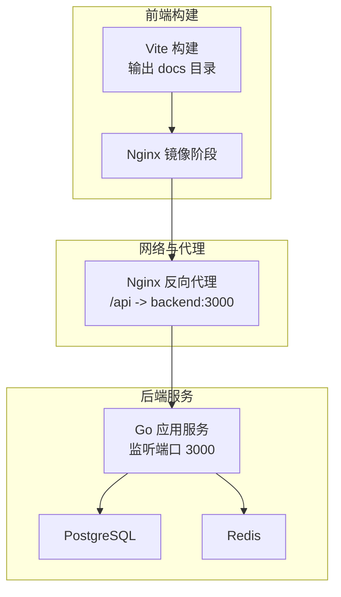
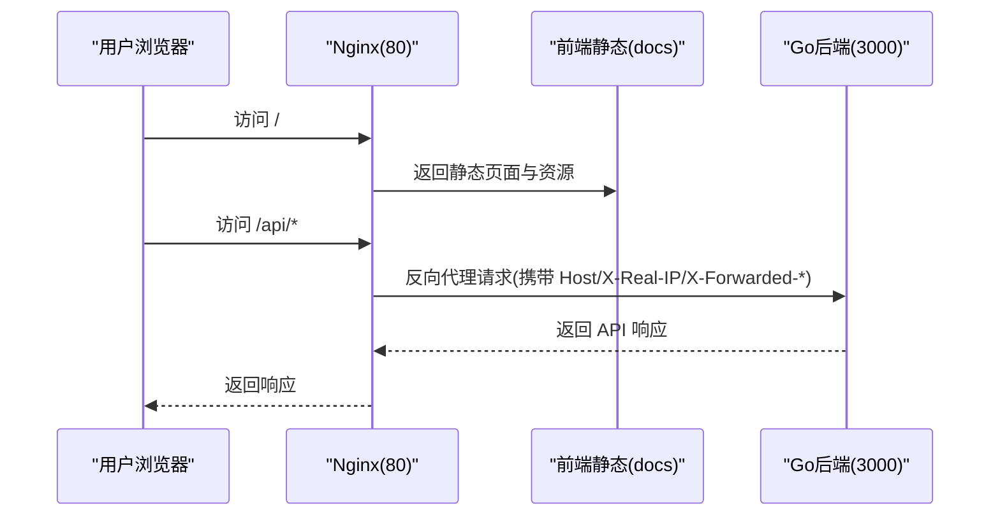
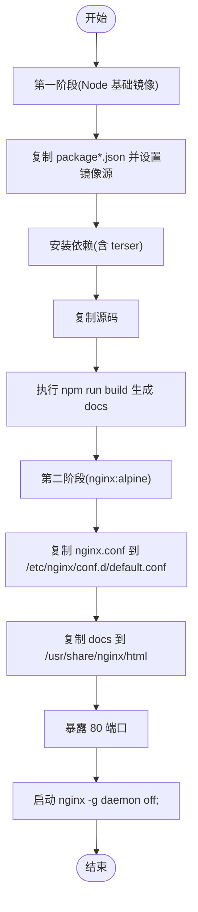
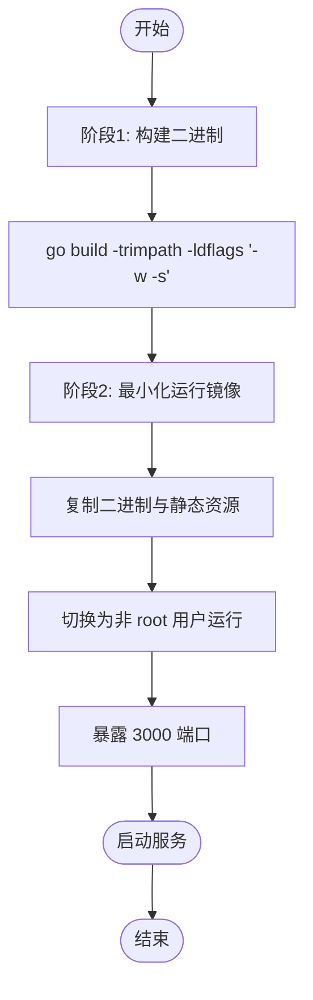
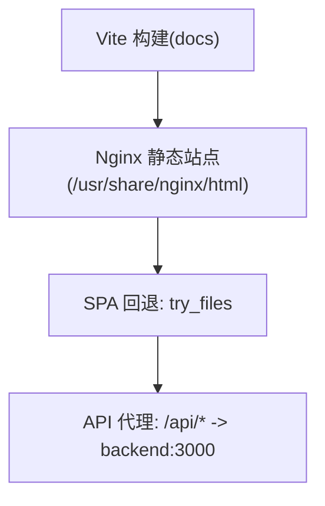
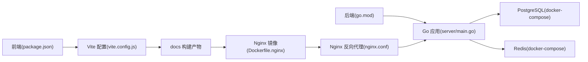

# 容器化构建

<cite>
**本文引用的文件**
- [Dockerfile.server.prod](file://Dockerfile.server.prod)
- [Dockerfile.nginx](file://Dockerfile.nginx)
- [.dockerignore](file://.dockerignore)
- [nginx.conf](file://nginx.conf)
- [vite.config.js](file://vite.config.js)
- [package.json](file://package.json)
- [server-go/docker-compose.yml](file://server-go/docker-compose.yml)
- [server-go/go.mod](file://server-go/go.mod)
- [server-go/cmd/server/main.go](file://server-go/cmd/server/main.go)
- [server-go/.env](file://server-go/.env)
</cite>

## 目录
1. [简介](#简介)
2. [项目结构](#项目结构)
3. [核心组件](#核心组件)
4. [架构总览](#架构总览)
5. [详细组件分析](#详细组件分析)
6. [依赖关系分析](#依赖关系分析)
7. [性能考虑](#性能考虑)
8. [故障排查指南](#故障排查指南)
9. [结论](#结论)
10. [附录](#附录)

## 简介
本文件围绕仓库中的容器化构建进行系统性说明，重点覆盖以下内容：
- 基于 Dockerfile.server.prod 的 Go 后端服务多阶段构建策略：依赖下载、编译优化与最小化镜像生成思路。
- 基于 Dockerfile.nginx 的 Nginx 前端镜像构建：静态资源复制与 HTTP 代理配置。
- 构建参数、缓存优化、安全加固（非 root 用户运行）与版本标签管理建议。
- 构建命令示例、常见构建错误排查（如依赖缺失、端口冲突）及性能优化建议。

## 项目结构
该仓库采用前后端分离的容器化方案：
- 前端构建产物由 Vite 输出至 docs 目录，随后在 Nginx 镜像中作为静态站点提供。
- 后端 Go 服务通过独立的 Dockerfile 进行构建与运行。
- Nginx 作为反向代理，将 /api/* 请求转发至后端服务。

图表来源
- [Dockerfile.nginx](file://Dockerfile.nginx#L1-L35)
- [nginx.conf](file://nginx.conf#L1-L23)
- [server-go/docker-compose.yml](file://server-go/docker-compose.yml#L1-L42)

章节来源
- [Dockerfile.nginx](file://Dockerfile.nginx#L1-L35)
- [nginx.conf](file://nginx.conf#L1-L23)
- [vite.config.js](file://vite.config.js#L1-L105)
- [server-go/docker-compose.yml](file://server-go/docker-compose.yml#L1-L42)

## 核心组件
- 前端静态资源与构建
  - Vite 在构建时将产物输出到 docs 目录，并启用按需分块与资源命名策略，便于缓存与 CDN 分发。
  - Dockerfile.nginx 在第二阶段将 docs 目录复制到 Nginx 的静态站点根目录，提供静态页面与资源。
- Nginx 反向代理
  - 通过 nginx.conf 将 /api/* 请求代理到 backend:3000，同时保留 Host、X-Real-IP、X-Forwarded-* 等头部信息，确保后端可正确识别客户端信息。
- 后端 Go 服务
  - Go 应用监听环境变量 PORT（默认 3000），并加载 .env 中的数据库、Redis、JWT 等配置。
  - Dockerfile.server.prod 将前端静态资源复制到容器内并暴露 3000 端口，用于本地开发或直接运行前端。
- 数据与缓存
  - docker-compose.yml 提供 PostgreSQL 与 Redis 的服务编排，包含健康检查与持久化卷。

章节来源
- [vite.config.js](file://vite.config.js#L1-L105)
- [Dockerfile.nginx](file://Dockerfile.nginx#L1-L35)
- [nginx.conf](file://nginx.conf#L1-L23)
- [server-go/cmd/server/main.go](file://server-go/cmd/server/main.go#L1-L107)
- [server-go/.env](file://server-go/.env#L1-L9)
- [server-go/docker-compose.yml](file://server-go/docker-compose.yml#L1-L42)

## 架构总览
下图展示容器化部署的整体交互：Nginx 作为入口，静态资源由 docs 提供，API 请求转发至后端 Go 服务；后端服务访问数据库与缓存。

图表来源
- [Dockerfile.nginx](file://Dockerfile.nginx#L1-L35)
- [nginx.conf](file://nginx.conf#L1-L23)
- [server-go/cmd/server/main.go](file://server-go/cmd/server/main.go#L1-L107)

## 详细组件分析

### 组件A：Nginx 前端镜像构建（Dockerfile.nginx）
- 多阶段构建
  - 第一阶段：使用 Node 基础镜像安装依赖、复制源码并执行构建，生成 docs 目录。
  - 第二阶段：基于 nginx:alpine，复制 nginx.conf 到 /etc/nginx/conf.d/default.conf，并将 docs 目录复制到 /usr/share/nginx/html，最终以 nginx -g "daemon off;" 启动。
- 缓存优化
  - 通过分层构建，优先复制 package*.json 并安装生产依赖，再复制源码与构建产物，提升缓存命中率。
  - 构建阶段显式安装 terser 以避免构建失败，减少后续重试成本。
- 静态资源与代理
  - docs 目录作为静态站点根目录，nginx.conf 配置 try_files 支持 SPA 路由回退。
  - /api/* 代理到 backend:3000，保留必要的请求头以便后端识别真实客户端信息。

图表来源
- [Dockerfile.nginx](file://Dockerfile.nginx#L1-L35)
- [nginx.conf](file://nginx.conf#L1-L23)

章节来源
- [Dockerfile.nginx](file://Dockerfile.nginx#L1-L35)
- [nginx.conf](file://nginx.conf#L1-L23)

### 组件B：Go 后端服务镜像构建（Dockerfile.server.prod）
- 构建策略
  - 使用 Node 基础镜像，复制 server/package*.json 并安装生产依赖，然后复制 server 源码，最后暴露 3000 端口并通过 npm start 启动。
- 多阶段构建建议
  - 当前 Dockerfile 未体现 Go 编译产物的最小化镜像，建议改为：
    - 阶段1：使用 Go 工具链镜像编译出二进制（CGO_ENABLED=0、GOOS=linux、GOARCH=amd64、-trimpath、-ldflags '-w -s'）。
    - 阶段2：使用 alpine 或 distroless 镜像，仅拷贝二进制与必要资源，不包含编译工具链，实现最小化与安全加固。
- 缓存优化
  - 先复制 go.mod/go.sum 再复制源码，利用 Go 模块缓存提升构建速度。
- 安全加固
  - 使用非 root 用户运行（例如创建非特权用户并 chown 对应目录），限制容器权限。
- 版本标签管理
  - 建议通过 CI 在构建时注入版本号（如 Git SHA、SemVer），并在镜像标签中体现，便于追踪与回滚。

图表来源
- [Dockerfile.server.prod](file://Dockerfile.server.prod#L1-L18)
- [server-go/go.mod](file://server-go/go.mod#L1-L64)
- [server-go/cmd/server/main.go](file://server-go/cmd/server/main.go#L1-L107)

章节来源
- [Dockerfile.server.prod](file://Dockerfile.server.prod#L1-L18)
- [server-go/go.mod](file://server-go/go.mod#L1-L64)
- [server-go/cmd/server/main.go](file://server-go/cmd/server/main.go#L1-L107)

### 组件C：前端构建与静态资源（Vite + Nginx）
- 构建产物
  - vite.config.js 将 outDir 设为 docs，Rollup 输出文件名包含哈希，有利于长期缓存与 CDN 分发。
- Nginx 配置
  - nginx.conf 将 / 映射到 /usr/share/nginx/html，并通过 try_files 支持 SPA 路由回退。
  - /api/* 代理到 backend:3000，保留 Host、X-Real-IP、X-Forwarded-* 等头部，便于后端日志与鉴权处理。

图表来源
- [vite.config.js](file://vite.config.js#L1-L105)
- [Dockerfile.nginx](file://Dockerfile.nginx#L1-L35)
- [nginx.conf](file://nginx.conf#L1-L23)

章节来源
- [vite.config.js](file://vite.config.js#L1-L105)
- [Dockerfile.nginx](file://Dockerfile.nginx#L1-L35)
- [nginx.conf](file://nginx.conf#L1-L23)

## 依赖关系分析
- 前端依赖
  - package.json 定义了 Vue、Pinia、NaiveUI、Axios、ioredis、jsonwebtoken、uuid 等依赖，Vite 作为打包工具。
- 后端依赖
  - go.mod 引入 Gin、GORM、Redis 客户端、JWT、WebSocket、Zap 日志等模块。
- 运行时依赖
  - docker-compose.yml 提供 PostgreSQL 与 Redis 的服务编排，包含健康检查与持久化卷。

图表来源
- [package.json](file://package.json#L1-L42)
- [vite.config.js](file://vite.config.js#L1-L105)
- [Dockerfile.nginx](file://Dockerfile.nginx#L1-L35)
- [server-go/go.mod](file://server-go/go.mod#L1-L64)
- [server-go/cmd/server/main.go](file://server-go/cmd/server/main.go#L1-L107)
- [server-go/docker-compose.yml](file://server-go/docker-compose.yml#L1-L42)

章节来源
- [package.json](file://package.json#L1-L42)
- [server-go/go.mod](file://server-go/go.mod#L1-L64)
- [server-go/docker-compose.yml](file://server-go/docker-compose.yml#L1-L42)

## 性能考虑
- 构建缓存
  - 前端：先复制 package*.json 并安装依赖，再复制源码与构建产物，提升缓存命中率。
  - 后端：先复制 go.mod/go.sum，再复制源码，利用 Go 模块缓存加速编译。
- 产物体积
  - 前端：启用 Rollup 分块与文件名哈希，配合 CDN 缓存策略，降低重复传输。
  - 后端：多阶段构建仅复制二进制与必要资源，避免编译工具链进入运行镜像。
- 网络与代理
  - Nginx 代理保留必要的请求头，有助于后端日志与追踪；对静态资源启用合适的缓存控制（可在 nginx.conf 中扩展）。

[本节为通用性能建议，无需列出具体文件来源]

## 故障排查指南
- 依赖缺失
  - 前端：若构建时报错缺少 terser，请确认 Dockerfile.nginx 的安装步骤已执行；或在本地先安装依赖再构建。
  - 后端：若 Go 构建报错，请检查 go.mod 与 go.sum 是否匹配，必要时清理模块缓存后重试。
- 端口冲突
  - 前端开发端口：Vite 默认端口可通过环境变量覆盖；生产 Nginx 监听 80，Go 服务监听 3000。请确保宿主机未占用相应端口。
  - docker-compose 中 PostgreSQL 默认映射 5432，Redis 映射 6379，如冲突请修改映射或停止占用进程。
- 权限问题
  - 若使用非 root 用户运行，请确保容器内的工作目录与日志目录具备写权限；在多阶段构建中注意 chown。
- 代理与路由
  - 若 /api/* 无法访问，请检查 nginx.conf 的 proxy_pass 地址是否指向 backend:3000，且后端服务已启动并监听 3000。
  - SPA 路由回退：确认 nginx.conf 中 try_files 配置正确，避免刷新页面后 404。

章节来源
- [Dockerfile.nginx](file://Dockerfile.nginx#L1-L35)
- [nginx.conf](file://nginx.conf#L1-L23)
- [server-go/docker-compose.yml](file://server-go/docker-compose.yml#L1-L42)
- [server-go/cmd/server/main.go](file://server-go/cmd/server/main.go#L1-L107)

## 结论
本项目的容器化方案通过 Nginx 作为统一入口，结合 Vite 的静态资源构建与 Go 后端服务，实现了清晰的前后端分离与可扩展的部署架构。当前 Dockerfile.server.prod 更偏向前端运行场景，建议引入多阶段构建与非 root 运行以提升安全性与镜像体积控制；Dockerfile.nginx 的多阶段与代理配置已较为完善，可进一步在 nginx.conf 中增强缓存与安全头策略。

[本节为总结性内容，无需列出具体文件来源]

## 附录

### 构建命令示例（建议）
- 构建前端 Nginx 镜像
  - docker build -f Dockerfile.nginx -t xiuxian-fe:latest .
- 构建后端镜像（建议采用多阶段构建）
  - docker build -f Dockerfile.server.prod -t xiuxian-be:latest .
- 使用 docker-compose 启动后端依赖
  - docker-compose -f server-go/docker-compose.yml up -d
- 打标签与推送（CI 建议）
  - docker tag xiuxian-fe:latest registry.example.com/xiuxian-fe:$(git rev-parse --short HEAD)
  - docker push registry.example.com/xiuxian-fe:$(git rev-parse --short HEAD)

[本节为操作建议，无需列出具体文件来源]

### .dockerignore 规则说明
- 忽略 node_modules、dist、.git、Dockerfile、docker-compose.yml 等，减少无关文件进入镜像层，提升构建效率与镜像体积控制。

章节来源
- [.dockerignore](file://.dockerignore#L1-L6)