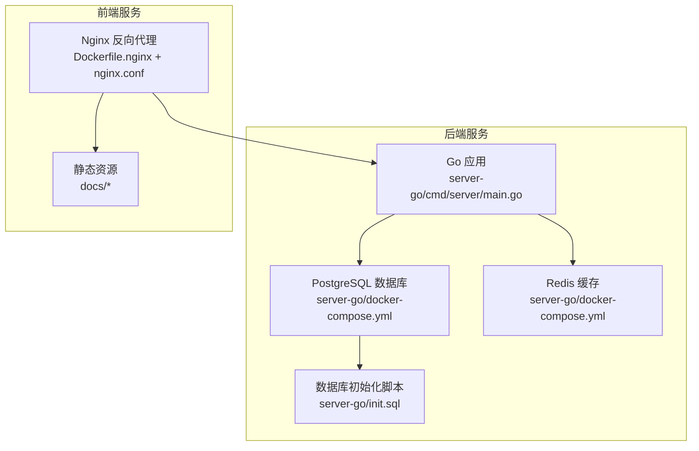
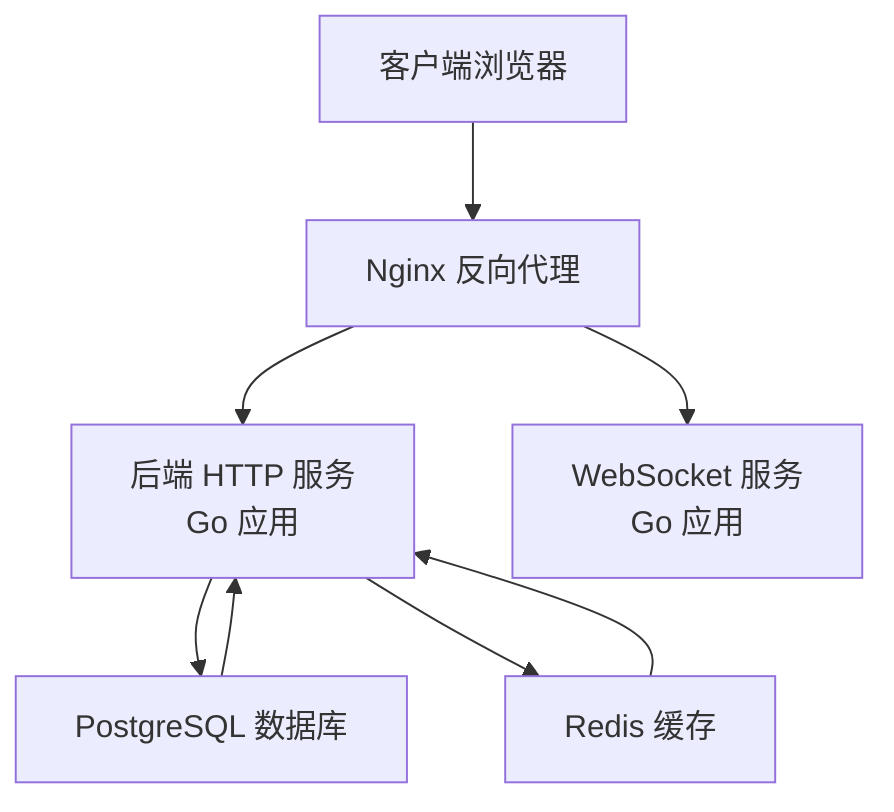
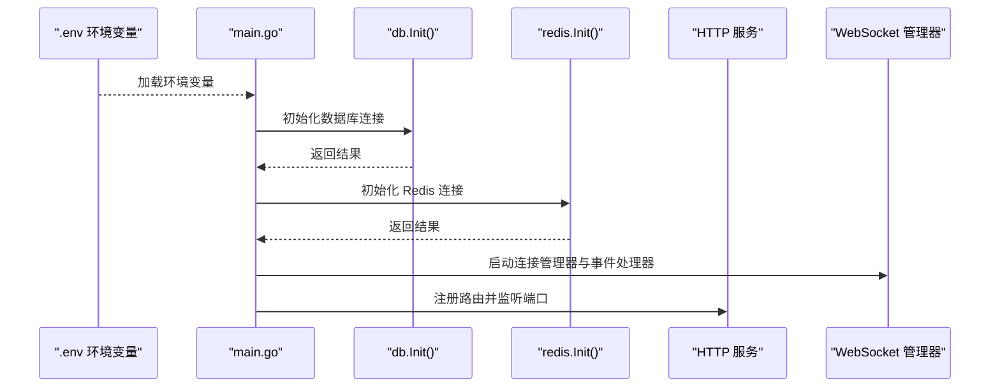
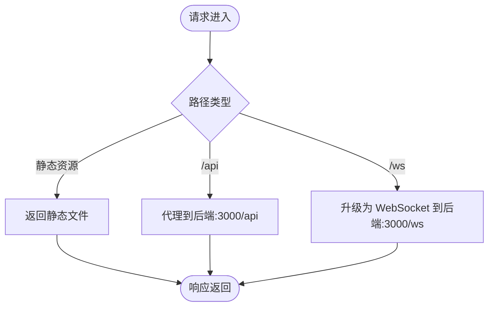
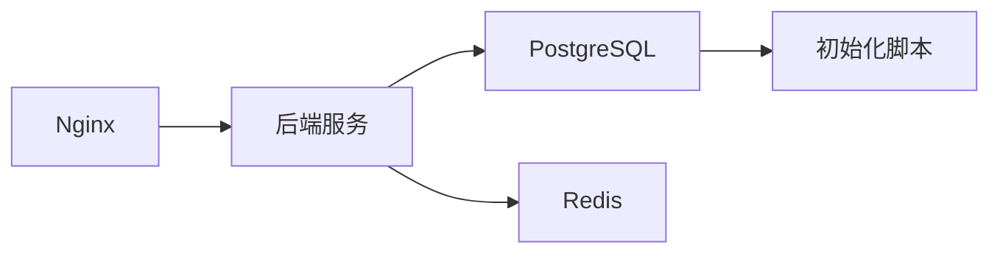

# 服务编排

<cite>
**本文引用的文件**
- [server-go/docker-compose.yml](file://server-go/docker-compose.yml)
- [server-go/.env](file://server-go/.env)
- [server-go/init.sql](file://server-go/init.sql)
- [server-go/cmd/server/main.go](file://server-go/cmd/server/main.go)
- [server-go/internal/db/db.go](file://server-go/internal/db/db.go)
- [server-go/internal/redis/redis.go](file://server-go/internal/redis/redis.go)
- [Dockerfile.server.prod](file://Dockerfile.server.prod)
- [Dockerfile.nginx](file://Dockerfile.nginx)
- [nginx.conf](file://nginx.conf)
- [WebSocket改造完整实现指南.md](file://WebSocket改造完整实现指南.md)
- [WebSocket实现完成总结.md](file://WebSocket实现完成总结.md)
</cite>

## 目录
1. [简介](#简介)
2. [项目结构](#项目结构)
3. [核心组件](#核心组件)
4. [架构总览](#架构总览)
5. [详细组件分析](#详细组件分析)
6. [依赖关系分析](#依赖关系分析)
7. [性能考量](#性能考量)
8. [故障排查指南](#故障排查指南)
9. [结论](#结论)
10. [附录](#附录)

## 简介
本文件围绕仓库中的多容器编排进行深入解析，重点覆盖以下方面：
- 服务依赖关系与启动顺序控制
- 网络配置与容器间通信
- 环境变量注入、数据卷挂载与健康检查机制
- 资源限制与生产部署要点
- 常见编排问题（如数据库初始化超时、Redis连接拒绝）的诊断与解决方案

说明：当前仓库未提供独立的“server”服务定义与“nginx”服务定义，但提供了后端服务的启动入口、数据库初始化脚本、Nginx配置与Dockerfile，以及WebSocket相关部署说明。因此，本文件将以现有文件为基础，给出可落地的编排实践与最佳实践建议，并对缺失的服务定义进行概念性补充说明。

## 项目结构
该仓库采用前后端分离与容器化部署思路：
- 后端服务位于 server-go 目录，包含 Go 应用、数据库初始化 SQL、Dockerfile 与 docker-compose.yml
- 前端静态资源由 Nginx 提供，Nginx 配置文件与 Dockerfile 位于根目录
- WebSocket 相关的生产部署与代理配置在文档中给出

图表来源
- [server-go/docker-compose.yml](file://server-go/docker-compose.yml#L1-L42)
- [server-go/init.sql](file://server-go/init.sql#L1-L166)
- [Dockerfile.nginx](file://Dockerfile.nginx#L1-L35)
- [nginx.conf](file://nginx.conf#L1-L23)

章节来源
- [server-go/docker-compose.yml](file://server-go/docker-compose.yml#L1-L42)
- [Dockerfile.nginx](file://Dockerfile.nginx#L1-L35)
- [nginx.conf](file://nginx.conf#L1-L23)

## 核心组件
- PostgreSQL 数据库服务：负责持久化用户、物品、炼丹、宠物、装备等业务数据；通过健康检查保障可用性；通过数据卷持久化；通过初始化脚本创建表结构与索引。
- Redis 缓存服务：提供会话、限流、临时状态等缓存能力；启用 AOF 持久化；通过健康检查保障可用性。
- Go 应用服务：加载 .env 环境变量，初始化数据库与 Redis 连接，启动 HTTP 服务与 WebSocket 管理器。
- Nginx 服务：反向代理静态资源与后端 API；配置 WebSocket 升级代理。

章节来源
- [server-go/docker-compose.yml](file://server-go/docker-compose.yml#L1-L42)
- [server-go/init.sql](file://server-go/init.sql#L1-L166)
- [server-go/internal/db/db.go](file://server-go/internal/db/db.go#L1-L44)
- [server-go/internal/redis/redis.go](file://server-go/internal/redis/redis.go#L1-L33)
- [server-go/cmd/server/main.go](file://server-go/cmd/server/main.go#L1-L106)
- [Dockerfile.nginx](file://Dockerfile.nginx#L1-L35)
- [nginx.conf](file://nginx.conf#L1-L23)

## 架构总览
下图展示了容器间的依赖与通信关系，以及请求在系统中的流转路径。

图表来源
- [server-go/cmd/server/main.go](file://server-go/cmd/server/main.go#L1-L106)
- [server-go/docker-compose.yml](file://server-go/docker-compose.yml#L1-L42)
- [nginx.conf](file://nginx.conf#L1-L23)

## 详细组件分析

### PostgreSQL 数据库服务
- 依赖与启动顺序
  - 通过健康检查确保数据库可用后再启动后端服务。
  - 初始化脚本挂载至容器内，首次启动时自动执行，创建表结构与索引。
- 网络与端口
  - 暴露 5432 端口，便于本地调试或外部访问。
- 数据卷与持久化
  - 使用命名卷存储数据目录，确保容器重启后数据不丢失。
- 环境变量
  - 通过环境变量设置数据库名称、用户名与密码。
- 健康检查
  - 使用 pg_isready 检测数据库连接可用性，具备间隔、超时与重试配置。

章节来源
- [server-go/docker-compose.yml](file://server-go/docker-compose.yml#L1-L42)
- [server-go/init.sql](file://server-go/init.sql#L1-L166)

### Redis 缓存服务
- 依赖与启动顺序
  - 通过健康检查确保 Redis 可用后再启动后端服务。
- 网络与端口
  - 暴露 6379 端口，便于本地调试或外部访问。
- 数据卷与持久化
  - 启用 AOF 持久化，使用命名卷存储持久化数据。
- 健康检查
  - 使用 redis-cli ping 检测连接可用性，具备间隔、超时与重试配置。

章节来源
- [server-go/docker-compose.yml](file://server-go/docker-compose.yml#L1-L42)

### Go 应用服务（后端）
- 环境变量注入
  - 启动前加载 .env 文件，读取数据库与 Redis 连接信息、端口、日志级别等。
- 数据库连接
  - 从环境变量读取主机、端口、数据库名、用户名与密码，构造连接字符串并初始化 GORM。
- Redis 连接
  - 从环境变量读取 REDIS_URL，解析并创建 Redis 客户端，执行 PING 检查。
- 服务启动
  - 初始化日志、注册路由、启动 WebSocket 管理器与后台任务，监听指定端口。

图表来源
- [server-go/cmd/server/main.go](file://server-go/cmd/server/main.go#L1-L106)
- [server-go/internal/db/db.go](file://server-go/internal/db/db.go#L1-L44)
- [server-go/internal/redis/redis.go](file://server-go/internal/redis/redis.go#L1-L33)
- [server-go/.env](file://server-go/.env#L1-L9)

章节来源
- [server-go/cmd/server/main.go](file://server-go/cmd/server/main.go#L1-L106)
- [server-go/internal/db/db.go](file://server-go/internal/db/db.go#L1-L44)
- [server-go/internal/redis/redis.go](file://server-go/internal/redis/redis.go#L1-L33)
- [server-go/.env](file://server-go/.env#L1-L9)

### Nginx 服务（前端静态资源与反向代理）
- 静态资源
  - 构建阶段复制前端构建产物到 Nginx 目录，提供静态页面与资源。
- 反向代理
  - 将 /api 请求转发至后端服务；将 /ws 请求升级为 WebSocket。
- 端口暴露
  - 暴露 80 端口，便于浏览器访问。

图表来源
- [Dockerfile.nginx](file://Dockerfile.nginx#L1-L35)
- [nginx.conf](file://nginx.conf#L1-L23)

章节来源
- [Dockerfile.nginx](file://Dockerfile.nginx#L1-L35)
- [nginx.conf](file://nginx.conf#L1-L23)

## 依赖关系分析
- 服务依赖
  - 后端服务依赖数据库与 Redis；数据库与 Redis 作为基础服务先于后端启动。
- 网络依赖
  - Nginx 通过域名或服务名访问后端服务；后端通过环境变量访问数据库与 Redis。
- 数据依赖
  - 数据库初始化脚本在首次启动时创建表结构与索引，确保后端服务可用。

图表来源
- [server-go/docker-compose.yml](file://server-go/docker-compose.yml#L1-L42)
- [server-go/init.sql](file://server-go/init.sql#L1-L166)

章节来源
- [server-go/docker-compose.yml](file://server-go/docker-compose.yml#L1-L42)
- [server-go/init.sql](file://server-go/init.sql#L1-L166)

## 性能考量
- 连接池与并发
  - 后端服务应结合数据库与 Redis 的连接池配置，合理设置最大连接数与空闲连接数，避免连接耗尽。
- 缓存策略
  - 对热点数据使用 Redis 缓存，减少数据库压力；对冷数据定期清理，避免内存膨胀。
- 压缩与传输
  - 后端已启用响应压缩中间件，可降低带宽占用。
- WebSocket 优化
  - 文档中给出了 WebSocket 代理与超时配置建议，可按需调整以提升稳定性与吞吐量。

章节来源
- [server-go/cmd/server/main.go](file://server-go/cmd/server/main.go#L1-L106)
- [WebSocket改造完整实现指南.md](file://WebSocket改造完整实现指南.md#L428-L502)

## 故障排查指南

### 数据库初始化超时
- 现象
  - 后端服务启动时无法连接数据库，提示初始化失败。
- 排查步骤
  - 检查数据库健康检查是否通过，确认容器已就绪。
  - 查看数据库初始化脚本是否成功执行，确认表结构与索引存在。
  - 核对数据库端口映射与网络连通性。
- 解决方案
  - 增加数据库启动等待时间或在编排中加入依赖等待策略。
  - 确保初始化脚本无语法错误且权限正确。

章节来源
- [server-go/docker-compose.yml](file://server-go/docker-compose.yml#L1-L42)
- [server-go/init.sql](file://server-go/init.sql#L1-L166)

### Redis 连接拒绝
- 现象
  - 后端服务初始化 Redis 失败，提示连接被拒绝。
- 排查步骤
  - 检查 Redis 健康检查是否通过，确认容器已就绪。
  - 核对 REDIS_URL 环境变量与端口映射。
  - 查看 Redis AOF 持久化是否正常，避免磁盘空间不足导致写入失败。
- 解决方案
  - 调整 Redis 命令参数与持久化策略，确保磁盘空间充足。
  - 在编排中增加依赖等待，确保 Redis 先于后端启动。

章节来源
- [server-go/docker-compose.yml](file://server-go/docker-compose.yml#L1-L42)
- [server-go/internal/redis/redis.go](file://server-go/internal/redis/redis.go#L1-L33)
- [server-go/.env](file://server-go/.env#L1-L9)

### Nginx 代理与 WebSocket 不生效
- 现象
  - /api 请求无法转发，/ws 无法升级为 WebSocket。
- 排查步骤
  - 检查 Nginx 配置中 upstream 与 location 是否正确指向后端服务。
  - 确认 /ws 的升级头设置与超时配置。
- 解决方案
  - 按文档中的代理配置修正 Nginx 设置，确保 WebSocket 升级头与超时参数正确。

章节来源
- [nginx.conf](file://nginx.conf#L1-L23)
- [WebSocket改造完整实现指南.md](file://WebSocket改造完整实现指南.md#L428-L502)

### 启动顺序控制与依赖等待
- 建议
  - 在编排中为后端服务添加依赖等待，确保数据库与 Redis 健康检查通过后再启动后端。
  - 使用健康检查与重启策略，提升系统自愈能力。

章节来源
- [server-go/docker-compose.yml](file://server-go/docker-compose.yml#L1-L42)

## 结论
本仓库的编排以 PostgreSQL 与 Redis 为核心基础设施，后端服务通过环境变量与健康检查实现稳定启动，Nginx 提供静态资源与 API/WS 代理。针对常见问题，建议完善启动顺序控制、增强健康检查与日志监控，并结合文档中的代理配置优化 WebSocket 体验。对于缺失的“server”与“nginx”服务定义，可在现有基础上扩展并遵循本文提供的最佳实践。

## 附录

### 环境变量一览
- 数据库相关
  - DB_HOST、DB_PORT、DB_NAME、DB_USER、DB_PASSWORD
- Redis 相关
  - REDIS_URL
- 应用相关
  - PORT、NODE_ENV、LOG_LEVEL、JWT_SECRET

章节来源
- [server-go/.env](file://server-go/.env#L1-L9)

### 数据库初始化脚本要点
- 创建用户、物品、炼丹、宠物、装备、秘境进度与增益等表。
- 为高频查询字段创建索引，提升查询性能。

章节来源
- [server-go/init.sql](file://server-go/init.sql#L1-L166)

### 生产部署要点
- 后端镜像与端口暴露
  - 使用生产镜像构建后端服务，暴露 3000 端口。
- Nginx 配置
  - 配置静态资源、API 代理与 WebSocket 升级头。
- WebSocket 代理
  - 参考文档中的代理配置，设置升级头与超时参数。

章节来源
- [Dockerfile.server.prod](file://Dockerfile.server.prod#L1-L18)
- [Dockerfile.nginx](file://Dockerfile.nginx#L1-L35)
- [nginx.conf](file://nginx.conf#L1-L23)
- [WebSocket改造完整实现指南.md](file://WebSocket改造完整实现指南.md#L428-L502)
- [WebSocket实现完成总结.md](file://WebSocket实现完成总结.md#L365-L457)