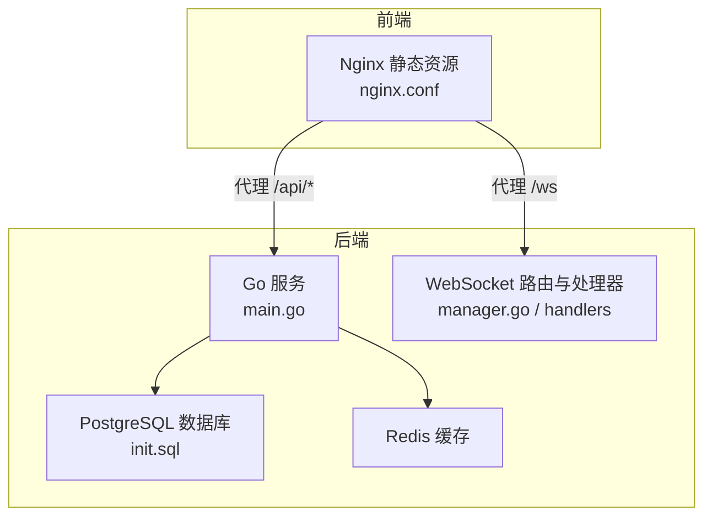
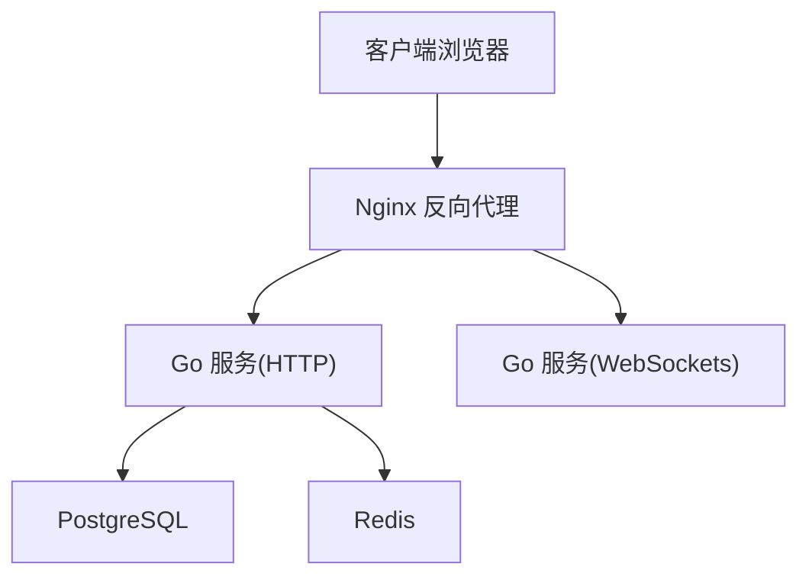
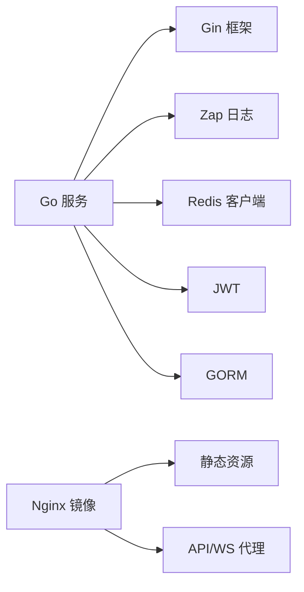

# 生产环境运维

<cite>
**本文引用的文件**
- [server-go/.env](file://server-go/.env)
- [server-go/docker-compose.yml](file://server-go/docker-compose.yml)
- [Dockerfile.nginx](file://Dockerfile.nginx)
- [Dockerfile.server.prod](file://Dockerfile.server.prod)
- [nginx.conf](file://nginx.conf)
- [server-go/cmd/server/main.go](file://server-go/cmd/server/main.go)
- [server-go/init.sql](file://server-go/init.sql)
- [server-go/go.mod](file://server-go/go.mod)
- [HEARTBEAT_AND_LOGOUT_GUIDE.md](file://HEARTBEAT_AND_LOGOUT_GUIDE.md)
- [WebSocket实现快速开始.md](file://WebSocket实现快速开始.md)
- [WebSocket改造完整实现指南.md](file://WebSocket改造完整实现指南.md)
- [开发文档/探索功能快速启动.md](file://开发文档/探索功能快速启动.md)
</cite>

## 目录
1. [简介](#简介)
2. [项目结构](#项目结构)
3. [核心组件](#核心组件)
4. [架构总览](#架构总览)
5. [详细组件分析](#详细组件分析)
6. [依赖关系分析](#依赖关系分析)
7. [性能与基线监控](#性能与基线监控)
8. [故障排查指南](#故障排查指南)
9. [结论](#结论)
10. [附录](#附录)

## 简介
本文件面向生产环境运维，围绕以下目标制定标准化流程：
- 环境变量（.env）的安全配置与加载
- SSL 证书部署与更新（结合 Nginx 代理）
- 日志文件（access.log、error.log）轮转与收集策略
- Prometheus 等监控指标采集配置与系统性能基线
- 零停机版本更新、数据库迁移与紧急回滚操作规程
- 保障服务高可用性的运维实践

## 项目结构
后端采用 Go 语言，使用 Gin 框架提供 HTTP 与 WebSocket 服务；前端静态资源由 Nginx 提供；数据库与缓存通过 docker-compose 管理；容器化产物分别用于后端与前端。

图表来源
- [nginx.conf](file://nginx.conf#L1-L23)
- [server-go/cmd/server/main.go](file://server-go/cmd/server/main.go#L31-L106)
- [server-go/docker-compose.yml](file://server-go/docker-compose.yml#L1-L42)
- [server-go/init.sql](file://server-go/init.sql#L1-L166)

章节来源
- [nginx.conf](file://nginx.conf#L1-L23)
- [server-go/cmd/server/main.go](file://server-go/cmd/server/main.go#L31-L106)
- [server-go/docker-compose.yml](file://server-go/docker-compose.yml#L1-L42)
- [server-go/init.sql](file://server-go/init.sql#L1-L166)

## 核心组件
- 环境变量加载与端口监听：后端通过 godotenv 加载 .env，并从环境变量读取端口；日志级别可由环境变量控制。
- 日志系统：使用 zap 结构化日志，集成 Gin 中间件输出访问日志与异常恢复日志。
- WebSocket 与心跳：后端实现心跳检测与自动下线，前端定时发送心跳，维持长连接稳定。
- 数据库与缓存：PostgreSQL 与 Redis 通过 docker-compose 管理，健康检查与持久化卷配置完善。
- 前端静态与反向代理：Nginx 提供静态资源与 API/WS 代理，支持 HTTPS（需自行配置证书）。

章节来源
- [server-go/.env](file://server-go/.env#L1-L9)
- [server-go/cmd/server/main.go](file://server-go/cmd/server/main.go#L31-L106)
- [HEARTBEAT_AND_LOGOUT_GUIDE.md](file://HEARTBEAT_AND_LOGOUT_GUIDE.md#L1-L252)
- [server-go/docker-compose.yml](file://server-go/docker-compose.yml#L1-L42)

## 架构总览
生产环境典型拓扑：
- Nginx 作为入口，负责 TLS 终止、静态资源、API 与 WebSocket 代理
- Go 服务监听本地端口，提供 HTTP 与 WebSocket
- PostgreSQL 与 Redis 作为后端存储与缓存

图表来源
- [nginx.conf](file://nginx.conf#L1-L23)
- [server-go/cmd/server/main.go](file://server-go/cmd/server/main.go#L31-L106)
- [server-go/docker-compose.yml](file://server-go/docker-compose.yml#L1-L42)

## 详细组件分析

### 环境变量与安全配置
- .env 加载：后端启动时加载 .env，读取端口、数据库、Redis、JWT 密钥等配置。
- 安全建议：
  - 将 .env 放置于受控目录，仅授予必要权限
  - 在 CI/CD 中通过密文注入环境变量，避免明文提交
  - 对敏感字段（如 JWT_SECRET、DB_PASSWORD）定期轮换
  - 通过 docker-compose 或编排平台挂载只读环境变量文件

章节来源
- [server-go/.env](file://server-go/.env#L1-L9)
- [server-go/cmd/server/main.go](file://server-go/cmd/server/main.go#L31-L106)

### SSL 证书部署与更新
- Nginx 作为 TLS 终止点，需在 nginx.conf 中配置证书与私钥路径
- 建议：
  - 使用 Let’s Encrypt 自动化证书签发与续期
  - 证书与私钥文件放置于受控目录，仅授予 Nginx 读取权限
  - 通过反代配置启用 HSTS、TLS 版本与密码套件加固
  - 更新证书后平滑重启 Nginx，避免中断

章节来源
- [nginx.conf](file://nginx.conf#L1-L23)
- [WebSocket改造完整实现指南.md](file://WebSocket改造完整实现指南.md#L428-L502)

### 日志轮转与收集策略
- 后端日志：
  - 使用 zap 输出结构化日志，Gin 中间件输出访问日志与异常恢复日志
  - 日志级别可通过环境变量动态调整
- 前端静态日志：
  - Nginx 默认提供 access/error 日志，建议启用并配置轮转
- 收集与归档：
  - 使用 systemd-journald、rsyslog 或 Fluent Bit 收集容器与主机日志
  - 将 access.log、error.log 与后端结构化日志统一输出至集中日志系统（如 ELK/EFK）

章节来源
- [server-go/cmd/server/main.go](file://server-go/cmd/server/main.go#L31-L106)
- [开发文档/探索功能快速启动.md](file://开发文档/探索功能快速启动.md#L168-L216)

### 监控指标采集与基线
- 访问指标（HTTP）：
  - Nginx 提供请求量、响应码分布、请求耗时等指标
  - 可通过 Exporter 暴露 Prometheus 指标
- 应用指标（Go）：
  - 可在 Gin 中集成 Prometheus 中间件，暴露 HTTP 请求耗时、请求数、错误数等
  - WebSocket 连接数、消息吞吐量等可自定义埋点
- 基线建议：
  - CPU：单核平均使用率 < 70%，峰值 < 90%
  - 内存：RSS 使用率 < 80%，GC 次数与暂停时间稳定
  - 连接数：HTTP 并发连接 < 80% 饱和，WS 连接 < 90% 饱和
  - 响应时间：P95 < 200ms，P99 < 500ms

章节来源
- [nginx.conf](file://nginx.conf#L1-L23)
- [server-go/cmd/server/main.go](file://server-go/cmd/server/main.go#L31-L106)

### 零停机版本更新
- 前端：
  - 使用 Nginx 配置静态资源缓存与回退策略，更新后平滑切换
- 后端：
  - 采用蓝绿/滚动发布：先拉起新实例，健康检查通过后再切流量
  - 使用 docker-compose 或 Kubernetes 副本与就绪探针
- WebSocket：
  - 保持多实例共享 Redis，在心跳与在线状态上保持一致性
  - 前端实现指数退避重连，避免雪崩效应

章节来源
- [WebSocket实现快速开始.md](file://WebSocket实现快速开始.md#L1-L323)
- [WebSocket改造完整实现指南.md](file://WebSocket改造完整实现指南.md#L428-L502)

### 数据库迁移与紧急回滚
- 迁移策略：
  - 使用 init.sql 初始化数据库结构；后续变更通过迁移脚本或 ORM 管理
  - 迁移前备份数据库，变更采用只增不删或幂等方式
- 回滚策略：
  - 若新版本出现严重问题，回滚至上一稳定版本
  - 回滚时同步回退迁移脚本，必要时使用备份恢复
- 健康检查：
  - docker-compose 已内置数据库与缓存健康检查，确保服务可用

章节来源
- [server-go/init.sql](file://server-go/init.sql#L1-L166)
- [server-go/docker-compose.yml](file://server-go/docker-compose.yml#L1-L42)

### 系统性能基线与心跳机制
- 心跳与自动下线：
  - 前端每秒发送心跳，后端每秒检查心跳超时，超时后自动下线并清理 Redis 在线状态
  - 该机制有助于释放无效连接，降低资源占用
- 性能基线：
  - 参考 WebSocket 快速开始中的预期性能指标，作为生产基线参考

章节来源
- [HEARTBEAT_AND_LOGOUT_GUIDE.md](file://HEARTBEAT_AND_LOGOUT_GUIDE.md#L1-L252)
- [WebSocket实现快速开始.md](file://WebSocket实现快速开始.md#L1-L323)

## 依赖关系分析
- 后端依赖：
  - Gin、Zap、Gzip、JWT、GORM、Redis 客户端等
- 前端静态构建：
  - 通过 Nginx 镜像复制构建产物，提供静态页面与 API 代理
- 容器化：
  - server-go 使用独立镜像，前端使用 Nginx 镜像

图表来源
- [server-go/go.mod](file://server-go/go.mod#L1-L64)
- [Dockerfile.nginx](file://Dockerfile.nginx#L1-L35)
- [Dockerfile.server.prod](file://Dockerfile.server.prod#L1-L18)

章节来源
- [server-go/go.mod](file://server-go/go.mod#L1-L64)
- [Dockerfile.nginx](file://Dockerfile.nginx#L1-L35)
- [Dockerfile.server.prod](file://Dockerfile.server.prod#L1-L18)

## 性能与基线监控
- 基线指标（参考）：
  - 单连接消息延迟：< 50ms
  - 系统支持在线连接数：≥ 10,000
  - 心跳检测周期：30 秒
  - 消息队列深度：256 条
  - 重连最大尝试次数：5 次
- 建议：
  - 使用 Prometheus + Grafana 监控 HTTP/WS 指标
  - 结合日志系统进行异常告警
  - 定期压测评估容量与瓶颈

章节来源
- [WebSocket实现快速开始.md](file://WebSocket实现快速开始.md#L270-L323)

## 故障排查指南
- 心跳与下线问题：
  - 检查前端心跳发送频率与后端心跳超时阈值
  - 核对 Redis 在线集合与玩家状态更新
- 日志定位：
  - 后端日志级别可通过环境变量调整
  - 前端日志可在浏览器控制台查看
- 性能分析：
  - 使用 pprof 分析 CPU/内存热点
- 常见问题：
  - WebSocket 连接失败：确认后端服务、参数与网络
  - 客户端无法接收消息：确认订阅事件与连接状态

章节来源
- [HEARTBEAT_AND_LOGOUT_GUIDE.md](file://HEARTBEAT_AND_LOGOUT_GUIDE.md#L1-L252)
- [开发文档/探索功能快速启动.md](file://开发文档/探索功能快速启动.md#L168-L216)

## 结论
通过标准化的环境变量管理、Nginx 代理与证书配置、日志轮转与集中收集、完善的监控与基线指标，以及蓝绿/滚动发布与数据库迁移回滚流程，可显著提升系统稳定性与可维护性。配合心跳与自动下线机制，可有效降低无效连接带来的资源浪费，保障高可用。

## 附录

### 环境变量清单（建议）
- NODE_ENV、PORT、DB_HOST、DB_PORT、DB_NAME、DB_USER、DB_PASSWORD、JWT_SECRET、REDIS_URL、LOG_LEVEL

章节来源
- [server-go/.env](file://server-go/.env#L1-L9)
- [server-go/cmd/server/main.go](file://server-go/cmd/server/main.go#L31-L106)

### Nginx 代理与 WebSocket 配置要点
- 静态资源与 API 代理
- WebSocket 升级头与超时设置
- TLS 终止与证书路径

章节来源
- [nginx.conf](file://nginx.conf#L1-L23)
- [WebSocket改造完整实现指南.md](file://WebSocket改造完整实现指南.md#L428-L502)

### 数据库初始化与健康检查
- init.sql 初始化表结构与索引
- docker-compose 健康检查与持久化卷

章节来源
- [server-go/init.sql](file://server-go/init.sql#L1-L166)
- [server-go/docker-compose.yml](file://server-go/docker-compose.yml#L1-L42)