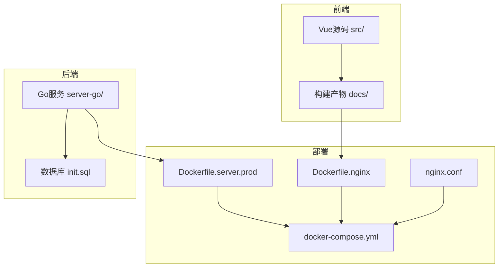
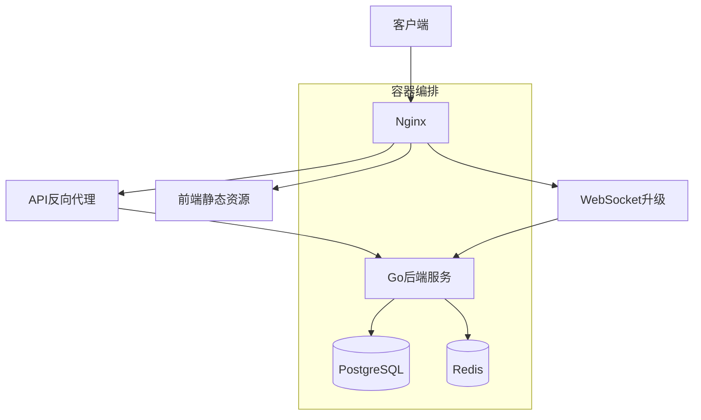
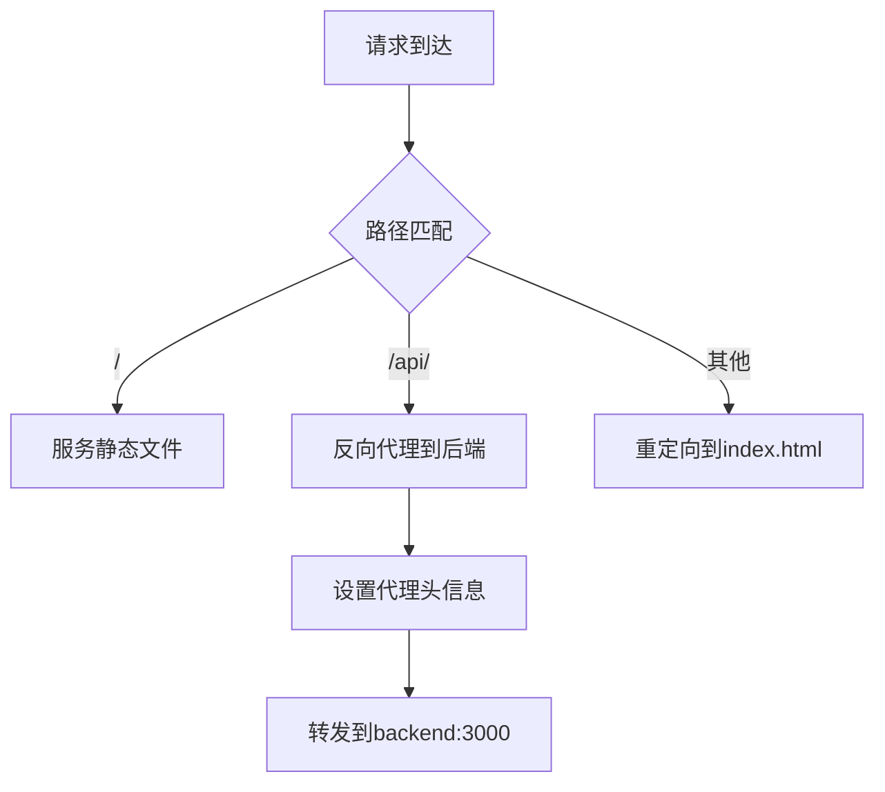
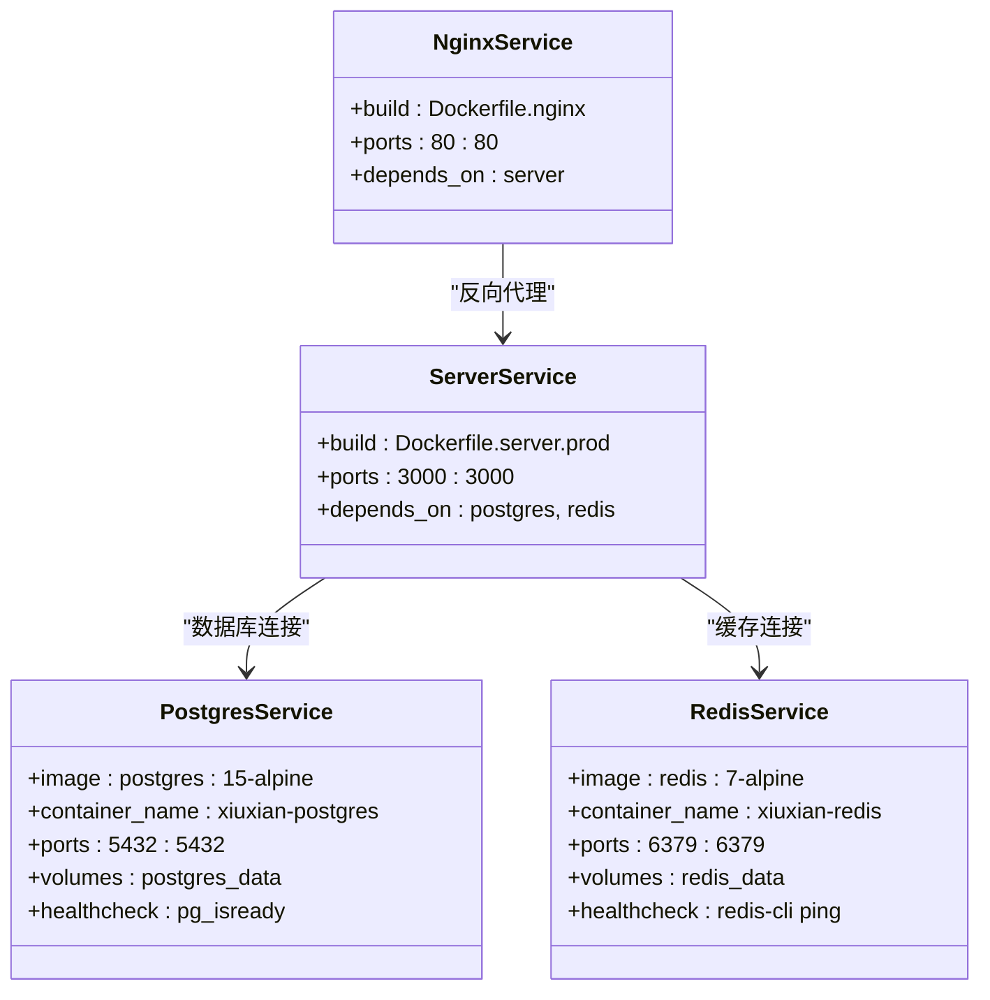
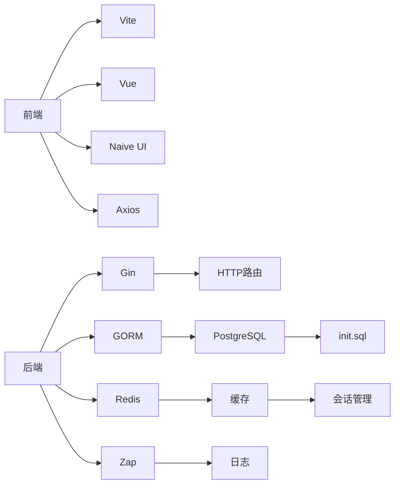

# 部署与运维

<cite>
**本文档引用的文件**  
- [Dockerfile.server.prod](file://Dockerfile.server.prod)
- [Dockerfile.nginx](file://Dockerfile.nginx)
- [docker-compose.yml](file://server-go/docker-compose.yml)
- [nginx.conf](file://nginx.conf)
- [server-go/.env](file://server-go/.env)
- [server-go/init.sql](file://server-go/init.sql)
- [package.json](file://package.json)
- [go.mod](file://server-go/go.mod)
- [server-go/cmd/server/main.go](file://server-go/cmd/server/main.go)
- [server-go/internal/websocket/router.go](file://server-go/internal/websocket/router.go)
- [server-go/internal/http/router/router.go](file://server-go/internal/http/router/router.go)
</cite>

## 目录
1. [简介](#简介)
2. [项目结构](#项目结构)
3. [核心组件](#核心组件)
4. [架构概览](#架构概览)
5. [详细组件分析](#详细组件分析)
6. [依赖分析](#依赖分析)
7. [性能考虑](#性能考虑)
8. [故障排除指南](#故障排除指南)
9. [结论](#结论)

## 简介
本部署与运维文档旨在为xiuxian-go项目提供完整的生产环境部署流程说明。文档详细阐述了基于`Dockerfile.server.prod`和`Dockerfile.nginx`的后端服务与前端静态资源容器化构建过程，解析`docker-compose.yml`中多容器应用（server、nginx、postgres、redis）的编排关系，并配置`nginx.conf`实现静态文件服务、API反向代理及WebSocket升级支持。同时，文档涵盖环境变量配置、SSL证书部署、日志收集、监控指标采集和版本更新等标准化操作流程，确保系统稳定可靠运行。

## 项目结构
xiuxian-go项目采用前后端分离架构，前端基于Vue框架构建，后端采用Go语言开发。项目根目录包含前端源码（src/）、前端构建产物（docs/）、后端服务（server-go/）、Nginx配置（nginx.conf）以及Docker相关配置文件。通过Docker和Docker Compose实现多容器应用的统一编排与部署。



**Diagram sources**
- [Dockerfile.server.prod](file://Dockerfile.server.prod)
- [Dockerfile.nginx](file://Dockerfile.nginx)
- [docker-compose.yml](file://server-go/docker-compose.yml)
- [nginx.conf](file://nginx.conf)

**Section sources**
- [Dockerfile.server.prod](file://Dockerfile.server.prod)
- [Dockerfile.nginx](file://Dockerfile.nginx)
- [docker-compose.yml](file://server-go/docker-compose.yml)
- [nginx.conf](file://nginx.conf)

## 核心组件
本项目核心组件包括：基于Go的后端服务，提供REST API和WebSocket接口；基于Vue的前端应用，提供用户界面；PostgreSQL数据库，存储用户数据和游戏状态；Redis缓存，用于会话管理和实时数据缓存；Nginx反向代理服务器，负责静态文件服务和API路由。

**Section sources**
- [server-go/cmd/server/main.go](file://server-go/cmd/server/main.go)
- [server-go/internal/http/router/router.go](file://server-go/internal/http/router/router.go)
- [server-go/internal/websocket/router.go](file://server-go/internal/websocket/router.go)
- [server-go/init.sql](file://server-go/init.sql)

## 架构概览
系统采用微服务架构模式，通过Docker容器化部署。Nginx作为入口网关，处理静态资源请求并反向代理API和WebSocket连接。后端服务通过Gin框架提供RESTful API，使用GORM与PostgreSQL数据库交互，并通过Redis实现缓存和实时通信。WebSocket连接由专门的连接管理器处理，支持灵力增长、秘境探索等实时功能。



**Diagram sources**
- [docker-compose.yml](file://server-go/docker-compose.yml)
- [nginx.conf](file://nginx.conf)
- [server-go/cmd/server/main.go](file://server-go/cmd/server/main.go)

## 详细组件分析

### 后端服务容器化
后端服务通过`Dockerfile.server.prod`构建，基于Node.js Alpine镜像，复制package.json文件并安装生产依赖，然后复制源代码并暴露3000端口。启动命令为`npm start`，适用于生产环境部署。

**Section sources**
- [Dockerfile.server.prod](file://Dockerfile.server.prod)
- [package.json](file://package.json)

### 前端容器化与Nginx配置
前端应用通过多阶段Docker构建，第一阶段使用Node.js镜像构建Vue应用，第二阶段使用Nginx Alpine镜像部署构建产物。`Dockerfile.nginx`将构建的前端文件复制到Nginx目录，并加载自定义`nginx.conf`配置。

#### Nginx配置分析


**Diagram sources**
- [Dockerfile.nginx](file://Dockerfile.nginx)
- [nginx.conf](file://nginx.conf)

**Section sources**
- [Dockerfile.nginx](file://Dockerfile.nginx)
- [nginx.conf](file://nginx.conf)

### 多容器编排
`docker-compose.yml`定义了四个服务：postgres、redis、server和nginx。PostgreSQL和Redis配置了数据卷以实现持久化存储，并设置了健康检查。服务间通过Docker网络进行通信，端口映射实现外部访问。

#### 服务编排关系


**Diagram sources**
- [docker-compose.yml](file://server-go/docker-compose.yml)

**Section sources**
- [docker-compose.yml](file://server-go/docker-compose.yml)

### API与WebSocket路由
后端服务通过Gin框架注册REST API和WebSocket路由。API路由包括用户认证、玩家数据、在线状态、抽卡、探索、修炼、秘境和炼丹等功能。WebSocket路由提供`/ws`升级端点和`/ws/stats`统计信息端点，支持实时通信。

#### API路由结构
```mermaid
graph TB
API[/api]
API --> Auth[/api/auth]
API --> Player[/api/player]
API --> Online[/api/online]
API --> Gacha[/api/gacha]
API --> Exploration[/api/exploration]
API --> Cultivation[/api/cultivation]
API --> Dungeon[/api/dungeon]
API --> Alchemy[/api/alchemy]
Auth --> Register
Auth --> Login
Auth --> GetUser
Player --> Leaderboard
Player --> Data
Player --> Spirit
Player --> Equipment
Online --> Login
Online --> Heartbeat
Online --> Logout
Online --> Players
Gacha --> Draw
Gacha --> AutoActions
Exploration --> Start
Exploration --> EventChoice
Cultivation --> Single
Cultivation --> Breakthrough
Cultivation --> Data
Dungeon --> Start
Dungeon --> Buffs
Dungeon --> SelectBuff
Dungeon --> Fight
Dungeon --> End
Alchemy --> Configs
Alchemy --> Recipes
Alchemy --> Craft
Alchemy --> BuyFragment
```

**Diagram sources**
- [server-go/internal/http/router/router.go](file://server-go/internal/http/router/router.go)

**Section sources**
- [server-go/internal/http/router/router.go](file://server-go/internal/http/router/router.go)

### WebSocket连接管理
WebSocket连接由`ConnectionManager`管理，维护所有活跃连接。通过`InitializeHandlers`初始化灵力、秘境、排行榜和探索等事件处理器。连接升级通过`/ws`端点处理，支持实时数据推送。

**Section sources**
- [server-go/internal/websocket/router.go](file://server-go/internal/websocket/router.go)
- [server-go/cmd/server/main.go](file://server-go/cmd/server/main.go)

## 依赖分析
项目依赖关系清晰，前端依赖Vue及相关UI库，后端依赖Gin、GORM、Redis等Go库。Docker镜像使用阿里云镜像仓库的稳定版本，确保部署一致性。数据库初始化脚本`init.sql`定义了完整的表结构和索引，确保数据完整性。



**Diagram sources**
- [package.json](file://package.json)
- [go.mod](file://server-go/go.mod)
- [server-go/init.sql](file://server-go/init.sql)

**Section sources**
- [package.json](file://package.json)
- [go.mod](file://server-go/go.mod)
- [server-go/init.sql](file://server-go/init.sql)

## 性能考虑
系统在设计上考虑了性能优化：数据库表建立了适当的索引以提高查询效率；使用Redis缓存频繁访问的数据；Nginx配置了Gzip压缩减少传输数据量；后端服务使用连接池管理数据库连接；WebSocket连接采用心跳机制维持长连接稳定性。

## 故障排除指南
常见问题包括：容器启动失败、数据库连接错误、WebSocket连接超时等。可通过查看容器日志、检查环境变量配置、验证数据库初始化状态等方式进行排查。`HEARTBEAT_AND_LOGOUT_GUIDE.md`文档提供了心跳机制和登出流程的详细说明。

**Section sources**
- [server-go/.env](file://server-go/.env)
- [HEARTBEAT_AND_LOGOUT_GUIDE.md](file://HEARTBEAT_AND_LOGOUT_GUIDE.md)

## 结论
xiuxian-go项目通过Docker容器化实现了前后端分离架构的标准化部署。完整的部署与运维文档为生产环境的稳定运行提供了保障，包括容器化构建、服务编排、反向代理配置、环境管理、日志监控等关键环节。系统架构合理，组件职责清晰，具备良好的可维护性和扩展性。