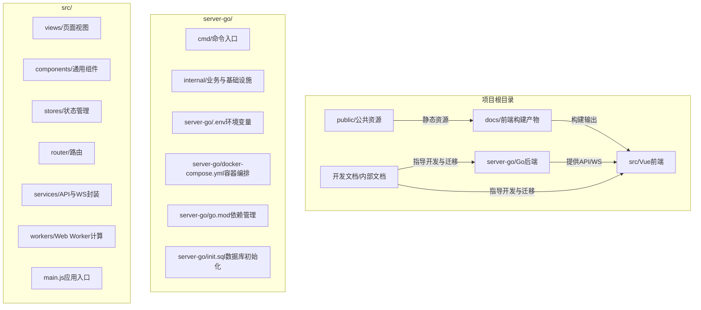

# 项目目录结构

<cite>
**本文引用的文件**
- [server-go/.env](file://server-go/.env)
- [server-go/docker-compose.yml](file://server-go/docker-compose.yml)
- [vite.config.js](file://vite.config.js)
- [server-go/go.mod](file://server-go/go.mod)
- [nginx.conf](file://nginx.conf)
- [server-go/cmd/server/main.go](file://server-go/cmd/server/main.go)
- [server-go/internal/http/router/router.go](file://server-go/internal/http/router/router.go)
- [server-go/internal/models/user.go](file://server-go/internal/models/user.go)
- [src/main.js](file://src/main.js)
- [src/router/index.js](file://src/router/index.js)
- [src/stores/playerInfo.js](file://src/stores/playerInfo.js)
- [server-go/init.sql](file://server-go/init.sql)
- [package.json](file://package.json)
- [开发文档/修炼功能后端实现总结.md](file://开发文档/修炼功能后端实现总结.md)
- [Dockerfile.nginx](file://Dockerfile.nginx)
- [Dockerfile.server.prod](file://Dockerfile.server.prod)
</cite>

## 目录总览

本项目采用前后端分离的目录组织方式，核心目录与职责如下：
- docs/：存放前端构建产物（Vite 输出），作为静态站点发布目录
- public/：公共资源（如域名 CNAME）放置于此
- server-go/：Go 后端服务代码，包含命令入口、HTTP 路由、业务服务、数据模型、数据库与 Redis 初始化、WebSocket 管理等
- src/：Vue 前端源码，包含组件、插件、路由、服务、状态管理、视图与 Web Worker 计算脚本
- 开发文档/：内部开发笔记与设计文档，涵盖功能迁移总结、架构分析与需求文档

图表来源
- [server-go/cmd/server/main.go](file://server-go/cmd/server/main.go#L1-L107)
- [server-go/internal/http/router/router.go](file://server-go/internal/http/router/router.go#L1-L126)
- [vite.config.js](file://vite.config.js#L1-L105)
- [server-go/init.sql](file://server-go/init.sql#L1-L166)

章节来源
- [server-go/cmd/server/main.go](file://server-go/cmd/server/main.go#L1-L107)
- [server-go/internal/http/router/router.go](file://server-go/internal/http/router/router.go#L1-L126)
- [vite.config.js](file://vite.config.js#L1-L105)
- [server-go/init.sql](file://server-go/init.sql#L1-L166)

## 关键配置文件详解

### 环境变量：server-go/.env
- 作用：集中定义后端运行所需的关键环境变量，包括端口、数据库连接、JWT 密钥、Redis 地址等
- 影响范围：后端启动时加载，影响数据库连接、日志级别、Redis 连接与 JWT 签发/校验
- 建议：在本地开发与生产部署中分别维护不同值，确保安全隔离

章节来源
- [server-go/.env](file://server-go/.env#L1-L9)

### 容器编排：server-go/docker-compose.yml
- 作用：定义 PostgreSQL 与 Redis 两个核心依赖服务，含健康检查、卷挂载与初始化 SQL
- 影响范围：一键拉起数据库与缓存，便于本地开发与测试；初始化 SQL 在首次启动时执行
- 建议：生产环境可替换为托管数据库与缓存服务，或使用更完善的编排方案

章节来源
- [server-go/docker-compose.yml](file://server-go/docker-compose.yml#L1-L42)

### 前端构建配置：vite.config.js
- 作用：配置 Vue 插件、自动导入、组件解析、打包输出目录、分包策略、压缩选项、代理与开发服务器端口
- 关键点：
  - 输出目录为 docs/，与后端静态站点部署配合
  - 代理将 /api 请求转发至后端 3000 端口，便于本地联调
  - 代码混淆与字符串数组编码增强前端代码安全性
- 建议：根据团队规范调整压缩与混淆策略，确保可维护性与性能平衡

章节来源
- [vite.config.js](file://vite.config.js#L1-L105)

### 依赖管理：server-go/go.mod
- 作用：声明 Go 语言版本与第三方依赖，包括 Gin Web 框架、JWT、GORM、Redis 客户端、日志库等
- 影响范围：决定后端运行时能力与兼容性，需与实际业务模块保持一致
- 建议：定期更新依赖，关注安全公告与性能改进

章节来源
- [server-go/go.mod](file://server-go/go.mod#L1-L64)

### 反向代理：nginx.conf
- 作用：将静态站点根目录指向构建产物 docs/，并把 /api/ 请求代理到后端服务
- 关键点：支持 SPA 回退到 index.html，保证前端路由正常工作
- 建议：生产环境建议启用 HTTPS 与缓存头，结合 CDN 提升性能

章节来源
- [nginx.conf](file://nginx.conf#L1-L23)

### 前端入口与路由：src/main.js、src/router/index.js
- 作用：创建 Vue 应用、注册 Pinia 与路由；在页面卸载时主动调用后端离线接口，保障在线状态一致性
- 影响范围：全局路由守卫控制访问权限，离线处理减少僵尸在线状态
- 建议：在路由守卫中增加更多鉴权与权限控制逻辑

章节来源
- [src/main.js](file://src/main.js#L1-L31)
- [src/router/index.js](file://src/router/index.js#L1-L37)

### 后端入口与路由：server-go/cmd/server/main.go、server-go/internal/http/router/router.go
- 作用：后端启动流程（加载 .env、初始化数据库与 Redis、配置日志与中间件、注册路由与 WebSocket）、HTTP 路由分组与端点注册
- 影响范围：统一暴露 /api/* 接口，按模块划分（认证、玩家、在线、抽卡、探索、修炼、秘境、炼丹）
- 建议：持续完善中间件与错误处理，确保接口稳定性与可观测性

章节来源
- [server-go/cmd/server/main.go](file://server-go/cmd/server/main.go#L1-L107)
- [server-go/internal/http/router/router.go](file://server-go/internal/http/router/router.go#L1-L126)

### 数据库初始化：server-go/init.sql
- 作用：定义核心表结构（用户、物品、灵草、丹药、碎片、炼丹数据、宠物、装备、秘境进度与增益等），并建立常用索引
- 影响范围：与后端模型定义保持一致，支撑各功能模块的数据持久化
- 建议：随着功能演进同步更新表结构与索引策略

章节来源
- [server-go/init.sql](file://server-go/init.sql#L1-L166)

### 前端状态与用户信息：src/stores/playerInfo.js
- 作用：集中管理玩家基础属性、战斗属性、抗性、特殊属性、灵宠与成就等状态，并提供登出清理逻辑
- 影响范围：作为前端数据源，驱动 UI 展示与交互
- 建议：拆分更细的状态模块，提升可维护性

章节来源
- [src/stores/playerInfo.js](file://src/stores/playerInfo.js#L1-L112)

### 包管理与脚本：package.json
- 作用：定义前端依赖、开发与构建脚本，支持 Vite、测试与打包
- 影响范围：决定前端工具链与构建行为
- 建议：定期审查依赖，优化构建时间与产物体积

章节来源
- [package.json](file://package.json#L1-L42)

### 开发文档与迁移总结：开发文档/修炼功能后端实现总结.md
- 作用：记录功能迁移过程、API 端点与前端改造要点，便于回顾与知识沉淀
- 影响范围：指导后续功能迁移与重构，降低沟通成本
- 建议：持续更新文档，补充测试与性能指标

章节来源
- [开发文档/修炼功能后端实现总结.md](file://开发文档/修炼功能后端实现总结.md#L1-L48)

### 容器镜像：Dockerfile.nginx、Dockerfile.server.prod
- 作用：分别用于前端静态站点与后端服务的镜像构建与运行
- 影响范围：简化部署流程，便于 CI/CD 集成
- 建议：优化镜像大小与构建缓存，启用多阶段构建

章节来源
- [Dockerfile.nginx](file://Dockerfile.nginx#L1-L35)
- [Dockerfile.server.prod](file://Dockerfile.server.prod#L1-L18)

## 目录组织与模块映射

- docs/：由 Vite 构建产出，作为 Nginx 静态站点根目录，承载前端页面与资源
- public/：放置域名 CNAME 等公共资源，便于域名绑定与静态资源访问
- server-go/cmd/server/main.go：后端入口，负责初始化、路由注册与 WebSocket 管理
- server-go/internal/http/router/router.go：按模块划分的 HTTP 路由组，统一对外提供 /api/* 接口
- server-go/internal/models/user.go：后端数据模型，与 init.sql 的表结构一一对应
- src/main.js：前端应用入口，注册路由与状态管理，处理页面卸载离线
- src/router/index.js：前端路由与守卫，控制访问权限
- src/stores/playerInfo.js：前端状态中心，管理玩家属性与行为
- server-go/init.sql：数据库初始化脚本，定义核心表与索引
- 开发文档/：内部知识库，记录迁移总结、架构分析与需求文档

章节来源
- [server-go/cmd/server/main.go](file://server-go/cmd/server/main.go#L1-L107)
- [server-go/internal/http/router/router.go](file://server-go/internal/http/router/router.go#L1-L126)
- [server-go/internal/models/user.go](file://server-go/internal/models/user.go#L1-L48)
- [src/main.js](file://src/main.js#L1-L31)
- [src/router/index.js](file://src/router/index.js#L1-L37)
- [src/stores/playerInfo.js](file://src/stores/playerInfo.js#L1-L112)
- [server-go/init.sql](file://server-go/init.sql#L1-L166)

## 结论

本项目通过清晰的目录划分与配置文件协同，实现了前后端分离的开发与部署模式。前端以 Vite 构建静态站点，后端以 Go 提供 API 与 WebSocket，数据库与缓存通过 Docker Compose 快速搭建。开发文档与迁移总结为后续迭代提供了坚实的知识基础。建议在后续工作中持续完善容器化与自动化流程，加强测试与监控体系，以提升整体交付质量与运维效率。